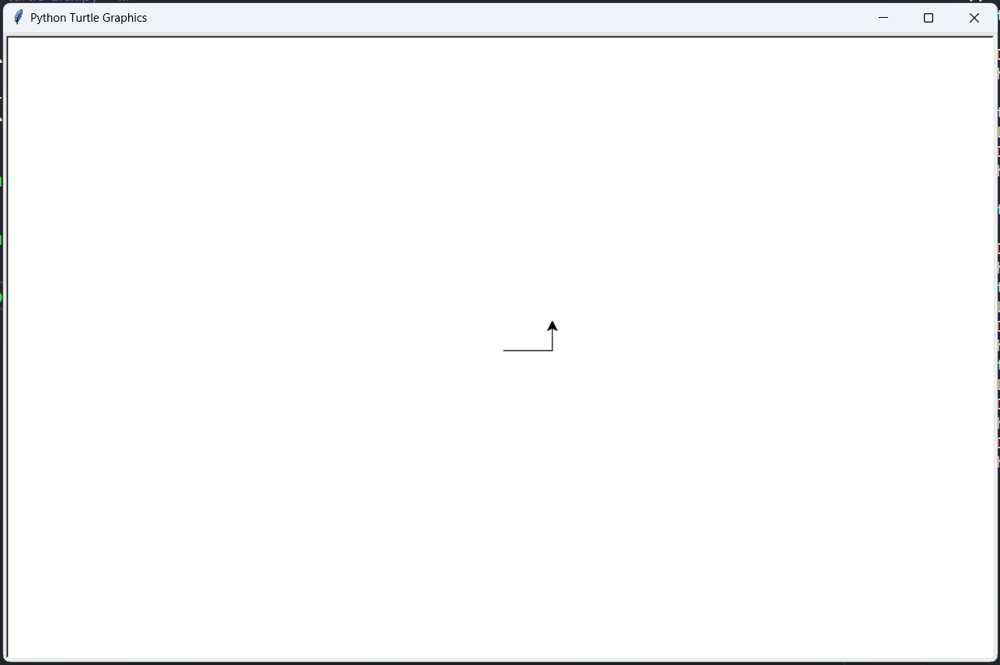
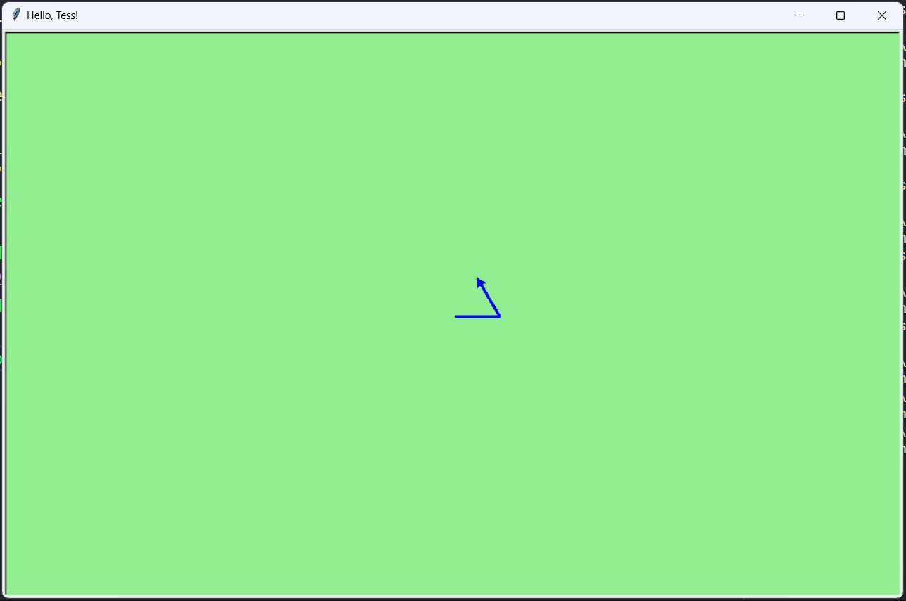
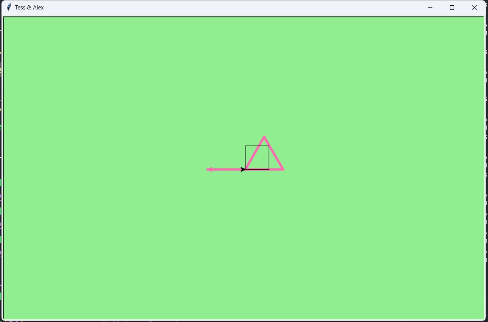
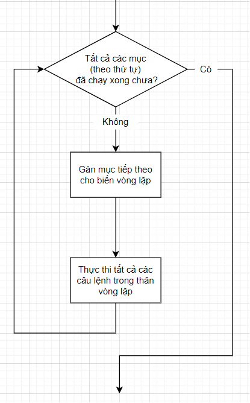

[English Version](http://openbookproject.net/thinkcs/python/english3e/hello_little_turtles.html)

# 3. Xin chào, những chú rùa con!

Có rất nhiều _modules_ trong Python cung cấp các tính năng rất mạnh mẽ mà chúng ta có thể sử dụng trong các chương trình của riêng mình. Một số trong số này có thể gửi email hoặc tìm nạp các trang web. Trong chương này chúng ta tạo ra những con rùa và yêu cầu chúng vẽ các hình dạng và mẫu.

Những con rùa rất thú vị, nhưng mục đích thực sự của chương là để dạy cho chúng ta thêm một chút về Python, và phát triển chủ đề của chúng ta về _tư duy tính toán_, hoặc _tư duy như một nhà khoa học máy tính_. Hầu hết các Python được đề cập ở đây sẽ được khám phá sâu hơn ở phần sau.

<details>
  <summary>English version</summary>

  > There are many _modules_ in Python that provide very powerful features that we can use in our own programs. Some of these can send email, or fetch web pages. The one we’ll look at in this chapter allows us to create turtles and get them to draw shapes and patterns.
  >
  > The turtles are fun, but the real purpose of the chapter is to teach ourselves a little more Python, and to develop our theme of _computational thinking_, or _thinking like a computer scientist_. Most of the Python covered here will be explored in more depth later.
</details>

## Chương trình rùa đầu tiên của chúng ta

Hãy viết một vài dòng trong chương trình Python để tạo một con rùa mới và bắt đầu vẽ một hình chữ nhật. (Chúng ta sẽ gọi biến đề cập đến con rùa đầu tiên của chúng ta là `alex`, nhưng chúng ta có thể chọn một tên khác nếu chúng ta tuân theo các quy tắc đặt tên từ chương trước).

<details>
  <summary>English version</summary>

  > Let’s write a couple of lines of Python program to create a new turtle and start drawing a rectangle. (We’ll call the variable that refers to our first turtle `alex`, but we can choose another name if we follow the naming rules from the previous chapter).
</details>

```python
import turtle             # Allows us to use turtles
wn = turtle.Screen()      # Creates a playground for turtles
alex = turtle.Turtle()    # Create a turtle, assign to alex

alex.forward(50)          # Tell alex to move forward by 50 units
alex.left(90)             # Tell alex to turn by 90 degrees
alex.forward(30)          # Complete the second side of a rectangle

wn.mainloop()             # Wait for user to close window
```

Khi chúng ta chạy chương trình này, một cửa sổ popup bật lên:

<details>
  <summary>English version</summary>

  > When we run this program, a new window pops up:
</details>



Dưới đây là một số điều chúng tôi cần hiểu về chương trình này.

<details>
  <summary>English version</summary>

  > Here are a couple of things we’ll need to understand about this program.
</details>

Dòng đầu tiên yêu cầu Python tải một module có tên là `turtle`. Module đó mang đến cho chúng ta hai kiểu mới mà chúng ta có thể sử dụng: kiểu `Turtle` và kiểu `Screen`. Ký hiệu dấu chấm `turtle.Turtle` có nghĩa là _“Kiểu Turtle được xác định trong module turtle”_. (Hãy nhớ rằng Python phân biệt chữ hoa chữ thường, vì vậy tên module, với chữ thường `t`, khác với kiểu `Turtle`.)

<details>
  <summary>English version</summary>

  > The first line tells Python to load a module named `turtle`. That module brings us two new types that we can use: the `Turtle` type, and the `Screen` type. The dot notation `turtle.Turtle` means _“The Turtle type that is defined within the turtle module”_. (Remember that Python is case sensitive, so the module name, with a lowercase `t`, is different from the type `Turtle`.)
</details>

Sau đó, chúng ta tạo và mở màn hình (chúng ta muốn gọi nó là cửa sổ), chúng ta gán cho biến wn. Mỗi cửa sổ đều chứa **canvas**, là vùng bên trong cửa sổ mà chúng ta có thể vẽ.

<details>
  <summary>English version</summary>

  > We then create and open what it calls a screen (we would prefer to call it a window), which we assign to variable wn. Every window contains a **canvas**, which is the area inside the window on which we can draw.
</details>

Trong dòng 3, chúng ta tạo ra một con rùa. Biến `alex` được tạo ra để chỉ con rùa này.

<details>
  <summary>English version</summary>

  > In line 3 we create a turtle. The variable `alex` is made to refer to this turtle.
</details>

Vì vậy, ba dòng đầu tiên này đã thiết lập mọi thứ, chúng ta đã sẵn sàng để con rùa của chúng ta vẽ trên canvas của chúng ta.

<details>
  <summary>English version</summary>

  > So these first three lines have set things up, we’re ready to get our turtle to draw on our canvas.
</details>

Trong dòng 5-7, chúng ta hướng dẫn **đối tượng** `alex` di chuyển và quay. Chúng ta thực hiện điều này bằng cách **gọi** hoặc kích hoạt **các phương thức** của `alex` - đây là những hướng dẫn mà tất cả các loài rùa đều biết cách phản hồi.

<details>
  <summary>English version</summary>

  > In lines 5-7, we instruct the **object** `alex` to move, and to turn. We do this by **invoking**, or activating, `alex`‘s **methods** — these are the instructions that all turtles know how to respond to.
</details>

Dòng cuối cùng cũng đóng một phần: biến `wn` tham chiếu đến cửa sổ được hiển thị ở trên. Khi chúng tôi gọi phương thức `mainloop` của nó, nó sẽ chuyển sang trạng thái chờ các sự kiện (như nhấn phím hoặc di chuyển chuột và nhấp chuột). Chương trình sẽ kết thúc khi người dùng đóng cửa sổ.

<details>
  <summary>English version</summary>

  > The last line plays a part too: the `wn` variable refers to the window shown above. When we invoke its `mainloop` method, it enters a state where it waits for events (like keypresses, or mouse movement and clicks). The program will terminate when the user closes the window.
</details>

Một đối tượng có thể có nhiều phương thức khác nhau - những thứ mà nó có thể làm - và nó cũng có thể có **thuộc tính** (attributes) - (trong tiếng Anh, đôi đôi khi _attributes_ được gọi là _properties_). Ví dụ: mỗi con rùa có một thuộc tính _color_. Lệnh gọi phương thức `alex.color("red ")` sẽ làm cho `alex` có màu đỏ và bản vẽ cũng sẽ có màu đỏ. (Lưu ý từ _color_ được đánh vần theo cách Mỹ!)

<details>
  <summary>English version</summary>

  > An object can have various methods — things it can do — and it can also have **attributes** — (sometimes called _properties_). For example, each turtle has a _color_ attribute. The method invocation `alex.color("red")` will make `alex` red, and drawing will be red too. (Note the word _color_ is spelled the American way!)
</details>

Màu sắc của con rùa, chiều rộng của bút, vị trí của con rùa trong cửa sổ, hướng nó đối mặt, v.v. tất cả đều là một phần của **trạng thái** hiện tại của nó. Tương tự, đối tượng cửa sổ có màu nền và một số văn bản trên thanh tiêu đề, kích thước và vị trí trên màn hình. Đây là một phần của trạng thái của đối tượng cửa sổ.

<details>
  <summary>English version</summary>

  > The color of the turtle, the width of its pen, the position of the turtle within the window, which way it is facing, and so on are all part of its current **state**. Similarly, the window object has a background color, and some text in the title bar, and a size and position on the screen. These are all part of the state of the window object.
</details>

Có khá nhiều phương pháp cho phép chúng ta sửa đổi rùa và các đối tượng cửa sổ. Chúng tôi sẽ chỉ hiển thị một vài. Trong chương trình này, chúng ta chỉ nhận xét những dòng khác với ví dụ trước (và chúng ta đã sử dụng một tên biến khác cho con rùa này):

<details>
  <summary>English version</summary>

  > Quite a number of methods exist that allow us to modify the turtle and the window objects. We’ll just show a couple. In this program we’ve only commented those lines that are different from the previous example (and we’ve used a different variable name for this turtle):
</details>

```python
import turtle
wn = turtle.Screen()
wn.bgcolor("lightgreen")      # Set the window background color
wn.title("Hello, Tess!")      # Set the window title

tess = turtle.Turtle()
tess.color("blue")            # Tell tess to change her color
tess.pensize(3)               # Tell tess to set her pen width

tess.forward(50)
tess.left(120)
tess.forward(50)

wn . mainloop ()
```

Khi chúng ta chạy chương trình này, cửa sổ mới này sẽ bật lên và sẽ vẫn ở trên màn hình cho đến khi chúng ta đóng nó.

<details>
  <summary>English version</summary>

  > When we run this program, this new window pops up, and will remain on the screen until we close it.
</details>



> **Mở rộng chương trình này ...**
>
> Sửa đổi chương trình này để trước khi tạo cửa sổ, nó sẽ nhắc người dùng nhập màu nền mong muốn. Nó sẽ lưu trữ phản hồi của người dùng trong một biến và sửa đổi màu sắc của cửa sổ theo mong muốn của người dùng. (Gợi ý: bạn có thể tìm thấy danh sách các tên màu được phép tại http://www.tcl.tk/man/tcl8.4/TkCmd/colors.htm. Nó bao gồm một số tên khá bất thường, như “peach puff” và “HotPink ”.)
>
> Thực hiện các thay đổi tương tự để cho phép người dùng, trong thời gian chạy, chỉ định màu `tess`'.
>
> Làm tương tự đối với chiều rộng của bút `tess`‘. _Gợi ý_: hộp thoại của bạn với người dùng sẽ trả về một chuỗi, nhưng phương thức `tess`‘ `pensize` mong đợi đối số của nó là một int. Vì vậy, bạn sẽ cần phải chuyển đổi chuỗi thành một số nguyên trước khi chuyển nó vào _pensize_.

<details>
  <summary>English version</summary>

  > **Extend this program ...**
  >
  > Modify this program so that before it creates the window, it prompts the user to enter the desired background color. It should store the user’s responses in a variable, and modify the color of the window according to the user’s wishes. (_Hint_: you can find a list of permitted color names at [http://www.tcl.tk/man/tcl8.4/TkCmd/colors.htm](http://www.tcl.tk/man/tcl8.4/TkCmd/colors.htm). It includes some quite unusual ones, like “peach puff” and “HotPink”.)
  >
  > Do similar changes to allow the user, at runtime, to set `tess`‘ color.
  >
  > Do the same for the width of `tess`‘ pen. _Hint_: your dialog with the user will return a string, but `tess`‘ `pensize` method expects its argument to be an int. So you’ll need to convert the string to an int before you pass it to pensize.
</details>

## Instances — một đàn rùa

Giống như chúng ta có thể có nhiều số nguyên khác nhau trong một chương trình, chúng ta cũng có thể có nhiều rùa. Mỗi một con rùa trong số chúng được gọi là một **instance**. Mỗi instance có các thuộc tính và phương thức riêng - vì vậy, `alex` có thể vẽ bằng bút đen mỏng và ở một số vị trí, trong khi` tess` có thể đi theo hướng riêng của mình bằng bút hồng béo.

<details>
  <summary>English version</summary>

  > Just like we can have many different integers in a program, we can have many turtles. Each of them is called an **instance**. Each instance has its own attributes and methods — so `alex` might draw with a thin black pen and be at some position, while `tess` might be going in her own direction with a fat pink pen.
</details>

```python
import turtle
wn = turtle.Screen()         # Set up the window and its attributes
wn.bgcolor("lightgreen")
wn.title("Tess & Alex")

tess = turtle.Turtle()       # Create tess and set some attributes
tess.color("hotpink")
tess.pensize(5)

alex = turtle.Turtle()       # Create alex

tess.forward(80)             # Make tess draw equilateral triangle
tess.left(120)
tess.forward(80)
tess.left(120)
tess.forward(80)
tess.left(120)               # Complete the triangle

tess.right(180)              # Turn tess around
tess.forward(80)             # Move her away from the origin

alex.forward(50)             # Make alex draw a square
alex.left(90)
alex.forward(50)
alex.left(90)
alex.forward(50)
alex.left(90)
alex.forward(50)
alex.left(90)

wn.mainloop()
```

Đây là những gì sẽ xảy ra khi `alex` hoàn thành hình chữ nhật của mình và `tess` hoàn thành hình tam giác của cô ấy:

<details>
  <summary>English version</summary>

  > Here is what happens when `alex` completes his rectangle, and `tess` completes her triangle:
</details>



Dưới đây là một số quan sát _Làm thế nào để suy nghĩ như một nhà khoa học máy tính_:
  1. Có 360 độ trong một vòng tròn đầy đủ. Nếu chúng ta cộng tất cả các lượt mà một con rùa thực hiện, _không quan trọng bước nào xảy ra giữa các lượt_, chúng ta có thể dễ dàng tìm ra nếu chúng cộng lại với một số bội số 360. Điều này sẽ thuyết phục chúng ta rằng `alex` đang gặp đúng vị trí và hướng ban đầu. (Quy ước hình học có 0 độ quay về hướng Đông, và đó cũng là trường hợp ở đây!)
  2. Chúng ta có thể bỏ qua lượt cuối cùng cho `alex`, nhưng điều đó sẽ không được thỏa mãn. Nếu chúng ta được yêu cầu vẽ một hình dạng khép kín như hình vuông hoặc hình chữ nhật, bạn nên hoàn thành tất cả các lượt và để con rùa trở lại nơi nó bắt đầu, quay mặt về hướng giống như lúc nó bắt đầu. Điều này giúp suy luận về chương trình và soạn các đoạn mã thành các chương trình lớn hơn, dễ dàng hơn cho con người chúng ta!
  3. Chúng ta cũng làm như vậy với `tess`: cô ấy vẽ hình tam giác của mình và quay qua 360 độ. Sau đó chúng ta xoay cô ấy lại và di chuyển cô ấy sang một bên. Ngay cả dòng trống 18 cũng là một gợi ý về cách viết mã của một lập trình viên: nói chung, các chuyển động của `tess`' được chia thành "vẽ hình tam giác" (dòng 12-17) và sau đó "di chuyển ra khỏi điểm gốc" (dòng 19 và 20).
  4. Một trong những cách sử dụng chính cho các bình luận là ghi lại những ý tưởng lớn và những ý tưởng lớn của chúng ta. Không phải lúc nào chúng cũng rõ ràng trong mã.
  5. Và, uh-huh, hai con rùa có thể không đủ cho một đàn. Nhưng ý tưởng quan trọng là module con rùa cung cấp cho chúng ta một loại nhà máy cho phép chúng ta tạo ra bao nhiêu con rùa mà chúng ta cần. Mỗi cá thể có trạng thái và hành vi riêng của nó.

<details>
  <summary>English version</summary>

  > Here are some _How to think like a computer scientist_ observations:
  >   1. There are 360 degrees in a full circle. If we add up all the turns that a turtle makes, _no matter what steps occurred between the turns_, we can easily figure out if they add up to some multiple of 360. This should convince us that `alex` is facing in exactly the same direction as he was when he was first created. (Geometry conventions have 0 degrees facing East, and that is the case here too!)
  >   2. We could have left out the last turn for `alex`, but that would not have been as satisfying. If we’re asked to draw a closed shape like a square or a rectangle, it is a good idea to complete all the turns and to leave the turtle back where it started, facing the same direction as it started in. This makes reasoning about the program and composing chunks of code into bigger programs easier for us humans!
  >   3. We did the same with `tess`: she drew her triangle, and turned through a full 360 degrees. Then we turned her around and moved her aside. Even the blank line 18 is a hint about how the programmer’s _mental chunking_ is working: in big terms, `tess`‘ movements were chunked as “draw the triangle” (lines 12-17) and then “move away from the origin” (lines 19 and 20).
  >   4. One of the key uses for comments is to record our mental chunking, and big ideas. They’re not always explicit in the code.
  >   5. And, uh-huh, two turtles may not be enough for a herd. But the important idea is that the turtle module gives us a kind of factory that lets us create as many turtles as we need. Each instance has its own state and behaviour.
</details>

## Vòng lặp for

Khi chúng ta vẽ hình vuông, nó khá tẻ nhạt. Chúng ta đã phải lặp lại rõ ràng các bước di chuyển và quay đầu bốn lần. Nếu chúng ta vẽ một hình lục giác, một hình bát giác, hoặc một hình đa giác có 42 cạnh, thì nó sẽ tệ hơn.

<details>
  <summary>English version</summary>

  > When we drew the square, it was quite tedious. We had to explicitly repeat the steps of moving and turning four times. If we were drawing a hexagon, or an octogon, or a polygon with 42 sides, it would have been worse.
</details>

Vì vậy, một khối xây dựng cơ bản của tất cả các chương trình là có thể lặp đi lặp lại một số đoạn mã.

<details>
  <summary>English version</summary>

  > So a basic building block of all programs is to be able to repeat some code, over and over again.
</details>

Vòng lặp **for** của Python giải quyết vấn đề này cho chúng ta. Giả sử chúng ta có một số người bạn và chúng ta muốn gửi cho họ email mời họ tham gia bữa tiệc của chúng ta. Chúng ta chưa biết cách gửi email, vì vậy, hiện tại chúng tôi sẽ chỉ in một tin nhắn cho từng người bạn:

<details>
  <summary>English version</summary>

  > Python’s **for** loop solves this for us. Let’s say we have some friends, and we’d like to send them each an email inviting them to our party. We don’t quite know how to send email yet, so for the moment we’ll just print a message for each friend:
</details>

```python
for f in ["Joe", "Zoe", "Brad", "Angelina", "Zuki", "Thandi", "Paris"]:
    invite = "Hi " + f + ".  Please come to my party on Saturday!"
    print(invite)
# more code can follow here ...
```

Khi chúng ta chạy đoạn mã này, đầu ra sẽ như thế này:

<details>
  <summary>English version</summary>

  > When we run this, the output looks like this:
</details>

```
Hi Joe.  Please come to my party on Saturday!
Hi Zoe.  Please come to my party on Saturday!
Hi Brad.  Please come to my party on Saturday!
Hi Angelina.  Please come to my party on Saturday!
Hi Zuki.  Please come to my party on Saturday!
Hi Thandi.  Please come to my party on Saturday!
Hi Paris.  Please come to my party on Saturday!
```

- Biến `f` trong câu lệnh `for` tại dòng 1 được gọi là **biến lặp**. Chúng ta có thể chọn bất kỳ tên biến nào khác để thay thế.
- Dòng 2 và 3 là **phần thân của vòng lặp**. Phần thân của vòng lặp luôn được thụt vào. Thụt lề xác định chính xác câu lệnh nào là “trong phần thân của vòng lặp”.
- Trên mỗi _iteration_ hoặc _pass_ của vòng lặp, trước tiên hãy kiểm tra xem có còn nhiều mục cần xử lý hay không. Nếu không còn điều kiện nào (đây được gọi là **điều kiện kết thúc** của vòng lặp), vòng lặp đã kết thúc. Việc thực thi chương trình tiếp tục ở câu lệnh tiếp theo sau phần thân của vòng lặp, (ví dụ: trong trường hợp này là câu lệnh tiếp theo bên dưới chú thích ở dòng 4).
- Nếu vẫn còn mục cần xử lý, biến vòng lặp được cập nhật để tham chiếu đến mục tiếp theo trong danh sách. Điều này có nghĩa là, trong trường hợp này, phần thân của vòng lặp được thực thi ở đây 7 lần và mỗi lần `f` sẽ tham chiếu đến một người bạn khác.
- Vào cuối mỗi lần thực thi phần thân của vòng lặp, Python quay lại câu lệnh `for`, để xem liệu có nhiều mục cần được xử lý hay không và gán mục tiếp theo cho `f`.

<details>
  <summary>English version</summary>

  > - The variable `f` in the `for` statement at line 1 is called the **loop variable**. We could have chosen any other variable name instead.
  > - Lines 2 and 3 are the **loop body**. The loop body is always indented. The indentation determines exactly what statements are “in the body of the loop”.
  > - On each _iteration_ or _pass_ of the loop, first a check is done to see if there are still more items to be processed. If there are none left (this is called the **terminating condition** of the loop), the loop has finished. Program execution continues at the next statement after the loop body, (e.g. in this case the next statement below the comment in line 4).
  > - If there are items still to be processed, the loop variable is updated to refer to the next item in the list. This means, in this case, that the loop body is executed here 7 times, and each time `f` will refer to a different friend.
  > - At the end of each execution of the body of the loop, Python returns to the `for` statement, to see if there are more items to be handled, and to assign the next one to `f`.
</details>

## Luồng thực thi của vòng lặp for

Khi chương trình thực thi, trình thông dịch luôn theo dõi câu lệnh nào được thực thi. Chúng ta gọi đây là **luồng điều khiển**, của **luồng thực thi** của chương trình. Khi con người thực hiện các chương trình, họ thường sử dụng ngón tay của mình để lần lượt chỉ vào từng câu lệnh. Vì vậy, chúng ta có thể coi luồng điều khiển là “ngón tay di chuyển của Python”.

Luồng điều khiển cho đến nay đã được thực hiện nghiêm ngặt từ trên xuống dưới, mỗi lần một tuyên bố. Vòng lặp `for` thay đổi điều này.

<details>
  <summary>English version</summary>

  > As a program executes, the interpreter always keeps track of which statement is about to be executed. We call this the **control flow**, of the **flow of execution** of the program. When humans execute programs, they often use their finger to point to each statement in turn. So we could think of control flow as “Python’s moving finger”.
  >
  > Control flow until now has been strictly top to bottom, one statement at a time. The `for` loop changes this.
</details>

> Lưu đồ của vòng lặp for
> Luồng điều khiển thường dễ hình dung và dễ hiểu nếu chúng ta vẽ sơ đồ. Điều này cho thấy các bước chính xác và logic về cách thực thi câu lệnh for.
> 

<details>
  <summary>English version</summary>

  > Flowchart of a for loop
  > Control flow is often easy to visualize and understand if we draw a flowchart. This shows the exact steps and logic of how the for statement executes.
</details>

## Vòng lặp đơn giản hóa chương trình rùa của chúng ta

Để vẽ một hình vuông, chúng ta muốn làm những điều tương tự bốn lần - di chuyển con rùa và quay. Trước đây chúng ta đã sử dụng 8 dòng để vẽ `alex` bốn cạnh của một hình vuông. Chúng ta sẽ thực hiện điều này hoàn toàn tương tự, nhưng chỉ sử dụng ba dòng:

<details>
  <summary>English version</summary>

  > To draw a square we’d like to do the same thing four times — move the turtle, and turn. We previously used 8 lines to have `alex` draw the four sides of a square. This does exactly the same, but using just three lines:
</details>

```python
for i in [0,1,2,3]:
    alex.forward(50)
    alex.left(90)
```

Một số nhận xét:
- Mặc dù "tiết kiệm một số dòng mã" có thể thuận tiện, nhưng nó không phải là vấn đề lớn ở đây. Điều quan trọng hơn nhiều là chúng ta đã tìm thấy "mẫu lặp lại" của các câu lệnh và tổ chức lại chương trình của chúng ta để lặp lại mẫu. Tìm kiếm các phần và bằng cách nào đó sắp xếp các chương trình của chúng ta xung quanh các phần đó là một kỹ năng quan trọng trong tư duy tính toán.
- Các giá trị [0,1,2,3] được cung cấp để làm cho phần thân của vòng lặp thực thi 4 lần. Chúng ta có thể đã sử dụng bốn giá trị bất kỳ, nhưng đây là những giá trị thông thường để sử dụng. Trên thực tế, chúng phổ biến đến mức Python cung cấp cho chúng ta các đối tượng đặc biệt tích hợp sẵn `range`:

<details>
  <summary>English version</summary>

  > Some observations:
  > - While “saving some lines of code” might be convenient, it is not the big deal here. What is much more important is that we’ve found a “repeating pattern” of statements, and reorganized our program to repeat the pattern. Finding the chunks and somehow getting our programs arranged around those chunks is a vital skill in computational thinking.
  > - The values [0,1,2,3] were provided to make the loop body execute 4 times. We could have used any four values, but these are the conventional ones to use. In fact, they are so popular that Python gives us special built-in `range` objects:
</details>

```python
for i in range(4):
    # Executes the body with i = 0, then 1, then 2, then 3
for x in range(10):
    # Sets x to each of ... [0, 1, 2, 3, 4, 5, 6, 7, 8, 9]
```

- Các nhà khoa học máy tính thích đếm từ 0!
- `range` có thể cung cấp một chuỗi giá trị cho biến vòng lặp trong vòng lặp `for`. Chúng bắt đầu từ 0 và trong những trường hợp này không bao gồm 4 hoặc 10.
- Mẹo nhỏ của chúng ta trước đó để đảm bảo rằng `alex` đã thực hiện lượt cuối cùng để hoàn thành 360 độ đã thành công: nếu chúng ta không làm điều đó, thì chúng ta sẽ không thể sử dụng một vòng lặp cho cạnh thứ tư của hình vuông. Nó sẽ trở thành một "trường hợp đặc biệt", khác với các trường hợp khác. Khi có thể, chúng ta muốn làm cho mã của mình phù hợp với một mẫu chung hơn là phải tạo một trường hợp đặc biệt.

<details>
  <summary>English version</summary>

  > - Computer scientists like to count from 0!
  > - `range` can deliver a sequence of values to the loop variable in the `for` loop. They start at 0, and in these cases do not include the 4 or the 10.
  > - Our little trick earlier to make sure that `alex` did the final turn to complete 360 degrees has paid off: if we had not done that, then we would not have been able to use a loop for the fourth side of the square. It would have become a “special case”, different from the other sides. When possible, we’d much prefer to make our code fit a general pattern, rather than have to create a special case.
</details>

Vì vậy, để lặp lại điều gì đó bốn lần, một lập trình viên Python giỏi sẽ làm điều này:

<details>
  <summary>English version</summary>

  > - So to repeat something four times, a good Python programmer would do this:
</details>

```python
for i in range(4):
    alex.forward(50)
    alex.left(90)
```

Bây giờ, bạn sẽ có thể xem cách chương trình trước đây của chúng ta thay đổi để `tess` cũng có thể sử dụng vòng lặp `for` để vẽ tam giác đều của cô ấy.

Nhưng bây giờ, điều gì sẽ xảy ra nếu chúng tôi thực hiện thay đổi này?

<details>
  <summary>English version</summary>

  > By now you should be able to see how to change our previous program so that `tess` can also use a `for` loop to draw her equilateral triangle.
  >
  > But now, what would happen if we made this change?
</details>

```python
for c in ["yellow", "red", "purple", "blue"]:
    alex.color(c)
    alex.forward(50)
    alex.left(90)
```

Một biến cũng có thể được gán một giá trị là một danh sách. Vì vậy, danh sách cũng có thể được sử dụng trong các tình huống tổng quát hơn, không chỉ trong vòng lặp for. Đoạn mã trên có thể được viết lại như thế này:

<details>
  <summary>English version</summary>

  > A variable can also be assigned a value that is a list. So lists can also be used in more general situations, not only in the for loop. The code above could be rewritten like this:
</details>

```python
# Assign a list to a variable
clrs = ["yellow", "red", "purple", "blue"]
for c in clrs:
    alex.color(c)
    alex.forward(50)
    alex.left(90)
```

## Một số phương thức turtle và thủ thuật khác
