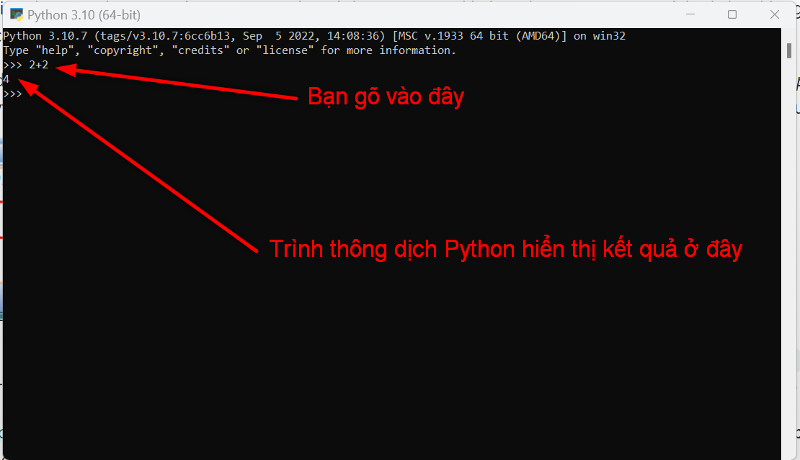
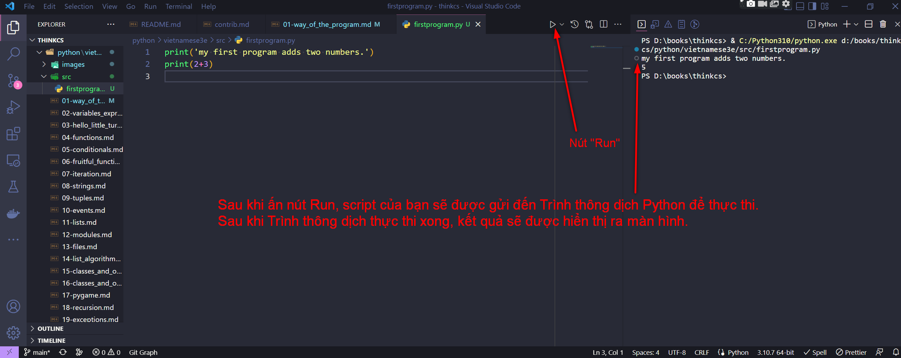

[English Version](http://openbookproject.net/thinkcs/python/english3e/way_of_the_program.html)

# 1. Cách thức của chương trình

Mục tiêu của cuốn sách này là dạy bạn suy nghĩ như một nhà khoa học máy tính. Cách suy nghĩ này bao gồm một số tính năng tốt nhất của toán học, kỹ thuật và khoa học tự nhiên. Giống như các nhà toán học, các nhà khoa học máy tính sử dụng các ngôn ngữ hình thức - [formal language](https://vi.wikipedia.org/wiki/Ng%C3%B4n_ng%E1%BB%AF_h%C3%ACnh_th%E1%BB%A9c) - để biểu thị các ý tưởng (cụ thể là các phép tính). Giống như các kỹ sư, họ thiết kế mọi thứ, lắp ráp các thành phần vào hệ thống và đánh giá sự cân bằng giữa các lựa chọn thay thế. Giống như các nhà khoa học, họ quan sát hành vi của các hệ thống phức tạp, hình thành giả thuyết và kiểm tra các dự đoán.

<details>
  <summary>English version</summary>

  > The goal of this book is to teach you to think like a computer scientist. This way of thinking combines some of the best features of mathematics, engineering, and natural science. Like mathematicians, computer scientists use formal languages to denote ideas (specifically computations). Like engineers, they design things, assembling components into systems and evaluating tradeoffs among alternatives. Like scientists, they observe the behavior of complex systems, form hypotheses, and test predictions.
</details>

Kỹ năng quan trọng nhất đối với một nhà khoa học máy tính là **giải quyết vấn đề**. Giải quyết vấn đề có nghĩa là khả năng hình thành vấn đề, suy nghĩ sáng tạo về giải pháp và diễn đạt giải pháp một cách rõ ràng và chính xác. Hóa ra, quá trình học lập trình là một cơ hội tuyệt vời để thực hành các kỹ năng giải quyết vấn đề. Đó là lý do tại sao chương này được gọi là Cách của chương trình.

<details>
  <summary>English version</summary>

  > The single most important skill for a computer scientist is **problem solving**. Problem solving means the ability to formulate problems, think creatively about solutions, and express a solution clearly and accurately. As it turns out, the process of learning to program is an excellent opportunity to practice problem-solving skills. That’s why this chapter is called, The way of the program.
</details>

Ở một cấp độ, bạn sẽ học lập trình, một kỹ năng hữu ích của chính nó. Ở một cấp độ khác, bạn sẽ sử dụng lập trình như một phương tiện để kết thúc. Khi chúng ta đi cùng, kết thúc đó sẽ trở nên rõ ràng hơn.

<details>
  <summary>English version</summary>

  > On one level, you will be learning to program, a useful skill by itself. On another level, you will use programming as a means to an end. As we go along, that end will become clearer.
</details>

## 1.1. Ngôn ngữ lập trình Python

Ngôn ngữ lập trình bạn sẽ học là Python. Python là một ví dụ về **ngôn ngữ cấp cao**; các ngôn ngữ cấp cao khác mà bạn có thể đã nghe nói đến là C++, PHP, Pascal, C# và Java.

<details>
  <summary>English version</summary>

  > The programming language you will be learning is Python. Python is an example of a **high-level language**; other high-level languages you might have heard of are C++, PHP, Pascal, C#, and Java.
</details>

Như bạn có thể suy ra từ tên ngôn ngữ cấp cao, cũng có **ngôn ngữ cấp thấp**, đôi khi được gọi là ngôn ngữ máy hoặc ngôn ngữ hợp ngữ. Nói một cách dễ hiểu, máy tính chỉ có thể thực thi các chương trình được viết bằng ngôn ngữ cấp thấp. Do đó, các chương trình được viết bằng ngôn ngữ cấp cao phải được dịch sang một thứ gì đó phù hợp hơn trước khi chúng có thể chạy.

<details>
  <summary>English version</summary>

  > As you might infer from the name high-level language, there are also **low-level languages**, sometimes referred to as machine languages or assembly languages. Loosely speaking, computers can only execute programs written in low-level languages. Thus, programs written in a high-level language have to be translated into something more suitable before they can run.
</details>

Hầu hết tất cả các chương trình đều được viết bằng ngôn ngữ bậc cao vì những ưu điểm của chúng. Việc lập trình bằng ngôn ngữ cấp cao dễ dàng hơn nhiều nên các chương trình mất ít thời gian hơn để viết, chúng ngắn hơn và dễ đọc hơn, và chúng có nhiều khả năng chính xác hơn. Thứ hai, các ngôn ngữ cấp cao là **portable**, có nghĩa là chúng có thể chạy trên các loại máy tính khác nhau với ít hoặc không có sửa đổi.

<details>
  <summary>English version</summary>

  > Almost all programs are written in high-level languages because of their advantages. It is much easier to program in a high-level language so programs take less time to write, they are shorter and easier to read, and they are more likely to be correct. Second, high-level languages are **portable**, meaning that they can run on different kinds of computers with few or no modifications.
</details>

Công cụ dịch và chạy Python được gọi là **Trình thông dịch Python**: Có hai cách để sử dụng: *chế độ tức thì* và *chế độ tập lệnh*. Ở chế độ tức thì, bạn nhập biểu thức Python vào cửa sổ Trình thông dịch Python và trình thông dịch ngay lập tức hiển thị kết quả:

<details>
  <summary>English version</summary>

  > The engine that translates and runs Python is called the **Python Interpreter**: There are two ways to use it: *immediate mode* and *script mode*. In immediate mode, you type Python expressions into the Python Interpreter window, and the interpreter immediately shows the result:
</details>



Dấu `>>>` được gọi là **Lời nhắc Python**. Trình thông dịch sử dụng Lời nhắc để chỉ ra rằng nó đã sẵn sàng cho các hướng dẫn. Chúng tôi đã nhập `2 + 2` và Trình thông dịch đánh giá biểu thức của chúng tôi và trả lời là`4`, và trên dòng tiếp theo, nó đưa ra một Lời nhắc mới, cho biết rằng nó đã sẵn sàng để nhập thêm.

<details>
  <summary>English version</summary>

  > The `>>>` is called the **Python prompt**. The interpreter uses the prompt to indicate that it is ready for instructions. We typed `2 + 2`, and the interpreter evaluated our expression, and replied `4`, and on the next line it gave a new prompt, indicating that it is ready for more input.
</details>

Ngoài ra, bạn có thể viết một chương trình trong một tệp và sử dụng trình thông dịch để thực thi nội dung của tệp. Một tệp như vậy được gọi là **script**. Các script có lợi thế là chúng có thể được lưu vào đĩa, in, v.v.

<details>
  <summary>English version</summary>

  > Alternatively, you can write a program in a file and use the interpreter to execute the contents of the file. Such a file is called a **script**. Scripts have the advantage that they can be saved to disk, printed, and so on.
</details>

Trong bản dịch tiếng Việt này chúng tôi sử dụng [Visual Studio Code](https://code.visualstudio.com/docs/languages/python), một IDE phổ biến được dùng bởi các lập trình viên hiện nay. Bạn có thể sử dụng bất kỳ IDE khác nào bạn muốn.

<details>
  <summary>English version</summary>

  > In this Rhodes Local Edition of the textbook, we use a program development environment called **PyScripter**. (It is available at [http://code.google.com/p/pyscripter](http://code.google.com/p/pyscripter).) There are various other development environments. If you’re using one of the others, you might be better off working with the authors’ original book rather than this edition.
</details>

Ví dụ: chúng tôi đã tạo một tệp có tên là `firstprogram.py` bằng cách sử dụng VS Code. Theo quy ước, các tệp chứa chương trình Python có đuôi `.py`

<details>
  <summary>English version</summary>

  > For example, we created a file named `firstprogram.py` using PyScripter. By convention, files that contain Python programs have names that end with `.py`
</details>

Để thực thi chương trình, chúng ta có thể nhấp vào nút **Run** trong VS Code:

<details>
  <summary>English version</summary>

  > To execute the program, we can click the **Run** button in PyScripter:
</details>



Hầu hết các chương trình thú vị hơn chương trình này.

<details>
  <summary>English version</summary>

  > Most programs are more interesting than this one.
</details>

Làm việc trực tiếp trong Trình thông dịch thuận tiện cho việc kiểm tra các đoạn mã ngắn vì bạn nhận được phản hồi ngay lập tức. Hãy coi nó như một tờ giấy nháp được sử dụng để giúp bạn giải quyết các vấn đề. Bất cứ điều gì dài hơn một vài dòng nên được đưa vào một script.

<details>
  <summary>English version</summary>

  > Working directly in the interpreter is convenient for testing short bits of code because you get immediate feedback. Think of it as scratch paper used to help you work out problems. Anything longer than a few lines should be put into a script.
</details>

## 1.2. Chương trình là gì?

**Chương trình** là một chuỗi các hướng dẫn chỉ định cách thực hiện một phép tính. Tính toán có thể là toán học, chẳng hạn như giải một hệ phương trình hoặc tìm nghiệm nguyên của một đa thức, nhưng nó cũng có thể là một phép tính tượng trưng, chẳng hạn như tìm kiếm và thay thế văn bản trong tài liệu hoặc (kỳ lạ là) biên dịch một chương trình.

<details>
  <summary>English version</summary>

  > A **program** is a sequence of instructions that specifies how to perform a computation. The computation might be something mathematical, such as solving a system of equations or finding the roots of a polynomial, but it can also be a symbolic computation, such as searching and replacing text in a document or (strangely enough) compiling a program.
</details>

Các chi tiết có thể khác nhau ở các ngôn ngữ khác nhau, nhưng một số hướng dẫn cơ bản xuất hiện ở mọi ngôn ngữ:

<details>
  <summary>English version</summary>

  > The details look different in different languages, but a few basic instructions appear in just about every language:
</details>

|input|Nhận dữ liệu từ bàn phím, tệp hoặc một số thiết bị khác.|
|output|Hiển thị dữ liệu trên màn hình hoặc gửi dữ liệu đến một tệp hoặc thiết bị khác.|
|math|Thực hiện các phép toán cơ bản như cộng và nhân.|
|conditional execution|Kiểm tra các điều kiện nhất định và thực hiện chuỗi câu lệnh thích hợp.|
|repetition|Thực hiện một số hành động lặp đi lặp lại, thường là với một số biến thể.|

<details>
  <summary>English version</summary>

  > |input|Get data from the keyboard, a file, or some other device.|
  > |output|Display data on the screen or send data to a file or other device.|
  > |math|Perform basic mathematical operations like addition and multiplication.|
  > |conditional execution|Check for certain conditions and execute the appropriate sequence of statements.|
  > |repetition|Perform some action repeatedly, usually with some variation.|
</details>

Tin hay không thì tùy, đó là tất cả những gì cần làm. Mọi chương trình bạn đã từng sử dụng, cho dù phức tạp đến đâu, đều được tạo thành từ các hướng dẫn trông giống như sau. Do đó, chúng ta có thể mô tả lập trình là quá trình chia một nhiệm vụ lớn, phức tạp thành các nhiệm vụ con nhỏ hơn và nhỏ hơn cho đến khi các nhiệm vụ con đủ đơn giản để thực hiện với chuỗi các lệnh cơ bản này.

<details>
  <summary>English version</summary>

  > Believe it or not, that’s pretty much all there is to it. Every program you’ve ever used, no matter how complicated, is made up of instructions that look more or less like these. Thus, we can describe programming as the process of breaking a large, complex task into smaller and smaller subtasks until the subtasks are simple enough to be performed with sequences of these basic instructions.
</details>

Điều đó có thể hơi mơ hồ, nhưng chúng ta sẽ quay lại chủ đề này sau khi chúng ta nói về **thuật toán**.

<details>
  <summary>English version</summary>

  > That may be a little vague, but we will come back to this topic later when we talk about **algorithms**.
</details>

## 1.3. Gỡ lỗi (Debugging) là gì?

Lập trình là một quá trình phức tạp và vì nó được thực hiện bởi con người nên nó thường dẫn đến sai sót. Các lỗi lập trình được gọi là **bug** và quá trình theo dõi chúng và sửa chúng được gọi là **debugging**. Việc sử dụng thuật ngữ *bug* để mô tả những khó khăn nhỏ trong kỹ thuật có từ ít nhất là năm 1889, khi Thomas Edison gặp lỗi với máy quay đĩa của mình.

<details>
  <summary>English version</summary>

  > Programming is a complex process, and because it is done by human beings, it often leads to errors. Programming errors are called **bugs** and the process of tracking them down and correcting them is called **debugging**. Use of the term *bug* to describe small engineering difficulties dates back to at least 1889, when Thomas Edison had a bug with his phonograph.
</details>

Ba loại lỗi có thể xảy ra trong một chương trình: [lỗi cú pháp - syntax](http://en.wikipedia.org/wiki/Syntax_error), [lỗi runtime](http://en.wikipedia.org/wiki/Runtime_error), và [lỗi ngữ nghĩa - semantic](http://en.wikipedia.org/wiki/Logic_error). Sẽ rất hữu ích khi phân biệt giữa chúng để theo dõi chúng nhanh hơn.

<details>
  <summary>English version</summary>

  > Three kinds of errors can occur in a program: [syntax errors](http://en.wikipedia.org/wiki/Syntax_error), [runtime errors](http://en.wikipedia.org/wiki/Runtime_error), and [semantic errors](http://en.wikipedia.org/wiki/Logic_error). It is useful to distinguish between them in order to track them down more quickly.
</details>

## 1.4. Lỗi cú pháp (Syntax)

Python chỉ có thể thực thi một chương trình nếu chương trình đó đúng về mặt cú pháp; nếu không, quá trình không thành công và trả về một thông báo lỗi. **Cú pháp** đề cập đến cấu trúc của một chương trình và các quy tắc về cấu trúc đó. Ví dụ, trong tiếng Việt, một câu phải bắt đầu bằng chữ hoa và kết thúc bằng dấu chấm. câu này chứa một **lỗi cú pháp**. Câu này cũng vậy

<details>
  <summary>English version</summary>

  > Python can only execute a program if the program is syntactically correct; otherwise, the process fails and returns an error message. **Syntax** refers to the structure of a program and the rules about that structure. For example, in English, a sentence must begin with a capital letter and end with a period. this sentence contains a **syntax error**. So does this one
</details>

Đối với hầu hết độc giả, một vài lỗi cú pháp không phải là một vấn đề đáng kể, đó là lý do tại sao chúng ta có thể đọc thơ của E. E. Cummings mà không gặp vấn đề gì. Python không dễ tha thứ như vậy. Nếu có một lỗi cú pháp duy nhất ở bất kỳ đâu trong chương trình của bạn, Python sẽ hiển thị thông báo lỗi và thoát ra, và bạn sẽ không thể chạy chương trình của mình. Trong vài tuần đầu tiên của sự nghiệp lập trình, bạn có thể sẽ dành rất nhiều thời gian để theo dõi các lỗi cú pháp. Tuy nhiên, khi bạn tích lũy được kinh nghiệm, bạn sẽ mắc ít lỗi hơn và tìm thấy chúng nhanh hơn.

<details>
  <summary>English version</summary>

  > For most readers, a few syntax errors are not a significant problem, which is why we can read the poetry of E. E. Cummings without problems. Python is not so forgiving. If there is a single syntax error anywhere in your program, Python will display an error message and quit, and you will not be able to run your program. During the first few weeks of your programming career, you will probably spend a lot of time tracking down syntax errors. As you gain experience, though, you will make fewer errors and find them faster.
</details>

## 1.5. Lỗi runtime

Loại lỗi thứ hai là lỗi runtime, được gọi như vậy vì lỗi không xuất hiện cho đến khi bạn chạy chương trình. Những lỗi này còn được gọi là **ngoại lệ** vì chúng thường chỉ ra rằng một điều gì đó ngoại lệ (và tồi tệ) đã xảy ra.

<details>
  <summary>English version</summary>

  > The second type of error is a runtime error, so called because the error does not appear until you run the program. These errors are also called **exceptions** because they usually indicate that something exceptional (and bad) has happened.
</details>

Lỗi runtime hiếm khi xảy ra trong các chương trình đơn giản mà bạn sẽ thấy trong một vài chương đầu tiên, vì vậy có thể mất một lúc trước khi bạn gặp phải lỗi này.

<details>
  <summary>English version</summary>

  > Runtime errors are rare in the simple programs you will see in the first few chapters, so it might be a while before you encounter one.
</details>

## 1.6. Lỗi ngữ nghĩa (Semantic)

Loại lỗi thứ ba là **lỗi ngữ nghĩa**. Nếu có lỗi ngữ nghĩa trong chương trình của bạn, chương trình sẽ chạy thành công, theo nghĩa là máy tính sẽ không tạo ra bất kỳ thông báo lỗi nào, nhưng nó sẽ không làm đúng. Nó sẽ làm một cái gì đó khác. Cụ thể, nó sẽ làm những gì bạn đã bảo nó làm.

<details>
  <summary>English version</summary>

  > The third type of error is the **semantic error**. If there is a semantic error in your program, it will run successfully, in the sense that the computer will not generate any error messages, but it will not do the right thing. It will do something else. Specifically, it will do what you told it to do.
</details>

Vấn đề là chương trình bạn đã viết không phải là chương trình bạn muốn viết. Ý nghĩa của chương trình (ngữ nghĩa của nó) là sai. Việc xác định lỗi ngữ nghĩa có thể khó khăn vì nó đòi hỏi bạn phải làm việc ngược lại bằng cách xem đầu ra của chương trình và cố gắng tìm ra nó đang làm gì.

<details>
  <summary>English version</summary>

  > The problem is that the program you wrote is not the program you wanted to write. The meaning of the program (its semantics) is wrong. Identifying semantic errors can be tricky because it requires you to work backward by looking at the output of the program and trying to figure out what it is doing.
</details>

## 1.7. Gỡ lỗi thực nghiệm (Experimental debugging)

Một trong những kỹ năng quan trọng nhất bạn sẽ có được là gỡ lỗi. Mặc dù nó có thể gây khó chịu, nhưng gỡ lỗi là một trong những phần giàu trí tuệ, thử thách và thú vị nhất của lập trình.

<details>
  <summary>English version</summary>

  > One of the most important skills you will acquire is debugging. Although it can be frustrating, debugging is one of the most intellectually rich, challenging, and interesting parts of programming.
</details>

Theo một số cách, gỡ lỗi giống như công việc thám tử. Bạn phải đối mặt với các manh mối, và bạn phải suy ra các quá trình và sự kiện dẫn đến kết quả bạn thấy.

<details>
  <summary>English version</summary>

  > In some ways, debugging is like detective work. You are confronted with clues, and you have to infer the processes and events that led to the results you see.
</details>

Gỡ lỗi cũng giống như một môn khoa học thực nghiệm. Khi bạn biết điều gì đang xảy ra, bạn sửa đổi chương trình của mình và thử lại. Nếu giả thuyết của bạn đúng, thì bạn có thể dự đoán kết quả của việc sửa đổi và bạn tiến một bước gần hơn đến chương trình làm việc. Nếu giả thuyết của bạn sai, bạn phải nghĩ ra một giả thuyết mới. Như Sherlock Holmes đã chỉ ra, Khi bạn đã loại bỏ điều không thể, thì bất cứ điều gì còn lại, dù không thể xảy ra, cũng phải là sự thật. (A. Conan Doyle, *The Sign of Four*)

<details>
  <summary>English version</summary>

  > Debugging is also like an experimental science. Once you have an idea what is going wrong, you modify your program and try again. If your hypothesis was correct, then you can predict the result of the modification, and you take a step closer to a working program. If your hypothesis was wrong, you have to come up with a new one. As Sherlock Holmes pointed out, When you have eliminated the impossible, whatever remains, however improbable, must be the truth. (A. Conan Doyle, *The Sign of Four*)
</details>

Đối với một số người, lập trình và gỡ lỗi đều giống nhau. Đó là, lập trình là quá trình gỡ lỗi dần dần một chương trình cho đến khi nó thực hiện những gì bạn muốn. Ý tưởng là bạn nên bắt đầu với một chương trình thực hiện *một cái gì đó* và thực hiện các sửa đổi nhỏ, gỡ lỗi chúng khi bạn tiếp tục, để bạn luôn có một chương trình hoạt động.

<details>
  <summary>English version</summary>

  > For some people, programming and debugging are the same thing. That is, programming is the process of gradually debugging a program until it does what you want. The idea is that you should start with a program that does *something* and make small modifications, debugging them as you go, so that you always have a working program.
</details>

Ví dụ, Linux là một nhân hệ điều hành chứa hàng triệu dòng mã, nhưng nó khởi đầu là một chương trình đơn giản Linus Torvalds dùng để khám phá chip Intel 80386. Theo Larry Greenfield, một trong những dự án trước đây của Linus là chương trình chuyển đổi giữa hiển thị AAAA và BBBB. Điều này sau đó đã phát triển thành Linux (*Hướng dẫn Người dùng Linux* Phiên bản Beta 1).

<details>
  <summary>English version</summary>

  > For example, Linux is an operating system kernel that contains millions of lines of code, but it started out as a simple program Linus Torvalds used to explore the Intel 80386 chip. According to Larry Greenfield, one of Linus’s earlier projects was a program that would switch between displaying AAAA and BBBB. This later evolved to Linux (*The Linux Users’ Guide* Beta Version 1).
</details>

Các chương sau sẽ đưa ra nhiều gợi ý hơn về gỡ lỗi và các phương pháp lập trình khác.

<details>
  <summary>English version</summary>

  > Later chapters will make more suggestions about debugging and other programming practices.
</details>

## 1.8. Ngôn ngữ hình thức và Ngôn ngữ tự nhiên

**Ngôn ngữ tự nhiên** là ngôn ngữ mà mọi người nói, chẳng hạn như tiếng Anh, tiếng Tây Ban Nha và tiếng Pháp. Chúng không được thiết kế bởi mọi người (mặc dù mọi người cố gắng áp đặt một số trật tự cho chúng); chúng tiến hóa một cách tự nhiên.

<details>
  <summary>English version</summary>

  > **Natural languages** are the languages that people speak, such as English, Spanish, and French. They were not designed by people (although people try to impose some order on them); they evolved naturally.
</details>

**Ngôn ngữ hình thức** là ngôn ngữ được mọi người thiết kế cho các ứng dụng cụ thể. Ví dụ, ký hiệu mà các nhà toán học sử dụng là một ngôn ngữ hình thức đặc biệt tốt trong việc biểu thị mối quan hệ giữa các con số và ký hiệu. Các nhà hóa học sử dụng một ngôn ngữ hình thức để biểu diễn cấu trúc hóa học của các phân tử. Và quan trọng nhất:

<details>
  <summary>English version</summary>

  > **Formal languages** are languages that are designed by people for specific applications. For example, the notation that mathematicians use is a formal language that is particularly good at denoting relationships among numbers and symbols. Chemists use a formal language to represent the chemical structure of molecules. And most importantly:
</details>

```
Ngôn ngữ lập trình là ngôn ngữ hình thức được thiết kế để thể hiện các phép tính.
```

<details>
  <summary>English version</summary>

  > ```
  > Programming languages are formal languages that have been designed to express computations.
  > ```
</details>

Các ngôn ngữ hình thức có xu hướng có các quy tắc chặt chẽ về cú pháp. Ví dụ: `3 + 3 = 6` là một câu lệnh toán học đúng về mặt cú pháp, nhưng `3=+6$` thì không. H<sub>2</sub>O là tên hóa học chính xác về mặt cú pháp, nhưng <sub>2</sub>Zz thì không.

<details>
  <summary>English version</summary>

  > Formal languages tend to have strict rules about syntax. For example, `3+3=6` is a syntactically correct mathematical statement, but `3=+6$` is not. H<sub>2</sub>O is a syntactically correct chemical name, but <sub>2</sub>Zz is not.
</details>

Các quy tắc cú pháp có hai loại, liên quan đến **token** và cấu trúc. Token là các yếu tố cơ bản của ngôn ngữ, chẳng hạn như ký tự, số, dấu ngoặc đơn, dấu phẩy, v.v. Trong Python, một câu lệnh như `print("Happy New Year for", 2013)` có 6 token: tên hàm, dấu ngoặc đơn mở (, chuỗi, dấu phẩy, số và dấu ngoặc đóng ).

<details>
  <summary>English version</summary>

  > Syntax rules come in two flavors, pertaining to **tokens** and structure. Tokens are the basic elements of the language, such as words, numbers, parentheses, commas, and so on. In Python, a statement like `print("Happy New Year for ",2013)` has 6 tokens: a function name, an open parenthesis (round bracket), a string, a comma, a number, and a close parenthesis.
</details>

Một người có thể mắc lỗi trong cách xây dựng token. Một trong những vấn đề với `3=+6$` là `$` không phải là một token hợp pháp trong toán học (ít nhất là theo những gì chúng tôi biết). Tương tự, <sub>2</sub>Zz không phải là token hợp pháp trong ký hiệu hóa học vì không có phần tử nào có chữ viết tắt `Zz`.

<details>
  <summary>English version</summary>

  > It is possible to make errors in the way one constructs tokens. One of the problems with `3=+6$` is that `$` is not a legal token in mathematics (at least as far as we know). Similarly, <sub>2</sub>Zz is not a legal token in chemistry notation because there is no element with the abbreviation `Zz`.
</details>

Loại quy tắc cú pháp thứ hai liên quan đến **cấu trúc** của một câu lệnh — nghĩa là cách sắp xếp các token. Câu lệnh `3=+6$` về mặt cấu trúc là không hợp pháp vì bạn không thể đặt dấu cộng ngay sau dấu bằng. Tương tự, công thức phân tử phải có ký hiệu con sau tên nguyên tố, không phải trước. Và trong ví dụ Python của chúng tôi, nếu chúng tôi bỏ qua dấu phẩy hoặc nếu chúng tôi thay đổi hai dấu ngoặc đơn xung quanh để nói `print)"Happy New Year for", 2013(`, câu lệnh của chúng tôi sẽ vẫn có sáu token hợp pháp và hợp lệ, nhưng cấu trúc là không hợp lệ.

<details>
  <summary>English version</summary>

  > The second type of syntax rule pertains to the **structure** of a statement— that is, the way the tokens are arranged. The statement `3=+6$` is structurally illegal because you can’t place a plus sign immediately after an equal sign. Similarly, molecular formulas have to have subscripts after the element name, not before. And in our Python example, if we omitted the comma, or if we changed the two parentheses around to say `print)"Happy New Year for ",2013(` our statement would still have six legal and valid tokens, but the structure is illegal.
</details>

Khi bạn đọc một câu bằng tiếng Anh hoặc một câu trong ngôn ngữ hình thức, bạn phải tìm ra cấu trúc của câu đó là gì (mặc dù trong ngôn ngữ tự nhiên, bạn làm điều này trong tiềm thức). Quá trình này được gọi là **phân tích cú pháp**.

<details>
  <summary>English version</summary>

  > When you read a sentence in English or a statement in a formal language, you have to figure out what the structure of the sentence is (although in a natural language you do this subconsciously). This process is called **parsing**.
</details>

Ví dụ, khi bạn nghe câu, "The other shoe fall", bạn hiểu rằng "The other shoe" là chủ ngữ và "fall" là động từ. Khi bạn đã phân tích cú pháp một câu, bạn có thể tìm ra ý nghĩa của nó hoặc **ngữ nghĩa** của câu. Giả sử bạn biết "shoe" là gì và "fall" nghĩa là gì, bạn sẽ hiểu được hàm ý chung của câu này.

<details>
  <summary>English version</summary>

  > For example, when you hear the sentence, “The other shoe fell”, you understand that the other shoe is the subject and fell is the verb. Once you have parsed a sentence, you can figure out what it means, or the **semantics** of the sentence. Assuming that you know what a shoe is and what it means to fall, you will understand the general implication of this sentence.
</details>

Mặc dù ngôn ngữ hình thức và ngôn ngữ tự nhiên có nhiều đặc điểm chung - token, cấu trúc, cú pháp và ngữ nghĩa - có nhiều điểm khác biệt:

<details>
  <summary>English version</summary>

  > Although formal and natural languages have many features in common — tokens, structure, syntax, and semantics — there are many differences:
</details>

| Từ khóa | Mô tả |
| --- | --- |
|**sự mơ hồ**|Ngôn ngữ tự nhiên chứa đầy sự mơ hồ, mà mọi người đối phó bằng cách sử dụng các manh mối ngữ cảnh và thông tin khác. Các ngôn ngữ hình thức được thiết kế để gần như hoặc hoàn toàn rõ ràng, có nghĩa là bất kỳ câu lệnh nào cũng có chính xác một ý nghĩa, bất kể ngữ cảnh.|
|**rườm rà**|Để bù đắp cho sự mơ hồ và giảm bớt sự hiểu lầm, các ngôn ngữ tự nhiên sử dụng rất nhiều phần thừa. Kết quả là, chúng thường dài dòng. Ngôn ngữ hình thức ít thừa và ngắn gọn hơn.|
|**nghĩa đen**|Ngôn ngữ hình thức có nghĩa là chính xác những gì họ nói. Mặt khác, ngôn ngữ tự nhiên chứa đầy thành ngữ và ẩn dụ. Nếu ai đó nói, "Chiếc giày kia rơi", có lẽ không có chiếc giày và không có gì rơi. Bạn sẽ cần tìm câu nói đùa ban đầu để hiểu ý nghĩa thành ngữ của chiếc giày kia rơi. Yahoo! Câu trả lời nghĩ rằng nó biết!|

<details>
  <summary>English version</summary>

  > | Keyword | Description |
  > | --- | --- |
  > |**ambiguity**|Natural languages are full of ambiguity, which people deal with by using contextual clues and other information. Formal languages are designed to be nearly or completely unambiguous, which means that any statement has exactly one meaning, regardless of context.|
  > |**redundancy**|In order to make up for ambiguity and reduce misunderstandings, natural languages employ lots of redundancy. As a result, they are often verbose. Formal languages are less redundant and more concise.|
  > |**literalness**|Formal languages mean exactly what they say. On the other hand, natural languages are full of idiom and metaphor. If someone says, “The other shoe fell”, there is probably no shoe and nothing falling. You’ll need to find the original joke to understand the idiomatic meaning of the other shoe falling. Yahoo! Answers thinks it knows!|
</details>

Mỗi người lớn lên nói một ngôn ngữ tự nhiên - tất cả mọi người - thường gặp khó khăn trong việc điều chỉnh để sử dụng các ngôn ngữ hình thức. Theo một cách nào đó, sự khác biệt giữa ngôn ngữ hình thức và ngôn ngữ tự nhiên giống như sự khác biệt giữa thơ và văn xuôi, nhưng còn hơn thế nữa:

<details>
  <summary>English version</summary>

  > People who grow up speaking a natural language—everyone—often have a hard time adjusting to formal languages. In some ways, the difference between formal and natural language is like the difference between poetry and prose, but more so:
</details>

| Từ khóa | Mô tả |
| --- | --- |
|**thơ**|Các từ được sử dụng cho âm thanh cũng như ý nghĩa của chúng, và toàn bộ bài thơ cùng nhau tạo ra một hiệu ứng hoặc cảm xúc. Sự mơ hồ không chỉ phổ biến mà thường có chủ ý.|
|**văn xuôi**|Nghĩa đen của từ quan trọng hơn, và cấu trúc đóng góp nhiều ý nghĩa hơn. Văn xuôi dễ phân tích hơn thơ nhưng vẫn thường mơ hồ.|
|**chương trình**|Ý nghĩa của một chương trình máy tính là rõ ràng và theo nghĩa đen, và có thể được hiểu hoàn toàn bằng cách phân tích các token và cấu trúc.|

<details>
  <summary>English version</summary>

  > | Keyword | Description |
  > | --- | --- |
  > |**poetry**|Words are used for their sounds as well as for their meaning, and the whole poem together creates an effect or emotional response. Ambiguity is not only common but often deliberate.|
  > |**prose**|The literal meaning of words is more important, and the structure contributes more meaning. Prose is more amenable to analysis than poetry but still often ambiguous.|
  > |**program**|The meaning of a computer program is unambiguous and literal, and can be understood entirely by analysis of the tokens and structure.|
</details>

Dưới đây là một số gợi ý cho việc đọc các chương trình (và các ngôn ngữ hình thức khác). Đầu tiên, hãy nhớ rằng ngôn ngữ hình thức đần độn hơn nhiều so với ngôn ngữ tự nhiên, vì vậy sẽ mất nhiều thời gian hơn để đọc chúng. Ngoài ra, cấu trúc cũng rất quan trọng, vì vậy bạn thường không nên đọc từ trên xuống dưới, từ trái sang phải. Thay vào đó, hãy học cách phân tích chương trình trong đầu bạn, xác định các token và diễn giải cấu trúc. Cuối cùng, các chi tiết quan trọng. Những điều nhỏ nhặt như lỗi chính tả và dấu câu sai, mà bạn có thể loại bỏ bằng ngôn ngữ tự nhiên, có thể tạo ra sự khác biệt lớn trong một ngôn ngữ hình thức.

<details>
  <summary>English version</summary>

  > Here are some suggestions for reading programs (and other formal languages). First, remember that formal languages are much more dense than natural languages, so it takes longer to read them. Also, the structure is very important, so it is usually not a good idea to read from top to bottom, left to right. Instead, learn to parse the program in your head, identifying the tokens and interpreting the structure. Finally, the details matter. Little things like spelling errors and bad punctuation, which you can get away with in natural languages, can make a big difference in a formal language.
</details>

## 1.9. Chương trình đầu tiên

Theo truyền thống, chương trình đầu tiên được viết bằng một ngôn ngữ mới được gọi là `Hello, World!` Bởi vì tất cả những gì nó làm là hiển thị các từ: "Hello, World!" Trong Python, tập lệnh trông giống như sau:

<details>
  <summary>English version</summary>

  > Traditionally, the first program written in a new language is called `Hello, World!` because all it does is display the words, Hello, World! In Python, the script looks like this: (For scripts, we’ll show line numbers to the left of the Python statements.)
</details>

```python
print("Hello, World!")
```

Đây là một ví dụ về việc sử dụng hàm **print**, hàm này không thực sự in bất cứ thứ gì trên giấy. Nó hiển thị một giá trị trên màn hình. Trong trường hợp này, kết quả hiển thị là

<details>
  <summary>English version</summary>

  > This is an example of using the **print function**, which doesn’t actually print anything on paper. It displays a value on the screen. In this case, the result shown is
</details>

```
Hello, World!
```

Dấu ngoặc kép trong chương trình đánh dấu phần đầu và phần cuối của giá trị; chúng không xuất hiện trong kết quả.

<details>
  <summary>English version</summary>

  > The quotation marks in the program mark the beginning and end of the value; they don’t appear in the result.
</details>

Một số người đánh giá chất lượng của một ngôn ngữ lập trình bằng sự đơn giản của chương trình `Hello, World!`. Theo tiêu chuẩn này, Python làm tốt nhất có thể.

<details>
  <summary>English version</summary>

  > Some people judge the quality of a programming language by the simplicity of the Hello, World! program. By this standard, Python does about as well as possible.
</details>

## 1.10. Chú thích

Khi các chương trình ngày càng lớn hơn và phức tạp hơn, chúng sẽ khó đọc hơn. Các ngôn ngữ hình thức thường tối nghĩa, và thường rất khó để nhìn vào một đoạn mã và tìm ra nó đang làm gì hoặc tại sao.

<details>
  <summary>English version</summary>

  > As programs get bigger and more complicated, they get more difficult to read. Formal languages are dense, and it is often difficult to look at a piece of code and figure out what it is doing, or why.
</details>

Vì lý do này, bạn nên thêm chú thích vào chương trình của mình để giải thích bằng ngôn ngữ tự nhiên về những gì chương trình đang làm.

<details>
  <summary>English version</summary>

  > For this reason, it is a good idea to add notes to your programs to explain in natural language what the program is doing.
</details>

**Chú thích** trong một chương trình máy tính là văn bản chỉ dành cho người đọc - nó hoàn toàn bị trình thông dịch bỏ qua.

<details>
  <summary>English version</summary>

  > A **comment** in a computer program is text that is intended only for the human reader — it is completely ignored by the interpreter.
</details>

Trong Python, token `#` là bắt đầu của một chú thích. Phần còn lại của dòng được bỏ qua. Đây là phiên bản mới của *Hello, World!*.

<details>
  <summary>English version</summary>

  > In Python, the `#` token starts a comment. The rest of the line is ignored. Here is a new version of *Hello, World!*.
</details>

```python
#---------------------------------------------------
# This demo program shows off how elegant Python is!
# Written by Joe Soap, December 2010.
# Anyone may freely copy or modify this program.
#---------------------------------------------------

print("Hello, World!")     # Isn't this easy!
```

Bạn cũng sẽ nhận thấy rằng chúng tôi đã để lại một dòng trống trong chương trình. Các dòng trống cũng bị trình thông dịch bỏ qua, nhưng chú thích và dòng trống có thể giúp con người phân tích cú pháp chương trình của bạn dễ dàng hơn nhiều. Hãy sử dụng chúng một cách phóng khoáng!

<details>
  <summary>English version</summary>

  > You’ll also notice that we’ve left a blank line in the program. Blank lines are also ignored by the interpreter, but comments and blank lines can make your programs much easier for humans to parse. Use them liberally!
</details>

## 1.11. Bảng chú giải

| Từ khóa | Mô tả |
| --- | --- |
|**thuật toán**|Một tập hợp các bước cụ thể để giải quyết một loại vấn đề.|
|**bug**|Một lỗi trong một chương trình.|
|**chú thích**|Thông tin trong chương trình dành cho các lập trình viên khác (hoặc bất kỳ ai đọc mã nguồn) và không ảnh hưởng đến việc thực thi chương trình.|
|**gỡ lỗi**|Quá trình tìm và loại bỏ bất kỳ lỗi nào trong ba loại lỗi lập trình.|
|**ngoại lệ**|Tên khác của lỗi runtime.|
|**ngôn ngữ hình thức**|Bất kỳ một trong những ngôn ngữ mà mọi người đã thiết kế cho các mục đích cụ thể, chẳng hạn như đại diện cho các ý tưởng toán học hoặc chương trình máy tính; tất cả các ngôn ngữ lập trình đều là ngôn ngữ hình thức.|
|**ngôn ngữ cấp cao**|Một ngôn ngữ lập trình như Python được thiết kế để con người dễ đọc và viết.|
|**chế độ tức thì**|Một kiểu sử dụng Python trong đó chúng ta nhập các biểu thức tại dấu nhắc lệnh và kết quả được hiển thị ngay lập tức. Tương phản với tập lệnh và được tìm thấy trong Python shell.|
|**trình thông dịch**|Công cụ thực thi các tập lệnh hoặc biểu thức Python của bạn.|
|**ngôn ngữ cấp thấp**|Một ngôn ngữ lập trình được thiết kế để máy tính dễ thực thi; còn được gọi là ngôn ngữ máy hoặc hợp ngữ.|
|**ngôn ngữ tự nhiên**|Bất kỳ ngôn ngữ nói nào của con người được phát triển một cách tự nhiên.|
|**object code**|Đầu ra của trình biên dịch sau khi nó dịch chương trình.|
|**phân tích cú pháp**|Để kiểm tra một chương trình và phân tích cấu trúc cú pháp.|
|**tính di động**|Thuộc tính của chương trình có thể chạy trên nhiều loại máy tính.|
|**hàm print**|Một hàm được sử dụng trong một chương trình hoặc tập lệnh khiến trình thông dịch Python hiển thị một giá trị trên thiết bị đầu ra của nó.|
|**giải quyết vấn đề**|Quá trình hình thành một vấn đề, tìm ra giải pháp và thể hiện giải pháp.|
|**chương trình**|một chuỗi các hướng dẫn chỉ định các hành động và tính toán của máy tính sẽ được thực hiện.|
|**Python shell**|Một giao diện người dùng tương tác với trình thông dịch Python. Người dùng Python shell nhập các lệnh tại dấu nhắc (>>>) và nhấn phím enter để gửi các lệnh này ngay lập tức đến trình thông dịch để xử lý. Từ `shell` bắt nguồn từ Unix.|
|**runtime error**|Một lỗi không xảy ra cho đến khi chương trình bắt đầu thực thi nhưng điều đó ngăn chương trình tiếp tục.|
|**script**|Một chương trình được lưu trữ trong một tệp (thường là một chương trình sẽ được thông dịch).|
|**lỗi ngữ nghĩa**|Một lỗi trong một chương trình khiến nó làm điều gì đó khác với những gì lập trình viên dự định.|
|**ngữ nghĩa**|Ý nghĩa của một chương trình.|
|**mã nguồn**|Một chương trình bằng ngôn ngữ cấp cao trước khi được biên dịch.|
|**cú pháp**|Cấu trúc của một chương trình.|
|**lỗi cú pháp**|Một lỗi trong chương trình khiến nó không thể phân tích cú pháp - và do đó không thể diễn giải.|
|**token**|Một trong những yếu tố cơ bản của cấu trúc cú pháp của chương trình, tương tự như một từ trong ngôn ngữ tự nhiên.|

<details>
  <summary>English version</summary>

  > | Keyword | Description |
  > | --- | --- |
  > |**algorithm**|A set of specific steps for solving a category of problems.|
  > |**bug**|An error in a program.|
  > |**comment**|Information in a program that is meant for other programmers (or anyone reading the source code) and has no effect on the execution of the program.|
  > |**debugging**|The process of finding and removing any of the three kinds of programming errors.|
  > |**exception**|Another name for a runtime error.|
  > |**formal language**|Any one of the languages that people have designed for specific purposes, such as representing mathematical ideas or computer programs; all programming languages are formal languages.|
  > |**high-level language**|A programming language like Python that is designed to be easy for humans to read and write.|
  > |**immediate mode**|A style of using Python where we type expressions at the command prompt, and the results are shown immediately. Contrast with script, and see the entry under Python shell.|
  > |**interpreter**|The engine that executes your Python scripts or expressions.|
  > |**low-level language**|A programming language that is designed to be easy for a computer to execute; also called machine language or assembly language.|
  > |**natural language**|Any one of the languages that people speak that evolved naturally.|
  > |**object code**|The output of the compiler after it translates the program.|
  > |**parse**|To examine a program and analyze the syntactic structure.|
  > |**portability**|A property of a program that can run on more than one kind of computer.|
  > |**print function**|A function used in a program or script that causes the Python interpreter to display a value on its output device.|
  > |**problem solving**|The process of formulating a problem, finding a solution, and expressing the solution.|
  > |**program**|a sequence of instructions that specifies to a computer actions and computations to be performed.|
  > |**Python shell**|An interactive user interface to the Python interpreter. The user of a Python shell types commands at the prompt (>>>), and presses the return key to send these commands immediately to the interpreter for processing. The word `shell` comes from Unix. In the PyScripter used in this RLE version of the book, the Interpreter Window is where we’d do the immediate mode interaction.|
  > |**runtime error**|An error that does not occur until the program has started to execute but that prevents the program from continuing.|
  > |**script**|A program stored in a file (usually one that will be interpreted).|
  > |**semantic error**|An error in a program that makes it do something other than what the programmer intended.|
  > |**semantics**|The meaning of a program.|
  > |**source code**|A program in a high-level language before being compiled.|
  > |**syntax**|The structure of a program.|
  > |**syntax error**|An error in a program that makes it impossible to parse — and therefore impossible to interpret.|
  > |**token**|One of the basic elements of the syntactic structure of a program, analogous to a word in a natural language.|
</details>

## 1.12. Bài tập

1. Viết một câu tiếng Anh với ngữ nghĩa dễ hiểu nhưng sai cú pháp. Viết một câu tiếng Anh khác đúng cú pháp nhưng có lỗi ngữ nghĩa.

2. Sử dụng trình thông dịch Python, nhập `1 + 2` và sau đó nhấn Enter. Python *đánh giá* *biểu thức* này, hiển thị kết quả và sau đó hiển thị một lời nhắc khác. _*_ là *multiplication operator* (toán tử nhân) và _**_ là toán tử _exponentiation operator_ (toán tử lũy thừa). Thử nghiệm bằng cách nhập các biểu thức khác nhau và ghi lại những gì được trình thông dịch Python hiển thị.

3. Nhập `1 2` và sau đó nhấn Enter. Python cố gắng đánh giá biểu thức, nhưng không thể vì biểu thức không hợp lệ về mặt cú pháp. Thay vào đó, nó hiển thị thông báo lỗi:

```python
  File "<interactive input>", line 1
    1 2
      ^
SyntaxError: invalid syntax
```

Trong nhiều trường hợp, Python cho biết lỗi cú pháp xảy ra ở đâu, nhưng không phải lúc nào lỗi cú pháp cũng đúng và không cung cấp cho bạn nhiều thông tin về lỗi cú pháp.

Vì vậy, phần lớn, bạn phải học các quy tắc cú pháp.

Trong trường hợp này, Python đang phàn nàn vì không có toán tử giữa các số.

Hãy xem liệu bạn có thể tìm thêm một vài ví dụ về những thứ sẽ tạo ra thông báo lỗi khi bạn nhập chúng tại dấu nhắc Python hay không. Viết ra những gì bạn nhập tại dấu nhắc và dòng cuối cùng của thông báo lỗi mà Python báo cáo lại cho bạn.

4. Gõ `print("hello")`. Python thực thi điều này, có tác dụng in các chữ cái h-e-l-l-o. Lưu ý rằng dấu ngoặc kép mà bạn đã sử dụng để bao quanh chuỗi không phải là một phần của đầu ra. Bây giờ gõ `"hello"` và mô tả kết quả của bạn. Ghi chú khi nào bạn thấy dấu ngoặc kép và khi nào thì không.

5. Gõ `cheese` không có dấu ngoặc kép. Đầu ra sẽ giống như thế này:

```python
Traceback (most recent call last):
  File "<interactive input>", line 1, in ?
NameError: name 'cheese' is not defined
```

Đây là lỗi  runtime; cụ thể, nó là NameError, và cụ thể hơn, nó là lỗi do tên `cheese` không được xác định. Nếu bạn chưa biết điều đó có nghĩa là gì, bạn sẽ sớm làm biết.

6. Nhập `6 + 4 * 9` tại dấu nhắc Python và nhấn enter. Ghi lại những gì xảy ra.

Bây giờ hãy tạo một tệp Python với các nội dung sau:

```python
 6 + 4 * 9
```

Điều gì xảy ra khi bạn chạy tệp này? Bây giờ thay đổi nội dung tệp thành:

```python
print(6 + 4 * 9)
```

và chạy lại.

Điều gì đã xảy ra lần này?

Bất cứ khi nào một _biểu thức_ được nhập tại dấu nhắc Python, nó sẽ được thực thi và kết quả _tự động_ được hiển thị ở dòng bên dưới. (Giống như trên máy tính bỏ túi của bạn, nếu bạn nhập biểu thức này, bạn sẽ nhận được kết quả 42.)

Tuy nhiên, một tệp là khác. Các thực thi của biểu thức không được hiển thị tự động, vì vậy cần sử dụng hàm **print** để hiển thị câu trả lời.

Hầu như không cần thiết phải sử dụng hàm *print* ở chế độ tức thì tại dấu nhắc lệnh.

<details>
  <summary>English version</summary>

  > 1. Write an English sentence with understandable semantics but incorrect syntax. Write another English sentence which has correct syntax but has semantic errors.
  >
  > 2. Using the Python interpreter, type `1 + 2` and then hit return. Python *evaluates* this *expression*, displays the result, and then shows another prompt. _*_ is the *multiplication operator*, and _**_ is the _exponentiation operator_. Experiment by entering different expressions and recording what is displayed by the Python interpreter.
  >
  > 3. Type `1 2` and then hit return. Python tries to evaluate the expression, but it can’t because the expression is not syntactically legal. Instead, it shows the error message:
  >
  > ```python
  >   File "<interactive input>", line 1
  >     1 2
  >       ^
  > SyntaxError: invalid syntax
  > ```
  >
  > In many cases, Python indicates where the syntax error occurred, but it is not always right, and it doesn’t give you much information about what is wrong.
  >
  > So, for the most part, the burden is on you to learn the syntax rules.
  >
  > In this case, Python is complaining because there is no operator between the numbers.
  >
  > See if you can find a few more examples of things that will produce error messages when you enter them at the Python prompt. Write down what you enter at the prompt and the last line of the error message that Python reports back to you.
  >
  > 4. Type `print("hello")`. Python executes this, which has the effect of printing the letters h-e-l-l-o. Notice that the quotation marks that you used to enclose the string are not part of the output. Now type `"hello"` and describe your result. Make notes of when you see the quotation marks and when you don’t.
  >
  > 5. Type `cheese` without the quotation marks. The output will look something like this:
  >
  > ```python
  > Traceback (most recent call last):
  >   File "<interactive input>", line 1, in ?
  > NameError: name 'cheese' is not defined
  > ```
  >
  > This is a run-time error; specifically, it is a NameError, and even more specifically, it is an error because the name `cheese` is not defined. If you don’t know what that means yet, you will soon.
  >
  > 6. Type `6 + 4 * 9` at the Python prompt and hit enter. Record what happens.
  >
  > Now create a Python script with the following contents:
  >
  > ```python
  >  6 + 4 * 9
  > ```
  >
  > What happens when you run this script? Now change the script contents to:
  >
  > ```python
  > print(6 + 4 * 9)
  > ```
  >
  > and run it again.
  >
  > What happened this time?
  >
  > Whenever an _expression_ is typed at the Python prompt, it is evaluated and the result is _automatically_ shown on the line below. (Like on your calculator, if you type this expression you’ll get the result 42.)
  >
  > A script is different, however. Evaluations of expressions are not automatically displayed, so it is necessary to use the **print** function to make the answer show up.
  >
  > It is hardly ever necessary to use the print function in immediate mode at the command prompt.
</details>

## Liên kết hữu dụng
- [Mục lục](README.md)
- [Trang trước](contrib.md) - Danh sách cộng tác viên
- [Trang kế](02-variables_expressions_statements.md) - Biến, biểu thức và câu lệnh
