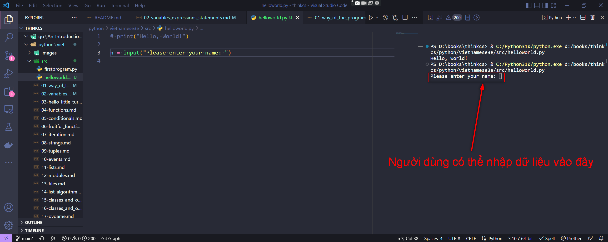
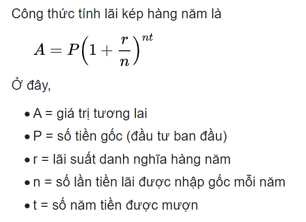

[English Version](http://openbookproject.net/thinkcs/python/english3e/variables_expressions_statements.html)

# 2. Biến, biểu thức và câu lệnh

## 2.1. Giá trị và kiểu dữ liệu

**Giá trị** là một trong những thứ cơ bản - như một chữ cái hoặc một số - mà một chương trình thao tác. Các giá trị mà chúng ta đã thấy cho đến bây giờ là 4 (kết quả khi chúng ta làm phép tínhthêm `2 + 2`) và `"Hello, World!"`.

<details>
  <summary>English version</summary>

  > A **value** is one of the fundamental things — like a letter or a number — that a program manipulates. The values we have seen so far are 4 (the result when we added `2 + 2`), and `"Hello, World!"`.
</details>

Các giá trị này được phân loại thành các **lớp** (class) hoặc **kiểu dữ liệu** (data type) khác nhau: `4` là một *số nguyên* và `"Hello, World!"` là một *chuỗi*, được gọi như thế là vì nó chứa một chuỗi các chữ cái. Bạn (và trình thông dịch) có thể xác định các chuỗi vì chúng được đặt trong dấu nháy kép.

<details>
  <summary>English version</summary>

  > These values are classified into different **classes**, or **data types**: `4` is an *integer*, and `"Hello, World!"` is a *string*, so-called because it contains a string of letters. You (and the interpreter) can identify strings because they are enclosed in quotation marks.
</details>

Nếu bạn không chắc giá trị thuộc lớp nào, Python có một hàm gọi là **type** có thể cho bạn biết.

<details>
  <summary>English version</summary>

  > If you are not sure what class a value falls into, Python has a function called **type** which can tell you.
</details>

```python
>>> type("Hello, World!")
<class 'str'>
>>> type(17)
<class 'int'>
```

Các chuỗi thuộc về lớp **str** và các số nguyên thuộc về lớp **int**. Ít rõ ràng hơn, các số có dấu thập phân thuộc về một lớp được gọi là **float**, vì những số này được biểu diễn ở định dạng được gọi là *floating-point* ([dấu phẩy động](https://vi.wikipedia.org/wiki/S%E1%BB%91_th%E1%BB%B1c_d%E1%BA%A5u_ph%E1%BA%A9y_%C4%91%E1%BB%99ng)). Ở giai đoạn này, bạn có thể coi các từ *class* và *type* thay thế cho nhau. Chúng ta sẽ trở lại để hiểu sâu hơn về lớp là gì trong các chương sau.

<details>
  <summary>English version</summary>

  > Not surprisingly, strings belong to the class **str** and integers belong to the class **int**. Less obviously, numbers with a decimal point belong to a class called **float**, because these numbers are represented in a format called *floating-point*. At this stage, you can treat the words *class* and *type* interchangeably. We’ll come back to a deeper understanding of what a class is in later chapters.
</details>

```python
>>> type(3.2)
<class 'float'>
```

Còn các giá trị như `"17"` và `"3.2"` thì sao? Chúng trông giống như số, nhưng chúng nằm trong dấu nháy kép giống như chuỗi.

<details>
  <summary>English version</summary>

  > What about values like `"17"` and `"3.2"`? They look like numbers, but they are in quotation marks like strings.
</details>

```python
>>> type("17")
<class 'str'>
>>> type("3.2")
<class 'str'>
```

Chúng là chuỗi!

Các chuỗi trong Python có thể được đặt trong dấu nháy đơn (`'`) hoặc dấu nháy kép (`"`) hoặc ba trong số mỗi dấu (`'''` hoặc `"""`)

<details>
  <summary>English version</summary>

  > They’re strings!
  >
  > Strings in Python can be enclosed in either single quotes (`'`) or double quotes (`"`), or three of each (`'''` or `"""`)
</details>

```python
>>> type('This is a string.')
<class 'str'>
>>> type("And so is this.")
<class 'str'>
>>> type("""and this.""")
<class 'str'>
>>> type('''and even this...''')
<class 'str'>
```

Các chuỗi nằm trong dấu nháy kép có thể bao gồm các dấu nháy đơn bên trong chúng, như trong `"Bruce's beard"`, và Các chuỗi nằm trong dấu nháy đơn có thể bao gồm các dấu nháy kép bên trong chúng, như trong `'The knights who say "Ni!"'`.

<details>
  <summary>English version</summary>

  > Double quoted strings can contain single quotes inside them, as in `"Bruce's beard"`, and single quoted strings can have double quotes inside them, as in `'The knights who say "Ni!"'`.
</details>

Các chuỗi nằm trong ba dấu nháy đơn hoặc ba dấu nháy kép được gọi là chuỗi được trích dẫn ba lần (triple quoted strings). Chúng có thể chứa dấu nháy đơn hoặc dấu nháy kép:

<details>
  <summary>English version</summary>

  > Strings enclosed with three occurrences of either quote symbol are called triple quoted strings. They can contain either single or double quotes:
</details>

```php
>>> print('''"Oh no", she exclaimed, "Ben's bike is broken!"''')
"Oh no", she exclaimed, "Ben's bike is broken!"
>>>
```

Chuỗi được trích dẫn ba lần thậm chí có thể kéo dài nhiều dòng:

<details>
  <summary>English version</summary>

  > Triple quoted strings can even span multiple lines:
</details>

```python
>>> message = """This message will
... span several
... lines."""
>>> print(message)
This message will
span several
lines.
>>>
```

Python không quan tâm đến việc bạn sử dụng dấu nháy đơn hay dấu nháy kép hoặc trích dẫn ba lần để bao quanh chuỗi của bạn: một khi nó đã phân tích cú pháp văn bản của chương trình hoặc lệnh của bạn, cách nó lưu trữ giá trị là giống nhau trong mọi trường hợp và các dấu nháy bao quanh không phải là một phần của giá trị. Nhưng khi trình thông dịch muốn hiển thị một chuỗi, nó phải quyết định sử dụng dấu nháy nào để làm cho nó giống như một chuỗi.

<details>
  <summary>English version</summary>

  > Python doesn’t care whether you use single or double quotes or the three-of-a-kind quotes to surround your strings: once it has parsed the text of your program or command, the way it stores the value is identical in all cases, and the surrounding quotes are not part of the value. But when the interpreter wants to display a string, it has to decide which quotes to use to make it look like a string.
</details>

```python
>>> 'This is a string.'
'This is a string.'
>>> """And so is this."""
'And so is this.'
```

Vì vậy, các nhà thiết kế ngôn ngữ Python thường chọn bao quanh các chuỗi của họ bằng các dấu nháy đơn. Điều gì sẽ xảy ra nếu chuỗi đã chứa dấu nháy đơn?

<details>
  <summary>English version</summary>

  > So the Python language designers usually chose to surround their strings by single quotes. What do think would happen if the string already contained single quotes?
</details>

<details>
  <summary>English version</summary>

  > Khi bạn nhập một số nguyên lớn, bạn có thể muốn sử dụng dấu phẩy giữa các nhóm gồm ba chữ số, như trong `42,000`. Đây không phải là một số nguyên hợp pháp trong Python, nhưng nó có nghĩa là hai số nguyên, hợp pháp:
</details>

```python
>>> 42000
42000
>>> 42,000
(42, 0)
```

Chà, đó không phải là những gì chúng ta mong đợi! Do dấu phẩy, Python đã chọn coi đây là một cặp giá trị. Chúng ta sẽ quay lại để tìm hiểu về các cặp sau. Tuy nhiên, hiện tại, hãy nhớ không đặt dấu phẩy hoặc dấu cách trong số nguyên của bạn, bất kể chúng lớn đến mức nào. Ngoài ra, hãy xem lại những gì chúng ta đã nói trong chương trước: ngôn ngữ hình thức là nghiêm ngặt, ký hiệu ngắn gọn và ngay cả những thay đổi nhỏ nhất cũng có thể có ý nghĩa hoàn toàn khác với những gì bạn dự định.

<details>
  <summary>English version</summary>

  > Well, that’s not what we expected at all! Because of the comma, Python chose to treat this as a pair of values. We’ll come back to learn about pairs later. But, for the moment, remember not to put commas or spaces in your integers, no matter how big they are. Also revisit what we said in the previous chapter: formal languages are strict, the notation is concise, and even the smallest change might mean something quite different from what you intended.
</details>

## 2.2. Biến

Một trong những tính năng mạnh mẽ nhất của ngôn ngữ lập trình là khả năng thao tác các **biến**. Một biến là một tên tham chiếu đến một giá trị.

<details>
  <summary>English version</summary>

  > One of the most powerful features of a programming language is the ability to manipulate **variables**. A variable is a name that refers to a value.
</details>

Đây là **câu lệnh gán** một giá trị cho một biến:

<details>
  <summary>English version</summary>

  > The **assignment statement** gives a value to a variable:
</details>

```python
>>> message = "What's up, Doc?"
>>> n = 17
>>> pi = 3.14159
```

Ví dụ này thực hiện ba câu lệnh gán. Đầu tiên gán giá trị chuỗi `"What's up, Doc?"` cho một biến có tên là `message`. Thứ hai gán số nguyên `17` cho biến `n` và thứ ba gán số `dấu phẩy động` `3.14159` cho một biến có tên là `pi`.

<details>
  <summary>English version</summary>

  > This example makes three assignments. The first assigns the string value `"What's up, Doc?"` to a variable named `message`. The second gives the integer `17` to `n`, and the third assigns the `floating-point` number `3.14159` to a variable called `pi`.
</details>

**token gán**, `=`, không được nhầm lẫn với `bằng`, sử dụng token `==`. Câu lệnh gán liên kết một `tên`, ở phía bên trái của toán tử, với một `giá trị`, ở phía bên phải. Đây là lý do tại sao bạn sẽ gặp lỗi nếu nhập:

<details>
  <summary>English version</summary>

  > The **assignment token**,`=`, should not be confused with `equals`, which uses the token `==`. The assignment statement binds a `name`, on the left-hand side of the operator, to a `value`, on the right-hand side. This is why you will get an error if you enter:
</details>

```python
>>> 17 = n
File "<interactive input>", line 1
SyntaxError: can't assign to literal
```

> **Mẹo**
>
> Khi đọc hoặc viết mã, hãy tự nói “n được gán 17” hoặc “n nhận giá trị 17”. Đừng nói “n bằng 17”.

<details>
  <summary>English version</summary>

  > When reading or writing code, say to yourself “n is assigned 17” or “n gets the value 17”. Don’t say “n equals 17”.
</details>

Một cách phổ biến để biểu diễn biến trên giấy là viết tên có mũi tên trỏ đến giá trị của biến. Loại hình này được gọi là **ảnh chụp trạng thái** vì nó hiển thị trạng thái của mỗi biến tại một thời điểm cụ thể trong thời gian. (Hãy coi đó là trạng thái tâm trí của biến). Biểu đồ này cho thấy kết quả của việc thực hiện các câu lệnh gán:

<details>
  <summary>English version</summary>

  > A common way to represent variables on paper is to write the name with an arrow pointing to the variable’s value. This kind of figure is called a **state snapshot** because it shows what state each of the variables is in at a particular instant in time. (Think of it as the variable’s state of mind). This diagram shows the result of executing the assignment statements:
</details>


Nếu bạn yêu cầu trình thông dịch đánh giá một biến, nó sẽ hiện ra giá trị được liên kết với biến:

<details>
  <summary>English version</summary>

  > If you ask the interpreter to evaluate a variable, it will produce the value that is currently linked to the variable:
</details>

```python
>>> message
'What's up, Doc?'
>>> n
17
>>> pi
3.14159
```

Chúng ta sử dụng các biến trong một chương trình để "ghi nhớ" nhiều thứ, ví dụ như tỷ số hiện tại của một trận bóng đá. Nhưng các biến đều là *biến*. Điều này có nghĩa là chúng có thể thay đổi theo thời gian, giống như bảng tỷ số trong một trận đấu bóng đá. Bạn có thể gán một giá trị cho một biến và sau đó gán một giá trị khác cho cùng một biến. (*Điều này khác với toán học. Trong toán học, nếu bạn cho `x` giá trị 3, nó không thể thay đổi để liên kết với một giá trị khác trong suốt quá trình tính toán của bạn!*)

<details>
  <summary>English version</summary>

  > We use variables in a program to “remember” things, perhaps the current score at the football game. But variables are *variable*. This means they can change over time, just like the scoreboard at a football game. You can assign a value to a variable, and later assign a different value to the same variable. (*This is different from maths. In maths, if you give `x` the value 3, it cannot change to link to a different value half-way through your calculations!*)
</details>

```python
>>> day = "Thursday"
>>> day
'Thursday'
>>> day = "Friday"
>>> day
'Friday'
>>> day = 21
>>> day
21
```

Bạn sẽ nhận thấy rằng chúng ta đã thay đổi giá trị của `day` ba lần và trong lần gán thứ ba, chúng ta thậm chí còn đặt nó tham chiếu đến một giá trị thuộc một kiểu dữ liệu khác.

<details>
  <summary>English version</summary>

  > You’ll notice we changed the value of `day` three times, and on the third assignment we even made it refer to a value that was of a different type.
</details>

Phần lớn lập trình là để máy tính ghi nhớ mọi thứ, ví dụ: *Số cuộc gọi nhỡ trên điện thoại của bạn*, sau đó sắp xếp cập nhật hoặc thay đổi biến số khi bạn bỏ lỡ cuộc gọi khác.

<details>
  <summary>English version</summary>

  > A great deal of programming is about having the computer remember things, e.g. *The number of missed calls on your phone*, and then arranging to update or change the variable when you miss another call.
</details>


## 2.3. Tên biến và từ khóa

`Variable names` can be arbitrarily long. They can contain both letters and digits, but they have to begin with a letter or an underscore. Although it is legal to use uppercase letters, by convention we don’t. If you do, remember that case matters. `Bruce` and `bruce` are different variables.

The underscore character (`_`) can appear in a name. It is often used in names with multiple words, such as `my_name` or `price_of_tea_in_china`.

There are some situations in which names beginning with an underscore have special meaning, so a safe rule for beginners is to start all names with a letter.

If you give a variable an illegal name, you get a syntax error:

```python
>>> 76trombones = "big parade"
SyntaxError: invalid syntax
>>> more$ = 1000000
SyntaxError: invalid syntax
>>> class = "Computer Science 101"
SyntaxError: invalid syntax
```

`76trombones` is illegal because it does not begin with a letter. `more$` is illegal because it contains an illegal character, the dollar sign. But what’s wrong with `class`?

It turns out that class is one of the Python **keywords**. Keywords define the language’s syntax rules and structure, and they cannot be used as variable names.

Python has thirty-something keywords (and every now and again improvements to Python introduce or eliminate one or two):

|-|-|-|-|-|-|
| --- | --- | --- | --- | --- | --- |
| and | as |assert | break | class | continue |
| def | of | elif | else | except | exec |
| finally | for | from | global | if | import |
| in | is | lambda | nonlocal | not | or |
| pass | raise | return | try | while | with |
| yield | True | False | None | - | - |

You might want to keep this list handy. If the interpreter complains about one of your variable names and you don’t know why, see if it is on this list.

Programmers generally choose names for their variables that are meaningful to the human readers of the program — they help the programmer document, or remember, what the variable is used for.

> **Caution**
>
> Beginners sometimes confuse “meaningful to the human readers” with “meaningful to the computer”. So they’ll wrongly think that because they’ve called some variable average or pi, it will somehow magically calculate an average, or magically know that the variable pi should have a value like 3.14159. No! The computer doesn’t understand what you intend the variable to mean.
>
> So you’ll find some instructors who deliberately don’t choose meaningful names when they teach beginners — not because we don’t think it is a good habit, but because we’re trying to reinforce the message that you — the programmer — must write the program code to calculate the average, and you must write an assignment statement to give the variable pi the value you want it to have.

## 2.4. Statements

A **statement** is an instruction that the Python interpreter can execute. We have only seen the assignment statement so far. Some other kinds of statements that we’ll see shortly are `while` statements, `for` statements, `if` statements, and `import` statements. (There are other kinds too!)

When you type a statement on the command line, Python executes it. Statements don’t produce any result.

## 2.5. Evaluating expressions

An **expression** is a combination of values, variables, operators, and calls to functions. If you type an expression at the Python prompt, the interpreter **evaluates** it and displays the result:

```python
>>> 1 + 1
2
>>> len("hello")
5
```

In this example `len` is a built-in Python function that returns the number of characters in a string. We’ve previously seen the `print` and the `type` functions, so this is our third example of a function!

The *evaluation of an expression* produces a value, which is why expressions can appear on the right hand side of assignment statements. A value all by itself is a simple expression, and so is a variable.

```python
>>> 17
17
>>> y = 3.14
>>> x = len("hello")
>>> x
5
>>> y
3.14
```

## 2.6. Operators and operands

**Operators** are special tokens that represent computations like addition, multiplication and division. The values the operator uses are called **operands**.

The following are all legal Python expressions whose meaning is more or less clear:

```
20+32   hour-1   hour*60+minute   minute/60   5**2   (5+9)*(15-7)
```

The tokens `+`, `-`, and `*`, and the use of parenthesis for grouping, mean in Python what they mean in mathematics. The asterisk (`*`) is the token for multiplication, and `**` is the token for exponentiation.

```
>>> 2 ** 3
8
>>> 3 ** 2
9
```

When a variable name appears in the place of an operand, it is replaced with its value before the operation is performed.

Addition, subtraction, multiplication, and exponentiation all do what you expect.

Example: so let us convert 645 minutes into hours:

```python
>>> minutes = 645
>>> hours = minutes / 60
>>> hours
10.75
```

Oops! In Python 3, the division operator `/` always yields a floating point result. What we might have wanted to know was how many *whole* hours there are, and how many minutes remain. Python gives us two different flavors of the division operator. The second, called **floor division** uses the token `//`. Its result is always a whole number — and if it has to adjust the number it always moves it to the left on the number line. So 6 // 4 yields 1, but -6 // 4 might surprise you!

```python
>>> 7 / 4
1.75
>>> 7 // 4
1
>>> minutes = 645
>>> hours = minutes // 60
>>> hours
10
```

Take care that you choose the correct flavor of the division operator. If you’re working with expressions where you need floating point values, use the division operator that does the division accurately.

## 2.7. Type converter functions

Here we’ll look at three more Python functions, `int`, `float` and `str`, which will (attempt to) convert their arguments into types `int`, `float` and `str` respectively. We call these **type converter** functions.

The `int` function can take a floating point number or a string, and turn it into an int. For floating point numbers, it *discards* the decimal portion of the number — a process we call *truncation towards zero* on the number line. Let us see this in action:

```python
>>> int(3.14)
3
>>> int(3.9999)             # This doesn't round to the closest int!
3
>>> int(3.0)
3
>>> int(-3.999)             # Note that the result is closer to zero
-3
>>> int(minutes / 60)
10
>>> int("2345")             # Parse a string to produce an int
2345
>>> int(17)                 # It even works if arg is already an int
17
>>> int("23 bottles")
```

This last case doesn’t look like a number — what do we expect?

```
Traceback (most recent call last):
File "<interactive input>", line 1, in <module>
ValueError: invalid literal for int() with base 10: '23 bottles'
```

The type converter `float` can turn an integer, a float, or a syntactically legal string into a float:

```python
>>> float(17)
17.0
>>> float("123.45")
123.45
```

The type converter `str` turns its argument into a string:

```python
>>> str(17)
'17'
>>> str(123.45)
'123.45'
```

## 2.8. Order of operations

When more than one operator appears in an expression, the order of evaluation depends on the **rules of precedence**. Python follows the same precedence rules for its mathematical operators that mathematics does. The acronym PEMDAS is a useful way to remember the order of operations:

1. **P**arentheses have the highest precedence and can be used to force an expression to evaluate in the order you want. Since expressions in parentheses are evaluated first, `2 * (3-1)` is 4, and `(1+1)**(5-2)` is 8. You can also use parentheses to make an expression easier to read, as in `(minute * 100) / 60`, even though it doesn’t change the result.
2. **E**xponentiation has the next highest precedence, so `2**1+1` is 3 and not 4, and `3*1**3` is 3 and not 27.
3. **M**ultiplication and both **D**ivision operators have the same precedence, which is higher than **A**ddition and **S**ubtraction, which also have the same precedence. So `2*3-1` yields 5 rather than 4, and `5-2*2` is 1, not 6.
4. Operators with the *same* precedence are evaluated from left-to-right. In algebra we say they are *left-associative*. So in the expression `6-3+2`, the subtraction happens first, yielding 3. We then add 2 to get the result 5. If the operations had been evaluated from right to left, the result would have been `6-(3+2)`, which is 1. (The acronym PEDMAS could mislead you to thinking that division has higher precedence than multiplication, and addition is done ahead of subtraction - don’t be misled. Subtraction and addition are at the same precedence, and the left-to-right rule applies.)
   + Due to some historical quirk, an exception to the left-to-right left-associative rule is the exponentiation operator `**`, so a useful hint is to always use parentheses to force exactly the order you want when exponentiation is involved:

        ```python
        >>> 2 ** 3 ** 2     # The right-most ** operator gets done first!
        512
        >>> (2 ** 3) ** 2   # Use parentheses to force the order you want!
        64
        ```

        The immediate mode command prompt of Python is great for exploring and experimenting with expressions like this.

## 2.9. Operations on strings

In general, you cannot perform mathematical operations on strings, even if the strings look like numbers. The following are illegal (assuming that `message` has type string):

```python
>>> message - 1        # Error
>>> "Hello" / 123      # Error
>>> message * "Hello"  # Error
>>> "15" + 2           # Error
```

Interestingly, the + operator does work with strings, but for strings, the + operator represents **concatenation**, not addition. Concatenation means joining the two operands by linking them end-to-end. For example:

```python
fruit = "banana"
baked_good = " nut bread"
print(fruit + baked_good)
```

The output of this program is `banana nut bread`. The space before the word `nut` is part of the string, and is necessary to produce the space between the concatenated strings.

The `*` operator also works on strings; it performs repetition. For example, `'Fun'*3` is `'FunFunFun'`. One of the operands has to be a string; the other has to be an integer.

On one hand, this interpretation of `+` and `*` makes sense by analogy with addition and multiplication. Just as `4*3` is equivalent to `4+4+4`, we expect `"Fun"*3` to be the same as `"Fun"+"Fun"+"Fun"`, and it is. On the other hand, there is a significant way in which string concatenation and repetition are different from integer addition and multiplication. Can you think of a property that addition and multiplication have that string concatenation and repetition do not?

## 2.10. Input

There is a built-in function in Python for getting input from the user:

```python
n = input("Please enter your name: ")
```

A sample run of this script in PyScripter would pop up a dialog window like this:



The user of the program can enter the name and click *OK*, and when this happens the text that has been entered is returned from the `input` function, and in this case assigned to the variable `n`.

Even if you asked the user to enter their age, you would get back a string like `"17"`. It would be your job, as the programmer, to convert that string into a `int` or a `float`, using the int or float converter functions we saw earlier.

## 2.11. Composition

So far, we have looked at the elements of a program — variables, expressions, statements, and function calls — in isolation, without talking about how to combine them.

One of the most useful features of programming languages is their ability to take small building blocks and **compose** them into larger chunks.

For example, we know how to get the user to enter some input, we know how to convert the string we get into a float, we know how to write a complex expression, and we know how to print values. Let’s put these together in a small four-step program that asks the user to input a value for the radius of a circle, and then computes the area of the circle from the formula


Firstly, we’ll do the four steps one at a time:

```python
response = input("What is your radius? ")
r = float(response)
area = 3.14159 * r**2
print("The area is ", area)
```

Now let’s compose the first two lines into a single line of code, and compose the second two lines into another line of code.

```python
r = float( input("What is your radius? ") )
print("The area is ", 3.14159 * r**2)
```

If we really wanted to be tricky, we could write it all in one statement:

```python
print("The area is ", 3.14159*float(input("What is your radius?"))**2)
```

Such compact code may not be most understandable for humans, but it does illustrate how we can compose bigger chunks from our building blocks.

If you’re ever in doubt about whether to compose code or fragment it into smaller steps, try to make it as simple as you can for the human to follow. My choice would be the first case above, with four separate steps.

## 2.12. The modulus operator

The **modulus operator** works on integers (and integer expressions) and gives the remainder when the first number is divided by the second. In Python, the modulus operator is a percent sign (`%`). The syntax is the same as for other operators. It has the same precedence as the multiplication operator.

```python
>>> q = 7 // 3     # This is integer division operator
>>> print(q)
2
>>> r  = 7 % 3
>>> print(r)
1
```

So 7 divided by 3 is 2 with a remainder of 1.

The modulus operator turns out to be surprisingly useful. For example, you can check whether one number is divisible by another—if `x % y` is zero, then `x` is divisible by `y`.

Also, you can extract the right-most digit or digits from a number. For example, `x % 10` yields the right-most digit of `x` (in base 10). Similarly `x % 100` yields the last two digits.

It is also extremely useful for doing conversions, say from seconds, to hours, minutes and seconds. So let’s write a program to ask the user to enter some seconds, and we’ll convert them into hours, minutes, and remaining seconds.

```python
total_secs = int(input("How many seconds, in total?"))
hours = total_secs // 3600
secs_still_remaining = total_secs % 3600
minutes =  secs_still_remaining // 60
secs_finally_remaining = secs_still_remaining  % 60

print("Hrs=", hours, "  mins=", minutes,
                         "secs=", secs_finally_remaining)
```

## 2.13. Glossary

| Keyword | Description |
| --- | --- |
| assignment statement | A statement that assigns a value to a name (variable). To the left of the assignment operator, `=`, is a name. To the right of the assignment token is an expression which is evaluated by the Python interpreter and then assigned to the name. The difference between the left and right hand sides of the assignment statement is often confusing to new programmers. In the following assignment: ``` n = n + 1```, `n` plays a very different role on each side of the `=`. On the right it is a *value* and makes up part of the *expression* which will be evaluated by the Python interpreter before assigning it to the name on the left. |
| assignment token | `=` is Python’s assignment token. Do not confuse it with *equals*, which is an operator for comparing values. |
| composition | The ability to combine simple expressions and statements into compound statements and expressions in order to represent complex computations concisely. |
| concatenate | To join two strings end-to-end. |
| data type | A set of values. The type of a value determines how it can be used in expressions. So far, the types you have seen are integers (`int`), floating-point numbers (`float`), and strings (`str`). |
| evaluate | To simplify an expression by performing the operations in order to yield a single value. |
| expression | A combination of variables, operators, and values that represents a single result value. |
| float | A Python data type which stores `floating-point` numbers. Floating-point numbers are stored internally in two parts: a *base* and an *exponent*. When printed in the standard format, they look like decimal numbers. Beware of rounding errors when you use `floats`, and remember that they are only approximate values. |
| floor division | An operator (denoted by the token `//`) that divides one number by another and yields an integer, or, if the result is not already an integer, it yields the next smallest integer. |
| int | A Python data type that holds positive and negative whole numbers. |
| keyword | A reserved word that is used by the compiler to parse program; you cannot use keywords like `if`, `def`, and `while` as variable names. |
| modulus operator | An operator, denoted with a percent sign ( `%`), that works on integers and yields the remainder when one number is divided by another. |
| operand | One of the values on which an operator operates. |
| operator | A special symbol that represents a simple computation like addition, multiplication, or string concatenation. |
| rules of precedence | The set of rules governing the order in which expressions involving multiple operators and operands are evaluated. |
| state snapshot | A graphical representation of a set of variables and the values to which they refer, taken at a particular instant during the program’s execution. |
| statement | An instruction that the Python interpreter can execute. So far we have only seen the assignment statement, but we will soon meet the `import` statement and the `for` statement. |
| str | A Python data type that holds a string of characters. |
| value | A number or string (or other things to be named later) that can be stored in a variable or computed in an expression. |
| variable | A name that refers to a value. |
| variable name | A name given to a variable. Variable names in Python consist of a sequence of letters (a..z, A..Z, and _) and digits (0..9) that begins with a letter. In best programming practice, variable names should be chosen so that they describe their use in the program, making the program *self documenting*. |

## 2.14. Exercises

1. Take the sentence: *All work and no play makes Jack a dull boy*. Store each word in a separate variable, then print out the sentence on one line using `print`.
2. Add parenthesis to the expression `6 * 1 - 2` to change its value from 4 to -6.
3. Place a comment before a line of code that previously worked, and record what happens when you rerun the program.
4. Start the Python interpreter and enter `bruce + 4` at the prompt. This will give you an error:

   ```python
   NameError: name 'bruce' is not defined
   ```

   Assign a value to `bruce` so that `bruce + 4` evaluates to `10`.
5. The formula for computing the final amount if one is earning compound interest is given on Wikipedia as

   

   Write a Python program that assigns the principal amount of $10000 to variable *P*, assign to *n* the value 12, and assign to *r* the interest rate of 8%. Then have the program prompt the user for the number of years *t* that the money will be compounded for. Calculate and print the final amount after *t* years.
6. Evaluate the following numerical expressions in your head, then use the Python interpreter to check your results:

   1. `>>> 5 % 2`
   2. `>>> 9 % 5`
   3. `>>> 15 % 12`
   4. `>>> 12 % 15`
   5. `>>> 6 % 6`
   6. `>>> 0 % 7`
   7. `>>> 7 % 0`

   What happened with the last example? Why? If you were able to correctly anticipate the computer’s response in all but the last one, it is time to move on. If not, take time now to make up examples of your own. Explore the modulus operator until you are confident you understand how it works.
7. You look at the clock and it is exactly 2pm. You set an alarm to go off in 51 hours. At what time does the alarm go off? (Hint: you could count on your fingers, but this is not what we’re after. If you are tempted to count on your fingers, change the 51 to 5100.)
8. Write a Python program to solve the general version of the above problem. Ask the user for the time now (in hours), and ask for the number of hours to wait. Your program should output what the time will be on the clock when the alarm goes off.

## Liên kết hữu dụng
- [Mục lục](README.md)
- [Trang trước](01-way_of_the_program.md) - Cách thức của chương trình
- [Trang kế](03-hello_little_turtles.md) - Hello, little turtles!
