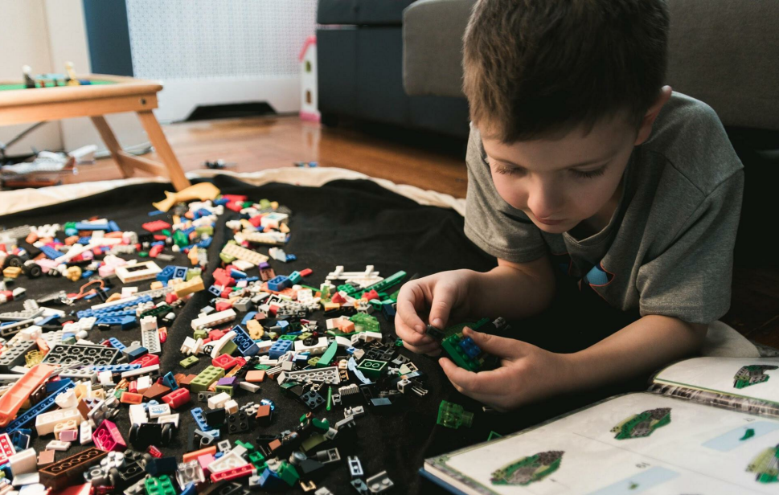

# Chương 2: Legos kỹ thuật số

Bạn có thích Lego? Tôi yêu Lego khi tôi còn là một đứa trẻ, và giờ tôi vẫn yêu chúng. Tôi nghĩ mọi người đều yêu thích Lego. Chúng rất vui (mặc dù không thú vị lắm đối với những bà mẹ phải dọn dẹp sau khi bọn trẻ chơi xong). Bạn có thể lắp ráp thành những thứ thực sự thú vị bằng cách ghép các mảnh Lego lại với nhau, giống như đứa trẻ đang cố gắng lắp ráp một thứ gì đó trong hình dưới đây.

  
English version

  > Do you like Legos? I loved Legos when I was a kid, and I still love them. I
think everyone loves Legos. They are so much fun (though not so much fun
for moms who have to clean up after kids are done with them). You can build
really cool things by putting Lego pieces together, just like the kid who is
trying to build something in the picture below.

Bạn có một bộ Lego? Nhớ lại những gì bạn đã trải qua với bộ Lego này. Tôi từng sở hữu một bộ Lego cảnh sát rất nhỏ. Mặc dù nó nhỏ, nhưng nó là một bộ phức tạp vì tôi phải lắp ráp một tháp canh bằng cách sử dụng các mảnh ghép Lego. Tôi phải hiểu các hình dạng khác nhau và cách chúng có thể khớp với nhau vì nhiều mảnh trông gần như giống nhau. Bạn đã bao giờ nhìn thấy những đứa trẻ sinh đôi trông gần giống nhau nhưng lại là hai người khác nhau? Thật khó để biết cái nào là cái nào. Tôi đã mất hàng tuần để hoàn thành bộ Lego. Tôi vẫn giữ bộ Lego này trong tầng hầm của mình sau ngần ấy năm.

  
English version

  > Do you have a Lego set? Recall what you can build with the set. I used to
own a very small police Lego set. Even though it was small, it was a complex
set because I had to construct a watch tower using Lego pieces. I had to
understand various shapes and how they can fit together because many pieces
looked almost the same. Have you ever seen twin kids that look almost the
same but are two different people? It is so hard to know which one is which.
It took me weeks to figure out the Lego set. I still have the Lego set in my
basement after all these years.

Lập trình Scratch cũng giống như chơi với các mảnh Lego, chỉ khác là bạn đang chơi Lego trên máy tính. Bạn lắp ráp một cái gì đó bằng cách ghép các mảnh lại với nhau, đảm bảo rằng bạn đang kết nối những mảnh phù hợp.

  
English version

  > Scratch is just like playing with Lego pieces, it’s just on a computer. You
build something by putting pieces together, making sure you are connecting
the right ones.

## Khối là gì?

Các khối là một khái niệm trong cuộc sống thực. Bạn có thể đã nhìn thấy những bức tường trắng được làm bằng các khối bê tông giống như trong hình dưới đây. Chúng thường được sử dụng trong các tòa nhà cao tầng. Bạn đã đến thăm tòa nhà cao tầng nào chưa? Ở hầu hết các quốc gia, một tòa nhà cao tầng là một tòa nhà rất cao với hơn 7 tầng!

  
English version

  > Blocks are a real-life concept. You might have seen white walls made of
concrete blocks just like in the picture below. They are usually used in highrise buildings. Have you visited any high-rise building? In most countries, a
high-rise building is a very tall building with more than 7 floors!

Khối bê tông có khái niệm tương tự như gạch đỏ nhưng có những đặc điểm khác nhau. Gạch đỏ phổ biến hơn ở các nước phương Tây vì chúng giữ ấm cho ngôi nhà rất tốt. Các khối bê tông cồng kềnh và chắc chắn hơn nhiều nên chúng rất lý tưởng cho các tòa nhà cao tầng.

  
English version

  > Concrete blocks are similar in concept to red bricks but have different
characteristics. Red bricks are more common in Western countries because
they are great at keeping a house warm. Concrete blocks are bulkier and
much stronger so they are ideal for tall buildings.

### Khối trong lập trình

Trong lập trình Scratch, mỗi phần bạn ghép lại với nhau để tạo ra thứ gì đó được gọi là một khối. Do đó, cách tiếp cận lập trình này được gọi là lập trình hướng khối. Bạn phải đặt các khối phù hợp với nhau để tạo ra một cái gì đó có ý nghĩa. Tùy thuộc vào tình huống, bạn cũng phải thay đổi cài đặt của một số hoặc tất cả các khối để có được kết quả mong muốn. Cuốn sách này sẽ dạy bạn toàn bộ quá trình. Nói tóm lại, bạn sẽ trở thành một thợ xây trong Scratch.

  
English version

  > In Scratch programming, each piece you put together to create stuff is called
a block. This approach to programming is therefore called block-oriented
programming. You must put the right blocks together to create something
meaningful. Depending on the situation, you must also change the setting of
some or all of the blocks to get the desired results. This book will teach you
the entire process. In short, you will become Bob the Builder who scratches!

## Lắp ráp Lego

Hãy cùng xem cách chúng ta xây dựng thứ gì đó bằng bộ Lego.

  
English version

  > Let us see how we build something using a Lego set.

### Những thứ chúng ta cần

Hãy tạo danh sách mọi thứ chúng ta cần.
   1. Một bộ Lego hoàn chỉnh. Chúng ta sẽ không thể lắp ráp hoàn chỉnh công trình mong muốn nếu thiếu các bộ phận.
   2. Hình ảnh công trình đã hoàn thành. Điều này giúp chúng ta biết liệu chúng ta đã sắp xếp mọi thứ với nhau theo đúng cách hay chưa.
   3. Bộ Lego cũng đi kèm với hướng dẫn và trình tự lắp ráp. Bạn phải làm theo các hướng dẫn theo đúng trình tự để hoàn thành việc lắp ráp.

  
English version

  > Let’s create a list of everything we need.
  > 1. A complete Lego set. We won’t be able to fully build the desired construction if parts are missing.
  > 2. A picture of the completed construction. This helps us to know if we have put everything together the right way.
  > 3. The Lego set also comes with instructions and the sequence on how to build using that set. You must follow the instructions in the correct sequence to complete the build.

### Lắp ráp

Dưới đây là hướng dẫn từng bước về cách lắp ráp bộ Lego.
   1. Xác định tất cả các mảnh khác nhau (chúng ta còn gọi chúng là gạch) trong bộ Lego.
   2. Nếu có quá nhiều viên gạch, hãy chia chúng thành nhiều đống bằng cách nhóm các viên gạch tương tự lại với nhau.
   3. Sử dụng các hướng dẫn, bắt đầu xây dựng theo trình tự nhất định. Tôi biết việc bỏ qua một vài bước nghe có vẻ hấp dẫn, nhưng đừng bỏ qua một bước nào. Nó sẽ làm cho mọi thứ trở nên khó khăn.
   4. Một khi công trình được lắp ráp xong, hãy tạo dáng như một vị vua vì bạn thực sự xứng đáng, và có thể là một vài chiếc bánh pizza!

  
English version

  > Here is a step-by-step guide on how to build using a Lego set.
  > 1. Identify all the different pieces (we also call them bricks) in the Lego set.
  > 2. If there are too many bricks, divide them into several heaps by grouping similar bricks together.
  > 3. Using the instructions, start building in the given sequence. I know skipping a few steps sounds tempting, but do not skip a step. It will make things difficult down the line.
  > 4. Once the construction is built, pose like a king because you truly deserve it, and maybe some pizza!

Sử dụng Scratch để lắp ráp đồ vật rất giống với việc lắp ráp đồ vật bằng bộ Lego. Trong cả hai tình huống, điều rất quan trọng là tuân theo trình tự. Dưới đây là một số kiến thức của Gandalf dành cho bạn: đường tắt không bao giờ tốt, không tồn tại trong đời thực và không đúng trong khi lập trình. Nếu bạn không biết [Gandalf](https://vi.wikipedia.org/wiki/Gandalf) là ai, tốt, tìm hiểu ngay nhé!

  
English version

  > Using Scratch to build stuff is very similar to building things with Lego sets.
In both situations, it is very important to follow the sequence. Here’s some
Gandalf wisdom for you: shortcuts are never good, not in real-life and not
while programming. If you do not know who Gandalf is, well, that needs to
be corrected right away!

## Liên kết hữu dụng
- [Mục lục](README.md)
- [Trang trước](01-Introduction-to-Programming.md) - Chương 1: Giới thiệu về lập trình
- [Trang kế](03-Start-Scratching.md) - Chương 3: Bắt đầu Scratch nào!
