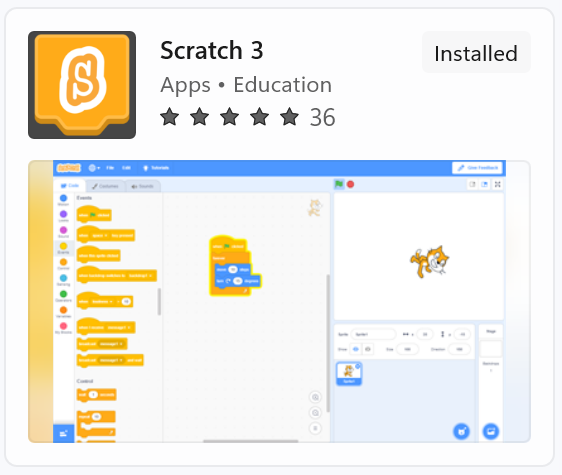

# Chapter 3: Start Scratching!

Kid, it is time we have some adventure, action and fun. Do you have
permission to install something on the home computer or the smart device
you usually use? If yes, you should follow the next sections to install and
setup Scratch. If not, you need help from an adult again. Sorry, I know, I
promise this is the last time!

  
English version

  > Kid, it is time we have some adventure, action and fun. Do you have
permission to install something on the home computer or the smart device
you usually use? If yes, you should follow the next sections to install and
setup Scratch. If not, you need help from an adult again. Sorry, I know, I
promise this is the last time!

## Install and Setup

There are two ways we can use Scratch
  - Online platform
  - Offline software (preferred)

  
English version

  > There are two ways we can use Scratch
  > - Online platform
  > - Offline software (preferred)

### Online Platform

The official link to the Scratch website is [https://scratch.mit.edu/](https://scratch.mit.edu/). Open up a
web browser on your device. In this book we have used Google Chrome. The
website will look like the picture below.

  
English version

  > The official link to the Scratch website is [https://scratch.mit.edu/](https://scratch.mit.edu/). Open up a
web browser on your device. In this book we have used Google Chrome. The
website will look like the picture below.

If you want to start building projects right away, click on “Create” at the top
menu.

  
English version

  > If you want to start building projects right away, click on “Create” at the top
menu.

Creating an account will allow you to share projects with others and make
friends online in a safe, regulated online community! Click on “Join Scratch”
to create a Scratch account. It is absolutely free.

  
English version

  > Creating an account will allow you to share projects with others and make
friends online in a safe, regulated online community! Click on “Join Scratch”
to create a Scratch account. It is absolutely free.

The sign-up form gives helpful prompts to explain the sign-up process.
Please make sure to write down the password and place it somewhere safe.
Remember that online account passwords must never be shared with anyone
under any circumstances. Modern browsers have the option to save the login
details, which makes subsequent logins convenient and faster. You can also
benefit from that feature.

  
English version

  > The sign-up form gives helpful prompts to explain the sign-up process.
Please make sure to write down the password and place it somewhere safe.
Remember that online account passwords must never be shared with anyone
under any circumstances. Modern browsers have the option to save the login
details, which makes subsequent logins convenient and faster. You can also
benefit from that feature.

The sign up form will initially look like the screenshot below.

  
English version

  > The sign up form will initially look like the screenshot below.

Click on “Next” after filling in username and password. The username cannot
be changed later and is used to identify users on Scratch platform, so make
sure it is something you will love.

  
English version

  > Click on “Next” after filling in username and password. The username cannot
be changed later and is used to identify users on Scratch platform, so make
sure it is something you will love.

Next, you will be asked about the country you are located in. I live in the
United States, so I chose that.

  
English version

  > Next, you will be asked about the country you are located in. I live in the
United States, so I chose that.

Then it’s your birthday. Make sure you use the correct date for the birthday.
In case you forget the password, usually this piece of information is requested
to verify if it is really you.

  
English version

  > Then it’s your birthday. Make sure you use the correct date for the birthday.
In case you forget the password, usually this piece of information is requested
to verify if it is really you.

The next screen will ask about gender. Select the appropriate option.

  
English version

  > The next screen will ask about gender. Select the appropriate option.

An email ID is required in the last step to complete sign up. Most common
email services like Gmail do not allow accounts for anyone younger than 13
years old. However, there are many kids-friendly email services such as
Zillamail that have built-in profanity filters offering a safe email service to
kids. On the flipside, most such services are paid. Alternatively, you can use
your parent's email ID to complete the sign up.

  
English version

  > An email ID is required in the last step to complete sign up. Most common
email services like Gmail do not allow accounts for anyone younger than 13
years old. However, there are many kids-friendly email services such as
Zillamail that have built-in profanity filters offering a safe email service to
kids. On the flipside, most such services are paid. Alternatively, you can use
your parent's email ID to complete the sign up.

And that’s it! You can start using the online version of Scratch to create and
share Scratch projects. Scratch will send a confirmation link to the email
address provided during sign up. Don’t forget to click on the link in the email
to confirm your account.

  
English version

  > And that’s it! You can start using the online version of Scratch to create and
share Scratch projects. Scratch will send a confirmation link to the email
address provided during sign up. Don’t forget to click on the link in the email
to confirm your account.

### Offline Application (Preferred)

You do not need to sign up for an account to use the Scratch application on
your own computer. The downside is, you will not be able to share your
projects with others on the Internet. But, this option is better for kids like you
who want to become a master.

  
English version

  > You do not need to sign up for an account to use the Scratch application on
your own computer. The downside is, you will not be able to share your
projects with others on the Internet. But, this option is better for kids like you
who want to become a master.

On a Windows operating system, there are two ways to install the offline
version of Scratch.

  
English version

  > On a Windows operating system, there are two ways to install the offline
version of Scratch.

#### Download Installer from Scratch Website

To download and install the Scratch application on your computer, use the
download link: [https://scratch.mit.edu/download](https://scratch.mit.edu/download). Choose the Operating
System (OS) that your computer uses. Windows is selected by default. Note
that at least Windows 10 is required for Scratch to work.

  
English version

  > To download and install the Scratch application on your computer, use the
download link: [https://scratch.mit.edu/download](https://scratch.mit.edu/download). Choose the Operating
System (OS) that your computer uses. Windows is selected by default. Note
that at least Windows 10 is required for Scratch to work.

#### Install from Windows Store

If you have a Windows 10 based computer, you can also install the Scratch
application through the Microsoft store. Click on the “Windows” logo in the
bottom left corner of your screen. In the search bar type “Microsoft Store”
and select the first option. In the new application window, you will see the
“Search” option towards the top right-hand corner. Search for “Scratch” and
you will see “Scratch Desktop” as the very first option.

  
English version

  > If you have a Windows 10 based computer, you can also install the Scratch
application through the Microsoft store. Click on the “Windows” logo in the
bottom left corner of your screen. In the search bar type “Microsoft Store”
and select the first option. In the new application window, you will see the
“Search” option towards the top right-hand corner. Search for “Scratch” and
you will see “Scratch Desktop” as the very first option.

Select the option and then you can install the application.

  
English version

  > Select the option and then you can install the application.

No matter how you installed the application, the Scratch application can be
accessed from the start menu. Please note that sometimes applications on
Windows Store are not readily updated. If you installed Scratch from
Windows Store and it gives a fatal error when you run the application,
uninstall it and download the installer from Scratch website. For easier access
for kids, create a desktop shortcut for the application.

  
English version

  > No matter how you installed the application, the Scratch application can be
accessed from the start menu. Please note that sometimes applications on
Windows Store are not readily updated. If you installed Scratch from
Windows Store and it gives a fatal error when you run the application,
uninstall it and download the installer from Scratch website. For easier access
for kids, create a desktop shortcut for the application.

## Take Command, Peter Pan!

Hey kid, Nat’s back with you and good news, no more adults and we are all
set up to have fun! I have to ask you a question. Do you know who Peter Pan
is? Yes? Good job smarty-pants. Well, let me tell you anyways, because I
also have a secret to share.

  
English version

  > Hey kid, Nat’s back with you and good news, no more adults and we are all
set up to have fun! I have to ask you a question. Do you know who Peter Pan
is? Yes? Good job smarty-pants. Well, let me tell you anyways, because I
also have a secret to share.

Peter Pan is an independent, confident, free-spirited kid who can fly, do
magic stuff, goes on adventures, helps other kids, and stands against evil.
He’s also a bit naughty, which is good, right? He also leads other kids so they
can also be good and have fun. You know what’s the sad part? Everyone
thinks Peter Pan is not real.

  
English version

  > Peter Pan is an independent, confident, free-spirited kid who can fly, do
magic stuff, goes on adventures, helps other kids, and stands against evil.
He’s also a bit naughty, which is good, right? He also leads other kids so they
can also be good and have fun. You know what’s the sad part? Everyone
thinks Peter Pan is not real.

But, I know a secret no one else knows and I can’t hold onto it any longer.
Let me spill it out. You, Mr. Smarty-pants, are Peter Pan! Well, I know you
can’t fly, but you can do everything else that Peter Pan could, and some
more! You can use Scratch to make amazing things. Let’s dive in!

  
English version

  > But, I know a secret no one else knows and I can’t hold onto it any longer.
Let me spill it out. You, Mr. Smarty-pants, are Peter Pan! Well, I know you
can’t fly, but you can do everything else that Peter Pan could, and some
more! You can use Scratch to make amazing things. Let’s dive in!

### Things-That-Must-Not-Be-Done!

Peter Pan is nearly invincible, but even he must be wary of a few things that can hurt really bad. I am giving you a list of things you must never do when using Scratch or anything on the Internet.
  1. Never share the account password with anyone. This is a golden rule for every account made on the Internet.
  2. Never interact with strangers.
  3. Never share personal details with anyone on the Internet. Personal details include your name, contact information such as phone number and where you live. If you think it is important to share, discuss with an adult in your house so they can decide if it’s really necessary.
  4. Never close Scratch application without saving the project (later I will tell you how to save your progress on Scratch).
  5. Never hide if you experienced something on the Internet that made you uncomfortable. Share with your parents so they can protect you.
  6. We, humans, have our limitations. For example, we can’t fly on our own (because humans do not possess the physical requirements needed to fly). So, what would happen if someone tried to fly without using an airplane? They would fall (yikes) and it would be a very unpleasant sight. Just like humans, every machine and every application has some limits. Scratch is no exception, so, we must be aware of them and not exceed the limitations or things can become wonky.
  7. Never leave the computer unattended and unlocked. Pee breaks are important, but before you leave, save your Scratch project and lock the computer. The last thing you want is your younger siblings making a mess or someone shutting down the computer!
  8. Scratch does not have an UNDO feature, so a good idea is to plan ahead. Never start a project without thinking it through. With practice, you won’t be needing to make a lot of changes.
  9. Never be shy of making mistakes. Mistakes are fun because they are easy to remember and help you learn new things.
  10. And the most important thing, because it is the hardest of all: Never give up! Things (like life in general) can be hard sometimes. You will be stuck, but never accept loss. If at first you don’t succeed, try, try, try again!

  
English version

  > Peter Pan is nearly invincible, but even he must be wary of a few things that can hurt really bad. I am giving you a list of things you must never do when using Scratch or anything on the Internet.
  > 1. Never share the account password with anyone. This is a golden rule for every account made on the Internet.
  > 2. Never interact with strangers.
  > 3. Never share personal details with anyone on the Internet. Personal details include your name, contact information such as phone number and where you live. If you think it is important to share, discuss with an adult in your house so they can decide if it’s really necessary.
  > 4. Never close Scratch application without saving the project (later I will tell you how to save your progress on Scratch).
  > 5. Never hide if you experienced something on the Internet that made you uncomfortable. Share with your parents so they can protect you.
  > 6. We, humans, have our limitations. For example, we can’t fly on our own (because humans do not possess the physical requirements needed to fly). So, what would happen if someone tried to fly without using an airplane? They would fall (yikes) and it would be a very unpleasant sight. Just like humans, every machine and every application has some limits. Scratch is no exception, so, we must be aware of them and not exceed the limitations or things can become wonky.
  > 7. Never leave the computer unattended and unlocked. Pee breaks are important, but before you leave, save your Scratch project and lock the computer. The last thing you want is your younger siblings making a mess or someone shutting down the computer!
  > 8. Scratch does not have an UNDO feature, so a good idea is to plan ahead. Never start a project without thinking it through. With practice, you won’t be needing to make a lot of changes.
  > 9. Never be shy of making mistakes. Mistakes are fun because they are easy to remember and help you learn new things.
  > 10. And the most important thing, because it is the hardest of all: Never give up! Things (like life in general) can be hard sometimes. You will be stuck, but never accept loss. If at first you don’t succeed, try, try, try again!

### The Concept of Give and Take

Have you ever gone to the mall with your parents or to the grocery store?
You must have noticed how your parents hand out money or swipe their
cards and, in exchange, the shopkeeper lets them keep whatever they
gathered. Everything in the world works like this. You have to give
something to get something.

  
English version

  > Have you ever gone to the mall with your parents or to the grocery store?
You must have noticed how your parents hand out money or swipe their
cards and, in exchange, the shopkeeper lets them keep whatever they
gathered. Everything in the world works like this. You have to give
something to get something.

Programming works on the same principles. You write a code/program that
gives instructions to the computer. The computer processes and you get a
response. In the computer world, what you give to the computer we call
“input” and the response we get is called “output”.

  
English version

  > Programming works on the same principles. You write a code/program that
gives instructions to the computer. The computer processes and you get a
response. In the computer world, what you give to the computer we call
“input” and the response we get is called “output”.

Now, here’s when things can get confusing, so pay attention kiddo: programs
are written for someone else to use them (we call them “users”). The user will
use the program to do some work, in short giving input and getting output.
This is how the entire world of the Internet works. Actually, this is also how
the real world works. For example, talking about cars, they are made by
people working in factories. People buy them and use them to go to work, to
shop, and to have fun, like going to picnics.

  
English version

  > Now, here’s when things can get confusing, so pay attention kiddo: programs
are written for someone else to use them (we call them “users”). The user will
use the program to do some work, in short giving input and getting output.
This is how the entire world of the Internet works. Actually, this is also how
the real world works. For example, talking about cars, they are made by
people working in factories. People buy them and use them to go to work, to
shop, and to have fun, like going to picnics.

You are going to be the Peter Pan of programmers. You are going to create
stuff that others can use and have fun and learn new things at the same time.

  
English version

  > You are going to be the Peter Pan of programmers. You are going to create
stuff that others can use and have fun and learn new things at the same time.

### Scratch Basics

#### Start Scratch

Let’s start Scratch. Below are instructions for you on how to start Scratch.
  - Click on the Scratch application icon on the desktop. The icon looks like this: 
  - Scratch will open up. It will look like this. What an amazing colorful screen! Do not worry if things on this new screen do not make sense to you right now. We are going to explain each section very soon. 

  
English version

  > Let’s start Scratch. Below are instructions for you on how to start Scratch.
  > - Click on the Scratch application icon on the desktop. The icon looks like this: 
  > - Scratch will open up. It will look like this. What an amazing colorful screen! Do not worry if things on this new screen do not make sense to you right now. We are going to explain each section very soon. 

#### Understanding different sections of Scratch screen

##### Menu Bar

The first thing you will notice is the blue line at the top with a bunch of
options (the bunch of options is called a menu). The blue area is a long and
stretched rectangle (like a bar), hence we call this whole area the menu bar.

  
English version

  > The first thing you will notice is the blue line at the top with a bunch of
options (the bunch of options is called a menu). The blue area is a long and
stretched rectangle (like a bar), hence we call this whole area the menu bar.

- The first option in the blue menu bar is the logo of Scratch.
- The second option on the menu, represented by the icon of the world, is the “language” used in the Scratch application. You can change the language anytime you want. At the start, it is set to English.

  
English version

  > - The first option in the blue menu bar is the logo of Scratch.
  > - The second option on the menu, represented by the icon of the world, is the “language” used in the Scratch application. You can change the language anytime you want. At the start, it is set to English.

- The third option is named “File”, to be honest due to a lack of a better
name! This is an option you will find in the menus of almost every
application and it contains general but important actions. In Scratch, the
“File” contains the following options (I will explain these options in a
bit).

  
English version

  > - The third option is named “File”, to be honest due to a lack of a better
name! This is an option you will find in the menus of almost every
application and it contains general but important actions. In Scratch, the
“File” contains the following options (I will explain these options in a
bit).

- The fourth option is “Edit”. It has only two options and we will not be
using any of them in this book. However, I will explain them, just for
your curiosity!

  
English version

  > - The fourth option is “Edit”. It has only two options and we will not be
using any of them in this book. However, I will explain them, just for
your curiosity!

- The fifth option is the “Tutorials” where you will find projects that you
can run to understand different things about Scratch. No need to worry
about them, as you have me and this book!

  
English version

  > - The fifth option is the “Tutorials” where you will find projects that you
can run to understand different things about Scratch. No need to worry
about them, as you have me and this book!

- The last option is a field where you can give a name to your current
project. It might already be filled with “Scratch Project”, but you can
change it to whatever you like.

  
English version

  > - The last option is a field where you can give a name to your current
project. It might already be filled with “Scratch Project”, but you can
change it to whatever you like.

As promised, I am going to briefly explain the options you see after clicking
on “File” or “Edit”.

  
English version

  > As promised, I am going to briefly explain the options you see after clicking
on “File” or “Edit”.

  
English version

  >

## Liên kết hữu dụng
- [Mục lục](README.md)
- [Trang trước](02-Digital-Legos.md) - Chapter 2: Digital Legos
- [Trang kế](03-Start-Scratching.md) - Chapter 3: Start Scratching
