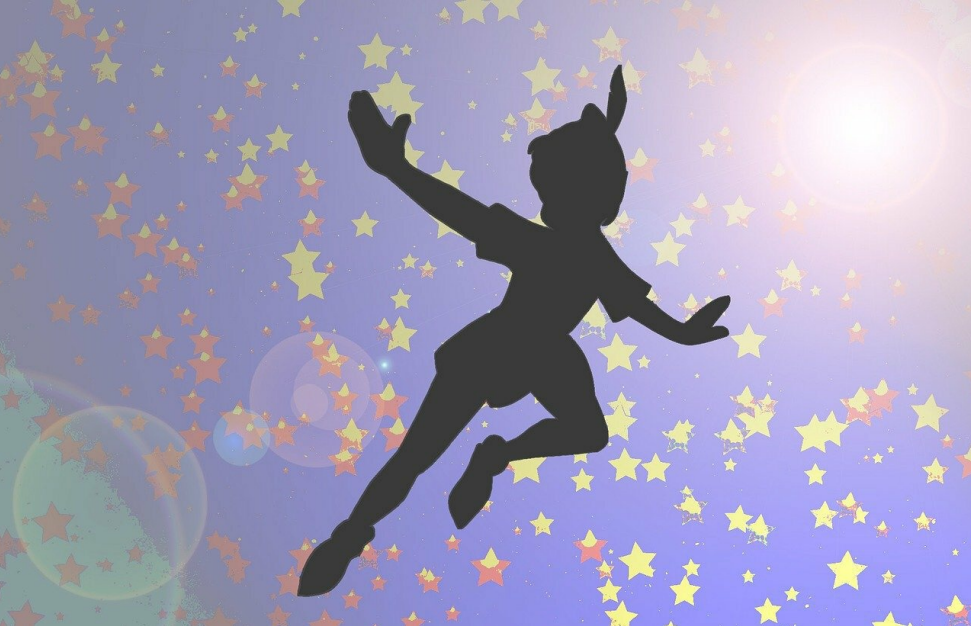
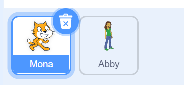

# Chương 3: Bắt đầu Scratch nào!

[Download PDF](download/03-Start-Scratching.pdf)

Nhóc con, đã đến lúc chúng ta có một số cuộc phiêu lưu, hành động và vui chơi. Bạn có quyền cài đặt thứ gì đó trên máy tính gia đình hoặc thiết bị thông minh mà bạn thường sử dụng không? Nếu có, bạn nên làm theo các phần tiếp theo để cài đặt và thiết lập Scratch. Nếu không, bạn lại cần đến sự giúp đỡ của người lớn. Xin lỗi, tôi biết, tôi hứa đây là lần cuối cùng!

  
English version

  > Kid, it is time we have some adventure, action and fun. Do you have
permission to install something on the home computer or the smart device
you usually use? If yes, you should follow the next sections to install and
setup Scratch. If not, you need help from an adult again. Sorry, I know, I
promise this is the last time!

## Cài đặt và Thiết lập

Có hai cách chúng ta có thể sử dụng Scratch:
   - Nền tảng trực tuyến
   - Phần mềm ngoại tuyến (bạn nên sử dụng cách này)

  
English version

  > There are two ways we can use Scratch
  > - Online platform
  > - Offline software (preferred)

### Nền tảng trực tuyến

Liên kết chính thức đến trang web Scratch là [https://scratch.mit.edu/](https://scratch.mit.edu/). Mở trình duyệt web trên thiết bị của bạn. Trong cuốn sách này, chúng tôi đã sử dụng Google Chrome. Trang web sẽ giống như hình bên dưới.

  
English version

  > The official link to the Scratch website is [https://scratch.mit.edu/](https://scratch.mit.edu/). Open up a
web browser on your device. In this book we have used Google Chrome. The
website will look like the picture below.

Cuộn xuống dưới cuối cùng của trang web và bạn có thể chỉnh ngôn ngữ về tiếng Việt

Nếu bạn muốn bắt đầu xây dựng dự án ngay lập tức, hãy nhấp vào “Khởi tạo” ở menu trên cùng.

  
English version

  > If you want to start building projects right away, click on “Create” at the top
menu.

Tạo một tài khoản sẽ cho phép bạn chia sẻ các dự án với những người khác và kết bạn trực tuyến trong một cộng đồng trực tuyến an toàn, được quản lý! Nhấp vào “Tham gia Scratch” để tạo tài khoản Scratch. Nó hoàn toàn miễn phí.

  
English version

  > Creating an account will allow you to share projects with others and make
friends online in a safe, regulated online community! Click on “Join Scratch”
to create a Scratch account. It is absolutely free.

Biểu mẫu đăng ký cung cấp các lời nhắc hữu ích để giải thích quy trình đăng ký. Hãy nhớ ghi lại mật khẩu và đặt nó ở nơi an toàn. Hãy nhớ rằng mật khẩu tài khoản trực tuyến không bao giờ được chia sẻ với bất kỳ ai trong bất kỳ trường hợp nào. Các trình duyệt hiện đại có tùy chọn để lưu các chi tiết đăng nhập, giúp các lần đăng nhập tiếp theo trở nên thuận tiện và nhanh chóng hơn. Bạn cũng có thể hưởng lợi từ tính năng đó.

  
English version

  > The sign-up form gives helpful prompts to explain the sign-up process.
Please make sure to write down the password and place it somewhere safe.
Remember that online account passwords must never be shared with anyone
under any circumstances. Modern browsers have the option to save the login
details, which makes subsequent logins convenient and faster. You can also
benefit from that feature.

Biểu mẫu đăng ký ban đầu sẽ giống như ảnh chụp màn hình bên dưới.

  
English version

  > The sign up form will initially look like the screenshot below.

Nhấp vào “Kế tiếp” sau khi điền username và mật khẩu. Username  không thể thay đổi sau này và được sử dụng để xác định người dùng trên nền tảng Scratch, vì vậy hãy đảm bảo rằng bạn yêu thích tên đó.

  
English version

  > Click on “Next” after filling in username and password. The username cannot
be changed later and is used to identify users on Scratch platform, so make
sure it is something you will love.

Tiếp theo, bạn sẽ được hỏi về quốc gia bạn đang ở. Tôi sống ở Việt Nam, vì vậy tôi đã chọn Vietnam.

  
English version

  > Next, you will be asked about the country you are located in. I live in the
United States, so I chose that.

Sau đó là sinh nhật của bạn. Đảm bảo rằng bạn sử dụng đúng ngày sinh nhật. Trong trường hợp bạn quên mật khẩu, thông thường phần thông tin này sẽ được yêu cầu để xác minh xem đó có thực sự là bạn hay không.

  
English version

  > Then it’s your birthday. Make sure you use the correct date for the birthday.
In case you forget the password, usually this piece of information is requested
to verify if it is really you.

Màn hình tiếp theo sẽ hỏi về giới tính. Chọn tùy chọn thích hợp.

  
English version

  > The next screen will ask about gender. Select the appropriate option.

Email là bước bắt buộc cuối cùng để hoàn tất đăng ký. Hầu hết các dịch vụ email phổ biến như Gmail không cho phép tài khoản dưới 13 tuổi. Tuy nhiên, có nhiều dịch vụ email thân thiện với trẻ em như Zillamail có bộ lọc ngôn từ tục tĩu được tích hợp sẵn cung cấp dịch vụ email an toàn cho trẻ em. Mặt khác, hầu hết các dịch vụ như vậy đều phải trả phí. Ngoài ra, bạn có thể sử dụng Email của cha mẹ mình để hoàn tất quá trình đăng ký.

  
English version

  > An email ID is required in the last step to complete sign up. Most common
email services like Gmail do not allow accounts for anyone younger than 13
years old. However, there are many kids-friendly email services such as
Zillamail that have built-in profanity filters offering a safe email service to
kids. On the flipside, most such services are paid. Alternatively, you can use
your parent's email ID to complete the sign up.

Và thế là xong! Bạn có thể bắt đầu sử dụng phiên bản Scratch trực tuyến để tạo và chia sẻ các dự án Scratch. Scratch sẽ gửi một liên kết xác nhận đến địa chỉ email được cung cấp trong quá trình đăng ký. Đừng quên nhấp vào liên kết trong email để xác nhận tài khoản của bạn.

  
English version

  > And that’s it! You can start using the online version of Scratch to create and
share Scratch projects. Scratch will send a confirmation link to the email
address provided during sign up. Don’t forget to click on the link in the email
to confirm your account.

### Phần mềm ngoại tuyến (bạn nên sử dụng cách này)

Bạn không cần đăng ký tài khoản để sử dụng ứng dụng Scratch trên máy tính của chính mình. Nhược điểm là bạn sẽ không thể chia sẻ dự án của mình với người khác trên Internet. Tuy nhiên, tùy chọn này tốt hơn cho những đứa trẻ như bạn muốn trở thành một bậc thầy.

  
English version

  > You do not need to sign up for an account to use the Scratch application on
your own computer. The downside is, you will not be able to share your
projects with others on the Internet. But, this option is better for kids like you
who want to become a master.

Trên hệ điều hành Windows, có hai cách để cài đặt phiên bản ngoại tuyến của Scratch.

  
English version

  > On a Windows operating system, there are two ways to install the offline
version of Scratch.

#### Tải xuống Trình cài đặt từ Trang web Scratch

Để tải xuống và cài đặt ứng dụng Scratch trên máy tính của bạn, hãy sử dụng liên kết: [https://scratch.mit.edu/download](https://scratch.mit.edu/download). Chọn Hệ điều hành (OS) mà máy tính của bạn sử dụng. Windows được chọn theo mặc định. Lưu ý rằng ít nhất phải có Windows 10 để Scratch hoạt động.

  
English version

  > To download and install the Scratch application on your computer, use the
download link: [https://scratch.mit.edu/download](https://scratch.mit.edu/download). Choose the Operating
System (OS) that your computer uses. Windows is selected by default. Note
that at least Windows 10 is required for Scratch to work.

#### Cài đặt từ Windows Store

Nếu bạn có máy tính chạy Windows 10, bạn cũng có thể cài đặt ứng dụng Scratch thông qua Microsoft store. Nhấp vào biểu trưng “Windows” ở góc dưới cùng bên trái của màn hình. Trong thanh tìm kiếm, nhập “Microsoft Store” và chọn tùy chọn đầu tiên. Trong cửa sổ ứng dụng mới, bạn sẽ thấy tùy chọn “Tìm kiếm” ở góc trên cùng bên phải. Tìm kiếm “Scratch” và bạn sẽ thấy “Scratch Desktop” là tùy chọn đầu tiên.

  
English version

  > If you have a Windows 10 based computer, you can also install the Scratch
application through the Microsoft store. Click on the “Windows” logo in the
bottom left corner of your screen. In the search bar type “Microsoft Store”
and select the first option. In the new application window, you will see the
“Search” option towards the top right-hand corner. Search for “Scratch” and
you will see “Scratch Desktop” as the very first option.

Chọn tùy chọn và sau đó bạn có thể cài đặt ứng dụng.

  
English version

  > Select the option and then you can install the application.

Bất kể bạn đã cài đặt ứng dụng như thế nào, ứng dụng Scratch có thể được truy cập từ menu start. Xin lưu ý rằng đôi khi các ứng dụng trên Windows Store không được cập nhật dễ dàng. Nếu bạn đã cài đặt Scratch từ Windows Store và nó gây ra lỗi nghiêm trọng khi bạn chạy ứng dụng, hãy gỡ cài đặt nó và tải xuống trình cài đặt từ trang web Scratch. Để trẻ em truy cập dễ dàng hơn, hãy tạo lối tắt trên màn hình cho ứng dụng.

  
English version

  > No matter how you installed the application, the Scratch application can be
accessed from the start menu. Please note that sometimes applications on
Windows Store are not readily updated. If you installed Scratch from
Windows Store and it gives a fatal error when you run the application,
uninstall it and download the installer from Scratch website. For easier access
for kids, create a desktop shortcut for the application.

## Hãy chỉ huy, Peter Pan!

Này nhóc, Nat đã trở lại với bạn và tin tốt lành, không còn người lớn nữa và tất cả chúng ta đều sẵn sàng để vui chơi! Tôi phải hỏi bạn một câu hỏi. Bạn có biết Peter Pan là ai không? Đúng? Làm tốt lắm. Vâng, hãy để tôi nói với bạn, vì tôi cũng có một bí mật để chia sẻ.

  
English version

  > Hey kid, Nat’s back with you and good news, no more adults and we are all
set up to have fun! I have to ask you a question. Do you know who Peter Pan
is? Yes? Good job smarty-pants. Well, let me tell you anyways, because I
also have a secret to share.

Peter Pan là một cậu bé độc lập, tự tin, có tinh thần tự do, có thể bay, làm phép thuật, đi phiêu lưu, giúp đỡ những đứa trẻ khác và chống lại cái ác. Anh ấy cũng hơi nghịch ngợm, điều đó tốt, phải không? Anh ấy cũng dẫn dắt những đứa trẻ khác để chúng có thể ngoan và vui vẻ. Bạn biết phần đáng buồn là gì không? Mọi người đều cho rằng Peter Pan không có thật.

  
English version

  > Peter Pan is an independent, confident, free-spirited kid who can fly, do
magic stuff, goes on adventures, helps other kids, and stands against evil.
He’s also a bit naughty, which is good, right? He also leads other kids so they
can also be good and have fun. You know what’s the sad part? Everyone
thinks Peter Pan is not real.

Nhưng, tôi biết một bí mật mà không ai khác biết và tôi không thể giữ nó lâu hơn được nữa. Hãy để tôi công bố nó nhé. Bạn, quý ngài thông minh, là Peter Pan! Chà, tôi biết bạn không thể bay, nhưng bạn có thể làm mọi thứ khác mà Peter Pan có thể, và một số việc khác nữa! Bạn có thể sử dụng Scratch để làm nên những điều kỳ diệu. Bắt đầu thôi nào!

  
English version

  > But, I know a secret no one else knows and I can’t hold onto it any longer.
Let me spill it out. You, Mr. Smarty-pants, are Peter Pan! Well, I know you
can’t fly, but you can do everything else that Peter Pan could, and some
more! You can use Scratch to make amazing things. Let’s dive in!

### Những-Điều-Không-Nên-Làm!

Peter Pan gần như bất khả chiến bại, nhưng ngay cả anh ta cũng phải cảnh giác với một vài thứ có thể gây tổn thương thực sự tồi tệ. Tôi cung cấp cho bạn một danh sách những điều bạn không bao giờ được làm khi sử dụng Scratch hoặc bất cứ thứ gì trên Internet.
  1. Không bao giờ chia sẻ mật khẩu tài khoản với bất kỳ ai. Đây là quy tắc vàng cho mọi tài khoản được thực hiện trên Internet.
  2. Không bao giờ tiếp xúc với người lạ.
  3. Không bao giờ chia sẻ chi tiết cá nhân với bất kỳ ai trên Internet. Chi tiết cá nhân bao gồm tên của bạn, thông tin liên lạc như số điện thoại và nơi bạn sống. Nếu bạn cho rằng việc chia sẻ là quan trọng, hãy thảo luận với người lớn trong nhà để họ quyết định xem điều đó có thực sự cần thiết hay không.
  4. Không bao giờ đóng ứng dụng Scratch mà không lưu dự án (sau này tôi sẽ cho bạn biết cách lưu tiến trình của bạn trên Scratch).
  5. Đừng bao giờ che giấu nếu bạn đã trải nghiệm điều gì đó trên Internet khiến bạn không thoải mái. Chia sẻ với cha mẹ của bạn để họ có thể bảo vệ bạn.
  6. Chúng ta, con người, có những giới hạn của mình. Ví dụ, chúng ta không thể tự bay (vì con người không có đủ các yêu cầu thể chất cần thiết để bay). Vì vậy, điều gì sẽ xảy ra nếu ai đó cố gắng bay mà không sử dụng máy bay? Họ sẽ ngã (có thể chết đấy) và đó sẽ là một cảnh tượng rất khó chịu. Cũng giống như con người, mọi máy móc và mọi ứng dụng đều có một số giới hạn. Scratch không phải là ngoại lệ, vì vậy, chúng ta phải nhận thức được chúng và không vượt quá những giới hạn hoặc mọi thứ có thể trở nên tồi tệ.
  7. Không bao giờ để máy tính ở chế độ không giám sát và mở khóa. Nghỉ giải lao rất quan trọng, nhưng trước khi rời đi, hãy lưu dự án Scratch của bạn và khóa máy tính. Bạn không muốn những đứa em của bạn làm loạn hoặc ai đó tắt máy tính đúng không?
  8. Scratch không có tính năng UNDO, vì vậy có một ý kiến ​​hay là bạn nên lên kế hoạch trước. Đừng bao giờ bắt đầu một dự án mà không suy nghĩ thấu đáo. Khi thực hành, bạn sẽ không cần phải thực hiện nhiều thay đổi.
  9. Đừng bao giờ ngại mắc sai lầm. Sai lầm rất thú vị vì chúng dễ nhớ và giúp bạn học những điều mới.
  10. Và điều quan trọng nhất, bởi vì nó là khó nhất: Đừng bao giờ bỏ cuộc! Mọi thứ (như cuộc sống nói chung) đôi khi có thể khó khăn. Bạn sẽ gặp khó khăn, nhưng đừng bao giờ chấp nhận mất mát. Nếu lúc đầu bạn không thành công, hãy thử, thử, thử lại!

  
English version

  > Peter Pan is nearly invincible, but even he must be wary of a few things that can hurt really bad. I am giving you a list of things you must never do when using Scratch or anything on the Internet.
  > 1. Never share the account password with anyone. This is a golden rule for every account made on the Internet.
  > 2. Never interact with strangers.
  > 3. Never share personal details with anyone on the Internet. Personal details include your name, contact information such as phone number and where you live. If you think it is important to share, discuss with an adult in your house so they can decide if it’s really necessary.
  > 4. Never close Scratch application without saving the project (later I will tell you how to save your progress on Scratch).
  > 5. Never hide if you experienced something on the Internet that made you uncomfortable. Share with your parents so they can protect you.
  > 6. We, humans, have our limitations. For example, we can’t fly on our own (because humans do not possess the physical requirements needed to fly). So, what would happen if someone tried to fly without using an airplane? They would fall (yikes) and it would be a very unpleasant sight. Just like humans, every machine and every application has some limits. Scratch is no exception, so, we must be aware of them and not exceed the limitations or things can become wonky.
  > 7. Never leave the computer unattended and unlocked. Pee breaks are important, but before you leave, save your Scratch project and lock the computer. The last thing you want is your younger siblings making a mess or someone shutting down the computer!
  > 8. Scratch does not have an UNDO feature, so a good idea is to plan ahead. Never start a project without thinking it through. With practice, you won’t be needing to make a lot of changes.
  > 9. Never be shy of making mistakes. Mistakes are fun because they are easy to remember and help you learn new things.
  > 10. And the most important thing, because it is the hardest of all: Never give up! Things (like life in general) can be hard sometimes. You will be stuck, but never accept loss. If at first you don’t succeed, try, try, try again!

### Khái niệm Cho và Nhận

Bạn đã bao giờ đi mua sắm cùng bố mẹ hoặc đến cửa hàng tạp hóa chưa? Bạn hẳn đã để ý cách bố mẹ bạn đưa tiền hoặc quẹt thẻ của họ và đổi lại, người bán hàng cho phép họ giữ lại bất cứ thứ gì họ thu thập được. Mọi thứ trên thế giới đều hoạt động như thế này. Bạn phải cho một cái gì đó để nhận được một cái gì đó.

  
English version

  > Have you ever gone to the mall with your parents or to the grocery store?
You must have noticed how your parents hand out money or swipe their
cards and, in exchange, the shopkeeper lets them keep whatever they
gathered. Everything in the world works like this. You have to give
something to get something.

Lập trình hoạt động trên các nguyên tắc giống nhau. Bạn viết mã / chương trình cung cấp hướng dẫn cho máy tính. Máy tính xử lý và bạn nhận được phản hồi. Trong thế giới máy tính, những gì bạn cung cấp cho máy tính chúng ta gọi là “đầu vào” và phản hồi mà chúng ta nhận được gọi là “đầu ra”.

  
English version

  > Programming works on the same principles. You write a code/program that
gives instructions to the computer. The computer processes and you get a
response. In the computer world, what you give to the computer we call
“input” and the response we get is called “output”.

Bây giờ, đây là lúc mọi thứ có thể trở nên khó hiểu, vì vậy hãy chú ý nhóc: các chương trình được viết để người khác sử dụng chúng (chúng ta gọi chúng là “người dùng”). Người dùng sẽ sử dụng chương trình để thực hiện một số công việc, ngắn gọn là đưa ra đầu vào và nhận đầu ra. Đây là cách toàn bộ thế giới Internet hoạt động. Trên thực tế, đây cũng là cách thế giới thực hoạt động. Ví dụ, nói về ô tô, chúng được tạo ra bởi những người làm việc trong các nhà máy. Mọi người mua chúng và sử dụng để đi làm, đi mua sắm, vui chơi, đi dã ngoại.

  
English version

  > Now, here’s when things can get confusing, so pay attention kiddo: programs
are written for someone else to use them (we call them “users”). The user will
use the program to do some work, in short giving input and getting output.
This is how the entire world of the Internet works. Actually, this is also how
the real world works. For example, talking about cars, they are made by
people working in factories. People buy them and use them to go to work, to
shop, and to have fun, like going to picnics.

Bạn sẽ trở thành Peter Pan của các lập trình viên. Bạn sẽ tạo ra những thứ mà người khác có thể sử dụng, vui chơi và học hỏi những điều mới cùng một lúc.

  
English version

  > You are going to be the Peter Pan of programmers. You are going to create
stuff that others can use and have fun and learn new things at the same time.

### Kiến thức cơ bản về Scratch

#### Khởi động Scratch

Hãy khởi động Scratch. Dưới đây là hướng dẫn cho bạn về cách khởi động Scratch.
  - Nhấn vào biểu tượng ứng dụng Scratch trên desktop. Biểu tượng trông như thế này: 
  - Scratch sẽ mở ra. Nó sẽ trông giống thế này. Thật là một màn hình đầy màu sắc tuyệt vời! Đừng lo lắng nếu mọi thứ trên màn hình mới này không có ý nghĩa với bạn ngay bây giờ. Chúng tôi sẽ giải thích từng phần rất sớm. 

  
English version

  > Let’s start Scratch. Below are instructions for you on how to start Scratch.
  > - Click on the Scratch application icon on the desktop. The icon looks like this: 
  > - Scratch will open up. It will look like this. What an amazing colorful screen! Do not worry if things on this new screen do not make sense to you right now. We are going to explain each section very soon. 

#### Hiểu các phần khác nhau của màn hình Scratch

##### Thanh menu

Điều đầu tiên bạn sẽ nhận thấy là dòng màu xanh ở trên cùng với một loạt các tùy chọn (nhóm các tùy chọn được gọi là menu). Khu vực màu xanh lam là một hình chữ nhật dài và kéo dài (giống như một thanh), do đó chúng tôi gọi toàn bộ khu vực này là thanh menu.

  
English version

  > The first thing you will notice is the blue line at the top with a bunch of
options (the bunch of options is called a menu). The blue area is a long and
stretched rectangle (like a bar), hence we call this whole area the menu bar.

- Tùy chọn đầu tiên trên thanh menu màu xanh là logo của Scratch.
- Tùy chọn thứ hai trên menu, được biểu thị bằng biểu tượng của thế giới, là “ngôn ngữ” được sử dụng trong ứng dụng Scratch. Bạn có thể thay đổi ngôn ngữ bất cứ lúc nào bạn muốn. Khi bắt đầu, nó được đặt thành tiếng Anh. Bây giờ, hãy chuyển sang tiếng Việt nhé.

  
English version

  > - The first option in the blue menu bar is the logo of Scratch.
  > - The second option on the menu, represented by the icon of the world, is the “language” used in the Scratch application. You can change the language anytime you want. At the start, it is set to English.

- Tùy chọn thứ ba được đặt tên là "Tập tin", thành thật mà nói do thiếu một cái tên tốt hơn! Đây là một tùy chọn bạn sẽ tìm thấy trong menu của hầu hết mọi ứng dụng và nó chứa các hành động chung nhưng quan trọng. Trong Scratch, Tập tin chứa các tùy chọn sau (tôi sẽ giải thích các tùy chọn này một chút).

  
English version

  > - The third option is named “File”, to be honest due to a lack of a better
name! This is an option you will find in the menus of almost every
application and it contains general but important actions. In Scratch, the
“File” contains the following options (I will explain these options in a
bit).

- Tùy chọn thứ tư là "Chỉnh sửa". Nó chỉ có hai tùy chọn và chúng ta sẽ không sử dụng bất kỳ tùy chọn nào trong số chúng trong cuốn sách này. Tuy nhiên, tôi sẽ giải thích chúng, chỉ vì tôi biết bạn sẽ rất tò mò muốn biết!

  
English version

  > - The fourth option is “Edit”. It has only two options and we will not be
using any of them in this book. However, I will explain them, just for
your curiosity!

- Tùy chọn thứ năm là “Hướng dẫn”, nơi bạn sẽ tìm thấy các dự án mà bạn có thể chạy để hiểu những điều khác nhau về Scratch. Không cần phải lo lắng về chúng, vì bạn có tôi và cuốn sách này!

  
English version

  > - The fifth option is the “Tutorials” where you will find projects that you
can run to understand different things about Scratch. No need to worry
about them, as you have me and this book!

- Tùy chọn cuối cùng là trường mà bạn có thể đặt tên cho dự án hiện tại của mình. Nó có thể đã được điền sẵn là “Dự án Scratch”, nhưng bạn có thể thay đổi nó thành bất cứ thứ gì bạn muốn.

  
English version

  > - The last option is a field where you can give a name to your current
project. It might already be filled with “Scratch Project”, but you can
change it to whatever you like.

Như đã hứa, tôi sẽ giải thích ngắn gọn các tùy chọn bạn thấy sau khi nhấp vào “Tập tin” hoặc “Chỉnh sửa”.

  
English version

  > As promised, I am going to briefly explain the options you see after clicking
on “File” or “Edit”.

##### Tùy chọn “Tập tin”

**Mới:** Sử dụng tùy chọn này để tạo một dự án mới. Nếu bạn đã làm việc trên một dự án hiện tại và chưa lưu các thay đổi, bạn sẽ được nhắc nhở bằng một lời nhắc. Thấy chưa, ngay cả Scratch cũng biết chúng ta đãng trí như thế nào!

  
English version

  > New: Use this option to create a new project. If you have already worked on
a current project and haven’t saved the changes, you will be reminded with a
prompt. See, even Scratch knows how forgetful we are!

**Mở từ máy tính:** Bạn có thể tải một dự án đã được lưu bằng cách sử dụng tùy chọn này. Bạn sẽ cần nhớ nơi bạn đã lưu dự án của mình và tên dự án là gì.

  
English version

  > Load from your computer: You can load an already saved project using this
option. You will need to remember where you saved your project and what
the project name was.

**Lưu về máy tính:** Tôi biết tầm quan trọng của việc nghỉ ngơi trong phòng tắm hoặc đi ăn bánh quy. Bạn có thể làm cả hai mà không phải lo lắng gì vì bạn có thể lưu dự án của mình bằng cách sử dụng tùy chọn này. Scratch sẽ hỏi nơi lưu dự án và đặt tên nó là gì. Cố gắng lưu nó ở đâu đó bạn sẽ nhớ. Tôi thường chỉ chọn "Máy tính để bàn". Tên bạn đã đặt cho dự án của mình sẽ tự động được đặt cho tên tập tin.

  
English version

  > Save to your computer: I know how important it is to take a bathroom break,
or go eat cookies. You can do both without any worries because you can save
your project using this option. Scratch will ask where to save the project and
what to name it. Try to save it somewhere you will remember. I usually just
select “Desktop”. The name you gave to your project is automatically given
to the filename.

##### Tùy chọn “Chỉnh sửa”

**Khôi phục:** Nếu bạn vô tình xóa nội dung nào đó và muốn khôi phục lại, bạn có thể sử dụng tùy chọn này. Hãy lưu ý rằng đây **không phải** là nút UNDO, vì vậy nó sẽ không hoàn nguyên mọi thứ bạn làm trong Scratch.

  
English version

  > Restore: If you deleted something by accident and want it back, you can use
this option. Beware that this is **not** an UNDO button, so it will not revert
everything you do in Scratch.

**Bật chế độ Turbo:** Nếu dự án của bạn có nhiều tính toán phức tạp, hãy kích hoạt chế độ này và các dự án có thể chạy nhanh hơn.

  
English version

  > Turn on Turbo Mode: If your project has a lot of complex calculations,
activate this mode and the projects may run faster.

#### Các tab

Bạn sẽ thấy ba tab trên màn hình Scratch như sau:

  
English version

  > You will see three tabs on the Scratch screen like this:

Chúng ta sẽ tìm hiểu chi tiết hơn về ba tab trong các chương tiếp theo. Bây giờ, bạn nên biết mục đích của họ.

  
English version

  > We will learn about the three tabs in greater detail in the next chapters. For
now, you should know their purpose.

##### Tab “code”

Đây là nơi bạn sẽ tìm thấy tất cả các khối bạn có thể sử dụng để tạo các dự án. Các khối được nhóm lại với nhau theo loại của chúng, chẳng hạn như “Chuyển động”, “Hiển thị” và “Âm thanh”.

  
English version

  > This is where you will find all the blocks you can use to create projects. The
blocks are grouped together by their type such as “motion”, “looks” and
“sound”.

##### Tab “Trang phục”

Tab này cung cấp cho bạn các tùy chọn để tùy chỉnh giao diện và hành vi của các nhân vật trong dự án của bạn.

  
English version

  > This tab gives you options to customize the look and behavior of characters
in your project.

##### Tab “Âm thanh”

Nếu bạn đã sử dụng khối âm thanh trong dự án của mình, tại đây bạn sẽ có thể tùy chỉnh từng thành phần âm thanh.

  
English version

  > If you have used a sound block in your project, here you will be able to
customize each sound component.

#### Điều khiển

Ở cùng dòng với các tab, nhưng về phía bên phải của màn hình, bạn sẽ thấy các nút sau:

  
English version

  > In the same line as the tabs, but towards the right side of your screen, you
will see the following buttons.

##### Cờ xanh

Cờ này chạy dự án của bạn

  
English version

  > This runs your project

##### Biểu tượng đỏ

Biểu tượng này dừng dự án đang chạy của bạn.

  
English version

  > This stops your project from running.

##### Chế độ Turbo

Bạn thấy dấu này nếu bạn đã bật Chế độ Turbo từ tùy chọn Chỉnh sửa trên thanh menu.

  
English version

  > You see this if you have enabled the Turbo Mode from the Edit option in the
menu bar.

##### Tùy chọn Xem

Ba tùy chọn tiếp theo thay đổi giao diện của toàn bộ màn hình Scratch.

  
English version

  > The next three options change the look of the entire Scratch screen.

#### Sân khấu

Đây là nơi bạn sẽ thấy dự án của mình chạy như thế nào. Mọi dự án đều bắt đầu với nhân vật mèo, vì vậy đó là những gì chúng ta hiện đang thấy trên sân khấu.

  
English version

  > This is where you will see how your project runs. Every project starts with
the cat character, so that’s what we see on the stage.

#### Nhân vật và Phông nền

Chúng ta sẽ học hai từ mới - nhân vật và phông nền.

  
English version

  > We are going to learn two new words - sprites and backdrops.

##### Nhân vật

Nhân vật là các đối tượng mà bạn có thể thêm vào đối tượng của mình. Các khối chúng tôi chọn từ tab code được áp dụng cho các nhân vật này.

  
English version

  > Sprites are objects that you can add to your object. The blocks we choose
from the code tab are applied to these sprites.

##### Phông nền

Đây là những hình nền chúng ta có thể lựa chọn cho các dự án của mình

  
English version

  > These are the backgrounds we can choose for our projects

### Dự án đầu tiên

Con mèo của chúng ta, Mona, đang đói. Trong dự án đầu tiên của chúng ta, chúng ta sẽ cho phép Mona đến gần Abby và đòi ăn! Chà, Mona sẽ chỉ nói “meo meo” nhưng Abby sẽ biết Mona muốn gì. Tất cả chúng ta đều biết mèo muốn gì - thức ăn!

  
English version

  > Our cat, Mona, is hungry. In our first project, we will enable Mona to go near
Abby, and demand some food! Well, Mona would just say “meow” but Abby
will know what Mona wants. We all know what cats want - food!

Hãy thêm Mona và Abby vào dự án “Dự án đầu tiên” của chúng ta. Đây là cách để làm điều đó.

  
English version

  > Let’s add Mona and Abby to our project “First Project”. Here is how to do
that.

  1. Để đổi tên dự án này, hãy nhấp vào trường bên cạnh Hướng dẫn trong thanh menu và nhập “Dự án đầu tiên”.

  
English version

  > 1. To rename this project, click on the field beside Tutorials in the
menu bar and type in “First Project”.

  2. Con mèo của chúng ta đã được thêm vào dự án. Chúng ta phải di chuyển con mèo về phía dưới cùng bên trái của sân khấu. Trên sân khấu, nhấp và kéo vào con mèo để di chuyển nó.
  3. Về phía góc dưới cùng bên phải của màn hình, trong phần “Nhân vật”, hãy di chuột vào biểu tượng trông giống như biểu tượng con mèo (nó sẽ cho biết “Chọn một Nhân vật”) và một dải màu xanh lam sẽ trượt lên. Chọn biểu tượng đầu tiên từ dưới cùng trông giống như kính lúp (đó là biểu tượng thường được sử dụng để nói “tìm kiếm”).

  
English version

  > 2. Our cat will already be added to the project. We have to move the cat towards the bottom left side of the stage. On the stage, click and drag on the cat to move it.
  > 3. Towards the bottom right hand corner of your screen, in the “sprites and backdrops” section, hover your mouse on the icon that looks like a cat icon (it will say “Choose a Sprite”) and a blue strip will slide up. Select the first icon from the bottom that looks like a magnifying glass (that’s the icon usually used to say “search”).

4. Bạn sẽ thấy một cửa sổ mới với rất nhiều nhân vật. Chọn một cái có ghi “Abby”.

  
English version

  > 4. You will see a new window with a lot of characters. Select the one
that says “Abby”.

Bây giờ, trong phần "Nhân vật", bạn sẽ thấy hai nhân vật.

  
English version

  > Now, in the “sprites and backdrops” section, you will see two sprites.

Bạn sẽ nhận thấy rằng Abby được chọn vì biểu tượng của cô ấy có viền dày màu xanh lam. Chúng ta phải lật cô ấy để cô ấy quay mặt về hướng tây. Nhấp vào "Hướng di chuyển" và thay đổi hướng của mũi tên để nó hướng về phía tây. Ngoài ra, hãy nhấp vào biểu tượng “đầu mũi tên” ở giữa. Trên trang tiếp theo, tôi đã đưa ra hình ảnh trước và sau khi thực hiện để tránh bất kỳ sự nhầm lẫn nào.

  
English version

  > You will notice that Abby is selected because her icon has a thick blue
border. We have to flip her so she faces toward the west. Click on the
“Direction” and change the direction of the arrow so it points toward the
west. Also, click on the “arrow heads” icon in the middle. On the next page, I
have given before and after images to avoid any confusion.

*trước*

*sau*

Chúng ta cũng phải đổi tên con mèo của mình

  
English version

  > We also have to rename our cat

Trong phần “Nhân vật”, hãy nhấp vào biểu tượng con mèo để nó được đánh dấu. Trong trường có nội dung “Nhân vật”, hãy thay đổi ‘Sprite1’ thành Mona (Nhấn phím ENTER trên bàn phím của bạn sau khi bạn nhập Mona để thay đổi có hiệu lực). Sau khi chỉnh sửa, hai nhân vật sẽ trông như thế này.

  
English version

  > In the “sprites and backdrops” section, click on the cat icon so it becomes
highlighted. In the field that says “Sprite”, change ‘Sprite1’ to Mona (Press
the ENTER key on your keyboard after you type Mona for the change to take
effect). After the edit, the two sprites should look like this.

Chúng ta cũng cần thay đổi phông nền. Về phía góc dưới cùng bên phải của màn hình, trong phần “Phông nền”, di chuột vào biểu tượng trông giống như biểu tượng hình ảnh (nó sẽ cho biết “Chọn một Phông nền”) và một dải màu xanh lam sẽ trượt lên. Chọn biểu tượng đầu tiên từ dưới cùng trông giống như một kính lúp.

  
English version

  > We also need to change the backdrop. Towards the bottom right hand corner
of your screen, in the “sprites and backdrops” section, hover your mouse on
the icon that looks like an image icon (it will say “Choose a Backdrop”) and a
blue strip will slide up. Select the first icon from the bottom that looks like a
magnifying glass.

Bạn sẽ thấy một cửa sổ mới với rất nhiều phông nền. Chọn một cái có ghi "Bedroom 1".

  
English version

  > You will see a new window with a lot of backdrops. Select the one that says
“Bedroom 1”.

Một điều cuối cùng chúng ta cần làm là di chuyển các nhân vật đến các vị trí chính xác.

  
English version

  > One last thing we need to do is move the sprites to correct locations.

Nhấp vào Mona, và trong ô “x”, nhập -184. Trong ô “y”, nhập -126.

  
English version

  > Click on Mona, and in the box “x”, enter -184. In the “y” box, enter -126.

Nhấp vào Abby, sau đó nhập 29 vào ô “x” và nhập -76 vào ô “y”. Xong việc, Sân khấu sẽ trông như thế này:

  
English version

  > Click on Abby, then enter 29 in the box “x”, and enter -76 in the “y” box.
After all this work, the stage will look like this:

Bây giờ, đã đến lúc đưa ra hướng dẫn cho Mona bằng cách sử dụng các khối để nó có thể di chuyển về phía Abby và đòi ăn.

  
English version

  > Now, it is time to give instructions to Mona using blocks so it can move towards Abby and demand some food.

Trong phần “Nhân vật”, hãy đảm bảo rằng Mona đang được chọn. Từ tab code, hãy chọn tùy chọn "Sự kiện". Bạn sẽ thấy khối có nội dung “Khi bấm vào” . Kéo nó vào không gian làm việc. Trong cuốn sách của chúng ta, hầu hết mọi dự án sẽ bắt đầu với khối này. Nó cho phép dự án chạy khi chúng ta nhấp vào lá cờ màu xanh lá cây trên màn hình Scratch.

  
English version

  > In the “sprites and backdrops” section, make sure Mona is selected. From the code tab, select the “Events” option. You will see the block that says “when clicked”. Drag it to the workspace. In our book, almost every project will start with this block. It makes the project run when we click the green flag on the Scratch screen.

*Biểu tượng chú mèo mờ mờ nằm trong không gian làm việc cho chúng ta biết rằng chúng ta đang làm việc với Nhân vật chú mèo Mona*

Bây giờ, hãy chọn tùy chọn “Chuyển động” trong tab code. Bạn sẽ có thể thấy khối "di chuyển 10 bước".

  
English version

  > Now, select the “Motion” option in the code tab. You should be able to see the “move 10 steps” block.

Kéo khối này vào không gian làm việc để nó xếp chồng xuống dưới khối trước đó. Nhấp vào khối màu xanh lam có ghi “10” và thay đổi thành “150” bước. Các khối của bạn bây giờ sẽ trông như thế này.

  
English version

  > Drag the block to the workspace so it stacks down with the previous block. Click on the blue block where it says “10” and change it to “150” steps. Your blocks should now look like this.

Liên kết các khối như thế này có nghĩa là chúng sẽ được chạy lần lượt.

Bây giờ, chúng ta thêm tiếng nói cho Mona. Chọn tùy chọn "Âm thanh" trong tab code, sau đó kéo khối "bắt đầu âm thanh Meo" và xếp nó với các khối còn lại.

Các khối sẽ trông như thế này.

  
English version

  > Linking blocks like this means they will be run one after the other.
  >
  > Now, we need to give Mona a voice. Select the "Sound” option in the Code tab, then drag the “start sound Meow” block and stack it with the remaining blocks.
  >
  > The blocks will look like this now.

Chúng ta cần thêm văn bản để mọi người có thể biết "Meo" nghĩa là gì. Hãy chuyển đến tùy chọn “Hiển thị” trong tab code và kéo nút “nói xin chào trong 2 giây” để liên kết với các khối khác.

  
English version

  > We need to add some text so everyone can know what Meow means. Let’s go to the “Looks” option in the Code tab and drag the “say Hello! for 2 seconds” block to link with other blocks.

Các khối sẽ trông như thế này.

  
English version

  > The blocks should look like this.

Chúng ta cũng cần thay đổi cài đặt của khối cuối cùng (khối màu tím). Nhấp vào nơi có nội dung "Xin chào!" và thay đổi văn bản thành "Tôi cần thức ăn!". Thay đổi giây “2” thành “1”. Sau khi bạn hoàn thành, các khối sẽ trông như thế này.

  
English version

  > We also need to change the last block’s settings (the purple block). Click where it says “Hello!” and change the text to “I need food!”. Change the “2” seconds to “1”. After you are done, the blocks should look like this.

Dự án của chúng ta đã hoàn thành. Chúng ta chỉ cần lưu nó và chạy nó. Nhấp vào “Tập tin” trên thanh menu và chọn tùy chọn lưu. Đặt tên cho tệp dự án là “Dự án đầu tiên”. Nếu Scratch yêu cầu thay thế một tập tin khác có cùng tên, hãy làm điều đó.

Bạn đã sẵn sàng để xem thành quả tuyệt vời của mình chưa? Tim tôi đập rộn ràng. Hãy nhấp vào lá cờ màu xanh lá cây bên cạnh dấu hiệu màu đỏ.

  
English version

  > Our project is complete. We just need to save it and run it. Click on “File” in the menu bar and select the save option. Name the project file “First Project”. If Scratch asks to replace another file with the same name, do it.
  >
  > Ready to see something amazing? My heart is racing with excitement. Let’s click on the green flag next to the red sign.

Con mèo sẽ tiến lại gần Abby, kêu meo và nói: "Tôi cần thức ăn!"

  
English version

  > The cat will move closer to Abby, there will be a meow sound, and a popup will say, “I need food!”

Chúng ta đã hoàn thành dự án đầu tiên của mình! Thật tuyệt vời, phải không? Con mèo Mona của chúng ta đã thành công khi nói với Abby rằng nó đói và Abby là một cô gái ngoan, vì vậy cô ấy sẽ lấy cho Mona một ít thức ăn ngay lập tức. Mọi người đều thắng!

Trong chương này, chúng ta đã học cách cài đặt và thiết lập Scratch. Chúng ta đã tìm hiểu về các phần khác nhau của màn hình Scratch và chúng ta cũng đã thực hiện dự án dễ thương đầu tiên của mình. Peter Pan, đã đến lúc cho thứ lớn lao tiếp theo của chúng ta: hộp công cụ.

  
English version

  > We completed our first project! Feels amazing, right? Our cat Mona was successful in telling Abby she’s hungry and Abby is a good girl so she’ll get Mona some food right away. Everybody wins!
  >
  > In this chapter, we learned how to install and set up Scratch. We learned about the different parts of the Scratch screen and we also made our first cute project. Peter Pan, it’s time for our next big thing: toy boxes.

## Liên kết hữu dụng
- [Mục lục](README.md)
- [Trang trước](02-Digital-Legos.md) - Chương 2: Legos kỹ thuật số
- [Trang kế](04-Toolbox.md) - Chương 4: Hộp công cụ
