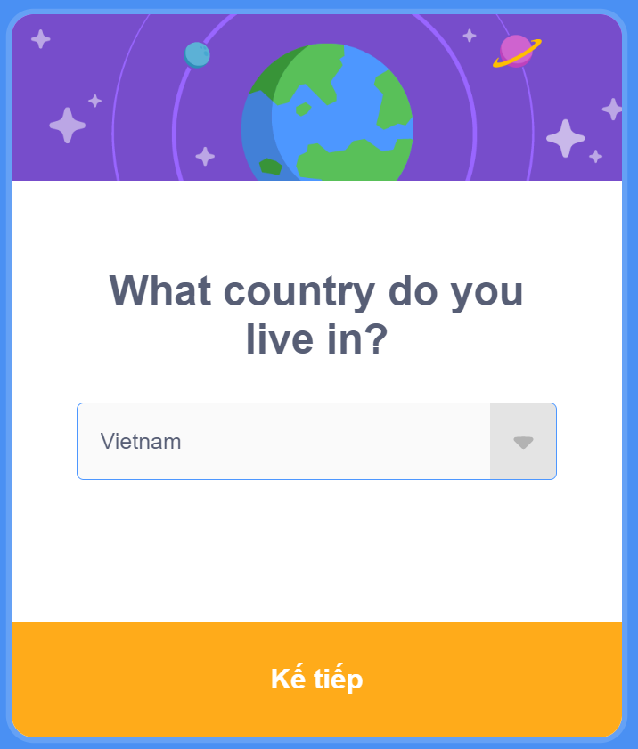

# Chương 3: Bắt đầu Scratch nào!

Nhóc con, đã đến lúc chúng ta có một số cuộc phiêu lưu, hành động và vui chơi. Bạn có quyền cài đặt thứ gì đó trên máy tính gia đình hoặc thiết bị thông minh mà bạn thường sử dụng không? Nếu có, bạn nên làm theo các phần tiếp theo để cài đặt và thiết lập Scratch. Nếu không, bạn lại cần đến sự giúp đỡ của người lớn. Xin lỗi, tôi biết, tôi hứa đây là lần cuối cùng!

  
English version

  > Kid, it is time we have some adventure, action and fun. Do you have
permission to install something on the home computer or the smart device
you usually use? If yes, you should follow the next sections to install and
setup Scratch. If not, you need help from an adult again. Sorry, I know, I
promise this is the last time!

## Cài đặt và Thiết lập

Có hai cách chúng ta có thể sử dụng Scratch:
   - Nền tảng trực tuyến
   - Phần mềm ngoại tuyến (bạn nên sử dụng cách này)

  
English version

  > There are two ways we can use Scratch
  > - Online platform
  > - Offline software (preferred)

### Nền tảng trực tuyến

Liên kết chính thức đến trang web Scratch là [https://scratch.mit.edu/](https://scratch.mit.edu/). Mở trình duyệt web trên thiết bị của bạn. Trong cuốn sách này, chúng tôi đã sử dụng Google Chrome. Trang web sẽ giống như hình bên dưới.

  
English version

  > The official link to the Scratch website is [https://scratch.mit.edu/](https://scratch.mit.edu/). Open up a
web browser on your device. In this book we have used Google Chrome. The
website will look like the picture below.

Cuộn xuống dưới cuối cùng của trang web và bạn có thể chỉnh ngôn ngữ về tiếng Việt

Nếu bạn muốn bắt đầu xây dựng dự án ngay lập tức, hãy nhấp vào “Khởi tạo” ở menu trên cùng.

  
English version

  > If you want to start building projects right away, click on “Create” at the top
menu.

Tạo một tài khoản sẽ cho phép bạn chia sẻ các dự án với những người khác và kết bạn trực tuyến trong một cộng đồng trực tuyến an toàn, được quản lý! Nhấp vào “Tham gia Scratch” để tạo tài khoản Scratch. Nó hoàn toàn miễn phí.

  
English version

  > Creating an account will allow you to share projects with others and make
friends online in a safe, regulated online community! Click on “Join Scratch”
to create a Scratch account. It is absolutely free.

Biểu mẫu đăng ký cung cấp các lời nhắc hữu ích để giải thích quy trình đăng ký. Hãy nhớ ghi lại mật khẩu và đặt nó ở nơi an toàn. Hãy nhớ rằng mật khẩu tài khoản trực tuyến không bao giờ được chia sẻ với bất kỳ ai trong bất kỳ trường hợp nào. Các trình duyệt hiện đại có tùy chọn để lưu các chi tiết đăng nhập, giúp các lần đăng nhập tiếp theo trở nên thuận tiện và nhanh chóng hơn. Bạn cũng có thể hưởng lợi từ tính năng đó.

  
English version

  > The sign-up form gives helpful prompts to explain the sign-up process.
Please make sure to write down the password and place it somewhere safe.
Remember that online account passwords must never be shared with anyone
under any circumstances. Modern browsers have the option to save the login
details, which makes subsequent logins convenient and faster. You can also
benefit from that feature.

Biểu mẫu đăng ký ban đầu sẽ giống như ảnh chụp màn hình bên dưới.

  
English version

  > The sign up form will initially look like the screenshot below.

Nhấp vào “Kế tiếp” sau khi điền username và mật khẩu. Username  không thể thay đổi sau này và được sử dụng để xác định người dùng trên nền tảng Scratch, vì vậy hãy đảm bảo rằng bạn yêu thích tên đó.

  
English version

  > Click on “Next” after filling in username and password. The username cannot
be changed later and is used to identify users on Scratch platform, so make
sure it is something you will love.

Tiếp theo, bạn sẽ được hỏi về quốc gia bạn đang ở. Tôi sống ở Việt Nam, vì vậy tôi đã chọn Vietnam.

  
English version

  > Next, you will be asked about the country you are located in. I live in the
United States, so I chose that.

Sau đó là sinh nhật của bạn. Đảm bảo rằng bạn sử dụng đúng ngày sinh nhật. Trong trường hợp bạn quên mật khẩu, thông thường phần thông tin này sẽ được yêu cầu để xác minh xem đó có thực sự là bạn hay không.

  
English version

  > Then it’s your birthday. Make sure you use the correct date for the birthday.
In case you forget the password, usually this piece of information is requested
to verify if it is really you.

Màn hình tiếp theo sẽ hỏi về giới tính. Chọn tùy chọn thích hợp.

  
English version

  > The next screen will ask about gender. Select the appropriate option.

Email là bước bắt buộc cuối cùng để hoàn tất đăng ký. Hầu hết các dịch vụ email phổ biến như Gmail không cho phép tài khoản dưới 13 tuổi. Tuy nhiên, có nhiều dịch vụ email thân thiện với trẻ em như Zillamail có bộ lọc ngôn từ tục tĩu được tích hợp sẵn cung cấp dịch vụ email an toàn cho trẻ em. Mặt khác, hầu hết các dịch vụ như vậy đều phải trả phí. Ngoài ra, bạn có thể sử dụng Email của cha mẹ mình để hoàn tất quá trình đăng ký.

  
English version

  > An email ID is required in the last step to complete sign up. Most common
email services like Gmail do not allow accounts for anyone younger than 13
years old. However, there are many kids-friendly email services such as
Zillamail that have built-in profanity filters offering a safe email service to
kids. On the flipside, most such services are paid. Alternatively, you can use
your parent's email ID to complete the sign up.

Và thế là xong! Bạn có thể bắt đầu sử dụng phiên bản Scratch trực tuyến để tạo và chia sẻ các dự án Scratch. Scratch sẽ gửi một liên kết xác nhận đến địa chỉ email được cung cấp trong quá trình đăng ký. Đừng quên nhấp vào liên kết trong email để xác nhận tài khoản của bạn.

  
English version

  > And that’s it! You can start using the online version of Scratch to create and
share Scratch projects. Scratch will send a confirmation link to the email
address provided during sign up. Don’t forget to click on the link in the email
to confirm your account.

### Phần mềm ngoại tuyến (bạn nên sử dụng cách này)

Bạn không cần đăng ký tài khoản để sử dụng ứng dụng Scratch trên máy tính của chính mình. Nhược điểm là bạn sẽ không thể chia sẻ dự án của mình với người khác trên Internet. Tuy nhiên, tùy chọn này tốt hơn cho những đứa trẻ như bạn muốn trở thành một bậc thầy.

  
English version

  > You do not need to sign up for an account to use the Scratch application on
your own computer. The downside is, you will not be able to share your
projects with others on the Internet. But, this option is better for kids like you
who want to become a master.

Trên hệ điều hành Windows, có hai cách để cài đặt phiên bản ngoại tuyến của Scratch.

  
English version

  > On a Windows operating system, there are two ways to install the offline
version of Scratch.

#### Tải xuống Trình cài đặt từ Trang web Scratch

To download and install the Scratch application on your computer, use the
download link: [https://scratch.mit.edu/download](https://scratch.mit.edu/download). Choose the Operating
System (OS) that your computer uses. Windows is selected by default. Note
that at least Windows 10 is required for Scratch to work.

  
English version

  > To download and install the Scratch application on your computer, use the
download link: [https://scratch.mit.edu/download](https://scratch.mit.edu/download). Choose the Operating
System (OS) that your computer uses. Windows is selected by default. Note
that at least Windows 10 is required for Scratch to work.

#### Install from Windows Store

If you have a Windows 10 based computer, you can also install the Scratch
application through the Microsoft store. Click on the “Windows” logo in the
bottom left corner of your screen. In the search bar type “Microsoft Store”
and select the first option. In the new application window, you will see the
“Search” option towards the top right-hand corner. Search for “Scratch” and
you will see “Scratch Desktop” as the very first option.

  
English version

  > If you have a Windows 10 based computer, you can also install the Scratch
application through the Microsoft store. Click on the “Windows” logo in the
bottom left corner of your screen. In the search bar type “Microsoft Store”
and select the first option. In the new application window, you will see the
“Search” option towards the top right-hand corner. Search for “Scratch” and
you will see “Scratch Desktop” as the very first option.

Select the option and then you can install the application.

  
English version

  > Select the option and then you can install the application.

No matter how you installed the application, the Scratch application can be
accessed from the start menu. Please note that sometimes applications on
Windows Store are not readily updated. If you installed Scratch from
Windows Store and it gives a fatal error when you run the application,
uninstall it and download the installer from Scratch website. For easier access
for kids, create a desktop shortcut for the application.

  
English version

  > No matter how you installed the application, the Scratch application can be
accessed from the start menu. Please note that sometimes applications on
Windows Store are not readily updated. If you installed Scratch from
Windows Store and it gives a fatal error when you run the application,
uninstall it and download the installer from Scratch website. For easier access
for kids, create a desktop shortcut for the application.

## Take Command, Peter Pan!

Hey kid, Nat’s back with you and good news, no more adults and we are all
set up to have fun! I have to ask you a question. Do you know who Peter Pan
is? Yes? Good job smarty-pants. Well, let me tell you anyways, because I
also have a secret to share.

  
English version

  > Hey kid, Nat’s back with you and good news, no more adults and we are all
set up to have fun! I have to ask you a question. Do you know who Peter Pan
is? Yes? Good job smarty-pants. Well, let me tell you anyways, because I
also have a secret to share.

Peter Pan is an independent, confident, free-spirited kid who can fly, do
magic stuff, goes on adventures, helps other kids, and stands against evil.
He’s also a bit naughty, which is good, right? He also leads other kids so they
can also be good and have fun. You know what’s the sad part? Everyone
thinks Peter Pan is not real.

  
English version

  > Peter Pan is an independent, confident, free-spirited kid who can fly, do
magic stuff, goes on adventures, helps other kids, and stands against evil.
He’s also a bit naughty, which is good, right? He also leads other kids so they
can also be good and have fun. You know what’s the sad part? Everyone
thinks Peter Pan is not real.

But, I know a secret no one else knows and I can’t hold onto it any longer.
Let me spill it out. You, Mr. Smarty-pants, are Peter Pan! Well, I know you
can’t fly, but you can do everything else that Peter Pan could, and some
more! You can use Scratch to make amazing things. Let’s dive in!

  
English version

  > But, I know a secret no one else knows and I can’t hold onto it any longer.
Let me spill it out. You, Mr. Smarty-pants, are Peter Pan! Well, I know you
can’t fly, but you can do everything else that Peter Pan could, and some
more! You can use Scratch to make amazing things. Let’s dive in!

### Things-That-Must-Not-Be-Done!

Peter Pan is nearly invincible, but even he must be wary of a few things that can hurt really bad. I am giving you a list of things you must never do when using Scratch or anything on the Internet.
  1. Never share the account password with anyone. This is a golden rule for every account made on the Internet.
  2. Never interact with strangers.
  3. Never share personal details with anyone on the Internet. Personal details include your name, contact information such as phone number and where you live. If you think it is important to share, discuss with an adult in your house so they can decide if it’s really necessary.
  4. Never close Scratch application without saving the project (later I will tell you how to save your progress on Scratch).
  5. Never hide if you experienced something on the Internet that made you uncomfortable. Share with your parents so they can protect you.
  6. We, humans, have our limitations. For example, we can’t fly on our own (because humans do not possess the physical requirements needed to fly). So, what would happen if someone tried to fly without using an airplane? They would fall (yikes) and it would be a very unpleasant sight. Just like humans, every machine and every application has some limits. Scratch is no exception, so, we must be aware of them and not exceed the limitations or things can become wonky.
  7. Never leave the computer unattended and unlocked. Pee breaks are important, but before you leave, save your Scratch project and lock the computer. The last thing you want is your younger siblings making a mess or someone shutting down the computer!
  8. Scratch does not have an UNDO feature, so a good idea is to plan ahead. Never start a project without thinking it through. With practice, you won’t be needing to make a lot of changes.
  9. Never be shy of making mistakes. Mistakes are fun because they are easy to remember and help you learn new things.
  10. And the most important thing, because it is the hardest of all: Never give up! Things (like life in general) can be hard sometimes. You will be stuck, but never accept loss. If at first you don’t succeed, try, try, try again!

  
English version

  > Peter Pan is nearly invincible, but even he must be wary of a few things that can hurt really bad. I am giving you a list of things you must never do when using Scratch or anything on the Internet.
  > 1. Never share the account password with anyone. This is a golden rule for every account made on the Internet.
  > 2. Never interact with strangers.
  > 3. Never share personal details with anyone on the Internet. Personal details include your name, contact information such as phone number and where you live. If you think it is important to share, discuss with an adult in your house so they can decide if it’s really necessary.
  > 4. Never close Scratch application without saving the project (later I will tell you how to save your progress on Scratch).
  > 5. Never hide if you experienced something on the Internet that made you uncomfortable. Share with your parents so they can protect you.
  > 6. We, humans, have our limitations. For example, we can’t fly on our own (because humans do not possess the physical requirements needed to fly). So, what would happen if someone tried to fly without using an airplane? They would fall (yikes) and it would be a very unpleasant sight. Just like humans, every machine and every application has some limits. Scratch is no exception, so, we must be aware of them and not exceed the limitations or things can become wonky.
  > 7. Never leave the computer unattended and unlocked. Pee breaks are important, but before you leave, save your Scratch project and lock the computer. The last thing you want is your younger siblings making a mess or someone shutting down the computer!
  > 8. Scratch does not have an UNDO feature, so a good idea is to plan ahead. Never start a project without thinking it through. With practice, you won’t be needing to make a lot of changes.
  > 9. Never be shy of making mistakes. Mistakes are fun because they are easy to remember and help you learn new things.
  > 10. And the most important thing, because it is the hardest of all: Never give up! Things (like life in general) can be hard sometimes. You will be stuck, but never accept loss. If at first you don’t succeed, try, try, try again!

### The Concept of Give and Take

Have you ever gone to the mall with your parents or to the grocery store?
You must have noticed how your parents hand out money or swipe their
cards and, in exchange, the shopkeeper lets them keep whatever they
gathered. Everything in the world works like this. You have to give
something to get something.

  
English version

  > Have you ever gone to the mall with your parents or to the grocery store?
You must have noticed how your parents hand out money or swipe their
cards and, in exchange, the shopkeeper lets them keep whatever they
gathered. Everything in the world works like this. You have to give
something to get something.

Programming works on the same principles. You write a code/program that
gives instructions to the computer. The computer processes and you get a
response. In the computer world, what you give to the computer we call
“input” and the response we get is called “output”.

  
English version

  > Programming works on the same principles. You write a code/program that
gives instructions to the computer. The computer processes and you get a
response. In the computer world, what you give to the computer we call
“input” and the response we get is called “output”.

Now, here’s when things can get confusing, so pay attention kiddo: programs
are written for someone else to use them (we call them “users”). The user will
use the program to do some work, in short giving input and getting output.
This is how the entire world of the Internet works. Actually, this is also how
the real world works. For example, talking about cars, they are made by
people working in factories. People buy them and use them to go to work, to
shop, and to have fun, like going to picnics.

  
English version

  > Now, here’s when things can get confusing, so pay attention kiddo: programs
are written for someone else to use them (we call them “users”). The user will
use the program to do some work, in short giving input and getting output.
This is how the entire world of the Internet works. Actually, this is also how
the real world works. For example, talking about cars, they are made by
people working in factories. People buy them and use them to go to work, to
shop, and to have fun, like going to picnics.

You are going to be the Peter Pan of programmers. You are going to create
stuff that others can use and have fun and learn new things at the same time.

  
English version

  > You are going to be the Peter Pan of programmers. You are going to create
stuff that others can use and have fun and learn new things at the same time.

### Scratch Basics

#### Start Scratch

Let’s start Scratch. Below are instructions for you on how to start Scratch.
  - Click on the Scratch application icon on the desktop. The icon looks like this: 
  - Scratch will open up. It will look like this. What an amazing colorful screen! Do not worry if things on this new screen do not make sense to you right now. We are going to explain each section very soon. 

  
English version

  > Let’s start Scratch. Below are instructions for you on how to start Scratch.
  > - Click on the Scratch application icon on the desktop. The icon looks like this: 
  > - Scratch will open up. It will look like this. What an amazing colorful screen! Do not worry if things on this new screen do not make sense to you right now. We are going to explain each section very soon. 

#### Understanding different sections of Scratch screen

##### Menu Bar

The first thing you will notice is the blue line at the top with a bunch of
options (the bunch of options is called a menu). The blue area is a long and
stretched rectangle (like a bar), hence we call this whole area the menu bar.

  
English version

  > The first thing you will notice is the blue line at the top with a bunch of
options (the bunch of options is called a menu). The blue area is a long and
stretched rectangle (like a bar), hence we call this whole area the menu bar.

- The first option in the blue menu bar is the logo of Scratch.
- The second option on the menu, represented by the icon of the world, is the “language” used in the Scratch application. You can change the language anytime you want. At the start, it is set to English.

  
English version

  > - The first option in the blue menu bar is the logo of Scratch.
  > - The second option on the menu, represented by the icon of the world, is the “language” used in the Scratch application. You can change the language anytime you want. At the start, it is set to English.

- The third option is named “File”, to be honest due to a lack of a better
name! This is an option you will find in the menus of almost every
application and it contains general but important actions. In Scratch, the
“File” contains the following options (I will explain these options in a
bit).

  
English version

  > - The third option is named “File”, to be honest due to a lack of a better
name! This is an option you will find in the menus of almost every
application and it contains general but important actions. In Scratch, the
“File” contains the following options (I will explain these options in a
bit).

- The fourth option is “Edit”. It has only two options and we will not be
using any of them in this book. However, I will explain them, just for
your curiosity!

  
English version

  > - The fourth option is “Edit”. It has only two options and we will not be
using any of them in this book. However, I will explain them, just for
your curiosity!

- The fifth option is the “Tutorials” where you will find projects that you
can run to understand different things about Scratch. No need to worry
about them, as you have me and this book!

  
English version

  > - The fifth option is the “Tutorials” where you will find projects that you
can run to understand different things about Scratch. No need to worry
about them, as you have me and this book!

- The last option is a field where you can give a name to your current
project. It might already be filled with “Scratch Project”, but you can
change it to whatever you like.

  
English version

  > - The last option is a field where you can give a name to your current
project. It might already be filled with “Scratch Project”, but you can
change it to whatever you like.

As promised, I am going to briefly explain the options you see after clicking
on “File” or “Edit”.

  
English version

  > As promised, I am going to briefly explain the options you see after clicking
on “File” or “Edit”.

##### “File” Options

New: Use this option to create a new project. If you have already worked on
a current project and haven’t saved the changes, you will be reminded with a
prompt. See, even Scratch knows how forgetful we are!

  
English version

  > New: Use this option to create a new project. If you have already worked on
a current project and haven’t saved the changes, you will be reminded with a
prompt. See, even Scratch knows how forgetful we are!

Load from your computer: You can load an already saved project using this
option. You will need to remember where you saved your project and what
the project name was.

  
English version

  > Load from your computer: You can load an already saved project using this
option. You will need to remember where you saved your project and what
the project name was.

Save to your computer: I know how important it is to take a bathroom break,
or go eat cookies. You can do both without any worries because you can save
your project using this option. Scratch will ask where to save the project and
what to name it. Try to save it somewhere you will remember. I usually just
select “Desktop”. The name you gave to your project is automatically given
to the filename.

  
English version

  > Save to your computer: I know how important it is to take a bathroom break,
or go eat cookies. You can do both without any worries because you can save
your project using this option. Scratch will ask where to save the project and
what to name it. Try to save it somewhere you will remember. I usually just
select “Desktop”. The name you gave to your project is automatically given
to the filename.

##### “Edit” Options

Restore: If you deleted something by accident and want it back, you can use
this option. Beware that this is **not** an UNDO button, so it will not revert
everything you do in Scratch.

  
English version

  > Restore: If you deleted something by accident and want it back, you can use
this option. Beware that this is **not** an UNDO button, so it will not revert
everything you do in Scratch.

Turn on Turbo Mode: If your project has a lot of complex calculations,
activate this mode and the projects may run faster.

  
English version

  > Turn on Turbo Mode: If your project has a lot of complex calculations,
activate this mode and the projects may run faster.

#### Tabs

You will see three tabs on the Scratch screen like this:

  
English version

  > You will see three tabs on the Scratch screen like this:

We will learn about the three tabs in greater detail in the next chapters. For
now, you should know their purpose.

  
English version

  > We will learn about the three tabs in greater detail in the next chapters. For
now, you should know their purpose.

##### “Code” Tab

This is where you will find all the blocks you can use to create projects. The
blocks are grouped together by their type such as “motion”, “looks” and
“sound”.

  
English version

  > This is where you will find all the blocks you can use to create projects. The
blocks are grouped together by their type such as “motion”, “looks” and
“sound”.

##### “Costumes” Tab

This tab gives you options to customize the look and behavior of characters
in your project.

  
English version

  > This tab gives you options to customize the look and behavior of characters
in your project.

##### “Sounds” Tab

If you have used a sound block in your project, here you will be able to
customize each sound component.

  
English version

  > If you have used a sound block in your project, here you will be able to
customize each sound component.

#### Controls

In the same line as the tabs, but towards the right side of your screen, you
will see the following buttons.

  
English version

  > In the same line as the tabs, but towards the right side of your screen, you
will see the following buttons.

##### Green flag

This runs your project

  
English version

  > This runs your project

##### Red sign

This stops your project from running.

  
English version

  > This stops your project from running.

##### Turbo Mode

You see this if you have enabled the Turbo Mode from the Edit option in the
menu bar.

  
English version

  > You see this if you have enabled the Turbo Mode from the Edit option in the
menu bar.

##### View Options

The next three options change the look of the entire Scratch screen.

  
English version

  > The next three options change the look of the entire Scratch screen.

#### Stage

This is where you will see how your project runs. Every project starts with
the cat character, so that’s what we see on the stage.

  
English version

  > This is where you will see how your project runs. Every project starts with
the cat character, so that’s what we see on the stage.

#### Sprites and backdrops

We are going to learn two new words - sprites and backdrops.

  
English version

  > We are going to learn two new words - sprites and backdrops.

##### Sprites

Sprites are objects that you can add to your object. The blocks we choose
from the code tab are applied to these sprites.

  
English version

  > Sprites are objects that you can add to your object. The blocks we choose
from the code tab are applied to these sprites.

##### Backdrop

These are the backgrounds we can choose for our projects

  
English version

  > These are the backgrounds we can choose for our projects

### First Project

Our cat, Mona, is hungry. In our first project, we will enable Mona to go near
Abby, and demand some food! Well, Mona would just say “meow” but Abby
will know what Mona wants. We all know what cats want - food!

  
English version

  > Our cat, Mona, is hungry. In our first project, we will enable Mona to go near
Abby, and demand some food! Well, Mona would just say “meow” but Abby
will know what Mona wants. We all know what cats want - food!

Let’s add Mona and Abby to our project “First Project”. Here is how to do
that.

  
English version

  > Let’s add Mona and Abby to our project “First Project”. Here is how to do
that.

  1. To rename this project, click on the field beside Tutorials in the
menu bar and type in “First Project”.

  
English version

  > 1. To rename this project, click on the field beside Tutorials in the
menu bar and type in “First Project”.

  2. Our cat will already be added to the project. We have to move the cat towards the bottom left side of the stage. On the stage, click and drag on the cat to move it.
  3. Towards the bottom right hand corner of your screen, in the “sprites and backdrops” section, hover your mouse on the icon that looks like a cat icon (it will say “Choose a Sprite”) and a blue strip will slide up. Select the first icon from the bottom that looks like a magnifying glass (that’s the icon usually used to say “search”).

  
English version

  > 2. Our cat will already be added to the project. We have to move the cat towards the bottom left side of the stage. On the stage, click and drag on the cat to move it.
  > 3. Towards the bottom right hand corner of your screen, in the “sprites and backdrops” section, hover your mouse on the icon that looks like a cat icon (it will say “Choose a Sprite”) and a blue strip will slide up. Select the first icon from the bottom that looks like a magnifying glass (that’s the icon usually used to say “search”).

4. You will see a new window with a lot of characters. Select the one
that says “Abby”.

  
English version

  > 4. You will see a new window with a lot of characters. Select the one
that says “Abby”.

Now, in the “sprites and backdrops” section, you will see two sprites.

  
English version

  > Now, in the “sprites and backdrops” section, you will see two sprites.

You will notice that Abby is selected because her icon has a thick blue
border. We have to flip her so she faces toward the west. Click on the
“Direction” and change the direction of the arrow so it points toward the
west. Also, click on the “arrow heads” icon in the middle. On the next page, I
have given before and after images to avoid any confusion.

  
English version

  > You will notice that Abby is selected because her icon has a thick blue
border. We have to flip her so she faces toward the west. Click on the
“Direction” and change the direction of the arrow so it points toward the
west. Also, click on the “arrow heads” icon in the middle. On the next page, I
have given before and after images to avoid any confusion.

*Before*

*After*

We also have to rename our cat

  
English version

  > We also have to rename our cat

In the “sprites and backdrops” section, click on the cat icon so it becomes
highlighted. In the field that says “Sprite”, change ‘Sprite1’ to Mona (Press
the ENTER key on your keyboard after you type Mona for the change to take
effect). After the edit, the two sprites should look like this.

  
English version

  > In the “sprites and backdrops” section, click on the cat icon so it becomes
highlighted. In the field that says “Sprite”, change ‘Sprite1’ to Mona (Press
the ENTER key on your keyboard after you type Mona for the change to take
effect). After the edit, the two sprites should look like this.

We also need to change the backdrop. Towards the bottom right hand corner
of your screen, in the “sprites and backdrops” section, hover your mouse on
the icon that looks like an image icon (it will say “Choose a Backdrop”) and a
blue strip will slide up. Select the first icon from the bottom that looks like a
magnifying glass.

  
English version

  > We also need to change the backdrop. Towards the bottom right hand corner
of your screen, in the “sprites and backdrops” section, hover your mouse on
the icon that looks like an image icon (it will say “Choose a Backdrop”) and a
blue strip will slide up. Select the first icon from the bottom that looks like a
magnifying glass.

You will see a new window with a lot of backdrops. Select the one that says
“Bedroom 1”.

  
English version

  > You will see a new window with a lot of backdrops. Select the one that says
“Bedroom 1”.

One last thing we need to do is move the sprites to correct locations.

  
English version

  > One last thing we need to do is move the sprites to correct locations.

Click on Mona, and in the box “x”, enter -184. In the “y” box, enter -126.

  
English version

  > Click on Mona, and in the box “x”, enter -184. In the “y” box, enter -126.

Click on Abby, then enter 29 in the box “x”, and enter -76 in the “y” box.
After all this work, the stage will look like this:

  
English version

  > Click on Abby, then enter 29 in the box “x”, and enter -76 in the “y” box.
After all this work, the stage will look like this:

  
English version

  >

## Liên kết hữu dụng
- [Mục lục](README.md)
- [Trang trước](02-Digital-Legos.md) - Chương 2: Legos kỹ thuật số
- [Trang kế](03-Start-Scratching.md) - Chapter 3: Start Scratching
