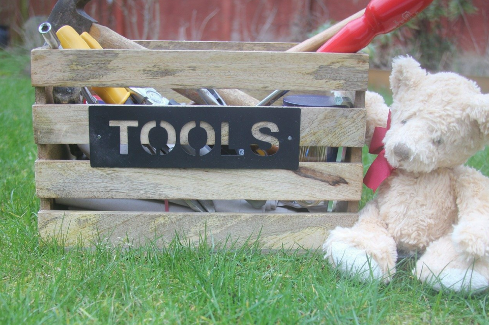
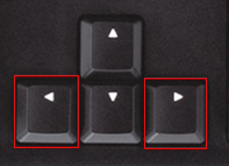
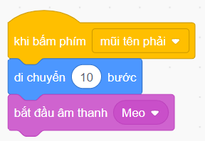
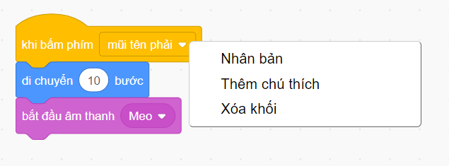
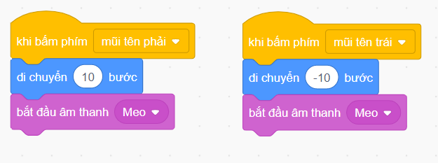
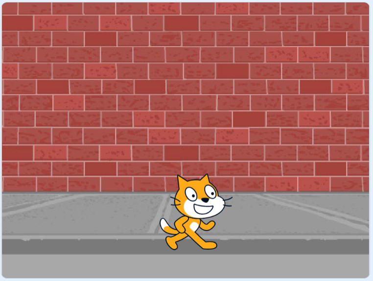
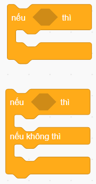
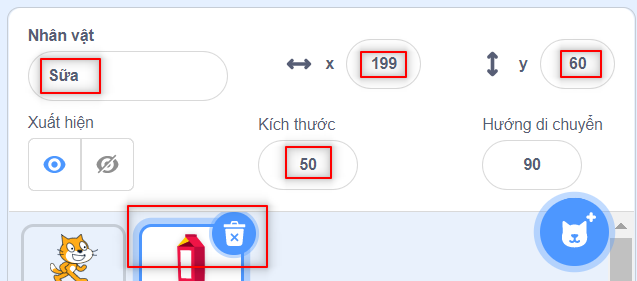
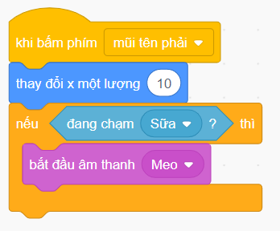
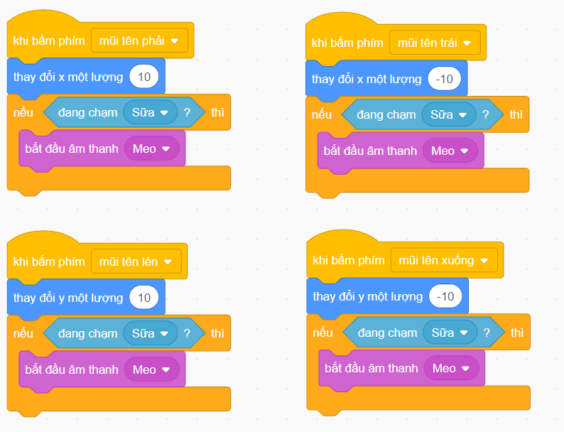

# Chương 4: Hộp công cụ

[Download PDF](download/04-Toolbox.pdf)

Mỗi hộ gia đình đều có một hộp dụng cụ. Hãy để tôi nói lại: mỗi người cha đều có một hộp dụng cụ mặc dù mẹ nói rằng họ không thể sửa chữa bất cứ thứ gì! Nhưng, các người cha rất thích hộp công cụ vì theo họ, chúng có những công cụ quan trọng có thể dùng để sửa chữa hoặc sáng tạo.

  
English version

  > Every household has a toolbox. Let me rephrase: every dad has a toolbox
even though mom says they can’t fix anything! But, dads love toolboxes
because according to them, they have important tools that can be used to fix
or create.

Có thể nói Scratch cũng là một hộp công cụ! Nó có rất nhiều công cụ (chúng ta gọi là khối) mà chúng ta có thể sử dụng để tạo ra những thứ tuyệt vời. Trong chương này, chúng ta sẽ xem xét một vài công cụ tuyệt vời này.

  
English version

  > We can say Scratch is a toolbox, too! It has a lot of tools (which we call
blocks) that we can use to create amazing stuff. In this chapter, we are going
to take a look at a couple of these amazing tools.

## Sự kiện

Chúng ta đã sử dụng một tùy chọn "Sự kiện" trong dự án đầu tiên của mình. Hãy sử dụng một cái khác trong một dự án mà con mèo sẽ kêu meo meo và di chuyển 10 bước sang phải bất cứ khi nào phím MŨI TÊN PHẢI được nhấn. Ngoài ra, mèo phải kêu meo meo và di chuyển 10 bước sang trái bất cứ khi nào nhấn phím MŨI TÊN TRÁI.

  
English version

  > We have already used one “events” option in our first project. Let’s use
another one in a project where the cat will meow and move 10 steps to the
right whenever the RIGHT ARROW key is pressed. Also, the cat should
meow and move 10 steps to the left whenever the LEFT ARROW key is
pressed.

Chúng ta sẽ bắt đầu với việc kéo khối “khi bấm phím `phím trắng`” từ tùy chọn “Sự kiện” trong tab code vào không gian làm việc. Thay đổi `phím trắng` thành `mũi tên phải`. Thêm các khối "di chuyển 10 bước" và "bắt đầu  âm thanh Meo" để ngăn xếp trông giống như bên dưới.

  
English version

  > We will start with dragging the “when SPACE is pressed” block from the
“Events” option under Code tab to the workspace. Change the SPACE to
RIGHT ARROW. Add the “move 10 steps” and “start sound MEOW” blocks
so the stack looks like below.

Bây giờ, chúng ta sao chép ngăn xếp này bằng cách nhấp chuột phải vào khối trên cùng của ngăn xếp và chọn “Nhân bản”.

  
English version

  > Now, we duplicate this block stack by right-clicking and selecting “Duplicate”.

Trong ngăn xếp được sao chép, thay đổi `mũi tên phải` thành `mũi tên trái` và thay đổi 10 bước thành -10 bước.  Bây giờ, toàn bộ không gian làm việc sẽ trông như thế này.

  
English version

  > In the duplicated stack, change the RIGHT ARROW to LEFT ARROW and
change the 10 steps to -10 steps. The entire workspace should look like this
now.

Như bạn có thể thấy, đây là hai ngăn xếp riêng biệt, độc lập. Do đó, chúng chạy độc lập với nhau. Tôi đã thêm một phông nền "Wall 1" để giúp nó đẹp hơn.

  
English version

  > As you can see, these are two separate, independent block stacks. Therefore,
they run independently of each other. I added a wall backdrop to make it look
better.

Để chạy dự án này, chúng ta không cần phải nhấn cờ xanh. Nhấn phím `mũi tên phải` hoặc phím `mũi tên trái` và chú mèo sprite sẽ phản hồi tương ứng. Đây là ảnh chụp màn hình sân khấu mà tôi đã thêm phông nền "Wall 1".

  
English version

  > To run this project, we don’t have to press the green flag. Press LEFT
ARROW or RIGHT ARROW key and the sprite cat will respond
accordingly. Here’s the stage screenshot where I added a wall backdrop.

Bạn muốn biết bí mật? Thoải mái bấm các phím mũi tên để xem con mèo di chuyển và kêu meo meo vui nhộn như thế nào!

  
English version

  > Want to know a secret? Spam the arrow keys and see how funny the cat looks
and sounds!

## Điều khiển

Khi chúng ta viết chương trình, nhiều lần chúng ta cho phép chương trình của mình đưa ra quyết định. Chúng ta làm điều đó mọi lúc trong cuộc sống thực. Tình huống này rất quen thuộc: Nếu mẹ vui, hãy xin bánh quy, nếu mẹ tức giận, hãy ôm mẹ. Nếu mẹ trở nên vui vẻ, hãy xin bánh quy!

  
English version

  > When we write programs, many times we have to enable our program to
make decisions. We do it all the time in real life. Let me know how familiar
this situation is: If mommy is happy, ask for cookies, else if mommy is angry,
give her a hug. If mommy becomes happy, ask for cookies!

Mọi người luôn đưa ra quyết định. Nếu điều A xảy ra, hãy làm B, nếu không thì làm C. Chúng ta cũng có thể thêm khả năng này vào các chương trình của mình. Trong tab code, nhấp vào tùy chọn “Điều khiển” màu cam. Bạn sẽ thấy hai khối sau:

  
English version

  > Every human is making decisions all the time. If this happens, do this, else do
this. We can add this capability to our programs, too. In the “Code” tab, click
on the orange “Control” option. You will see the following two blocks:

Hai khối này đại diện cho những gì chúng ta gọi là "điều kiện". Chúng ta có thể sử dụng bất kỳ cái nào trong số chúng, sự khác biệt duy nhất là khối thứ hai cũng có một nhánh `nếu không thì`. Nó kiểm tra một điều kiện và nếu đúng, nó sẽ thực thi các khối bên trong nhánh `nếu ... thì`. Nếu điều kiện là sai, các khối bên trong nhánh `nếu không thì` sẽ thực thi.

  
English version

  > These two blocks represent what we call “conditionals”. We can use any of
them, the only difference is the second block has an ELSE branch as well.
They check a condition, and if it’s true, it executes the blocks inside IF
branch. If the condition turns out to be false, the blocks inside the ELSE
branch execute.

Chúng ta sẽ sử dụng các khối điều kiện trong phần tiếp theo khi chúng ta tạo trò chơi Hunger của riêng mình, nơi con mèo Mona của chúng ta lại đói!

  
English version

  > We are going to use the conditional blocks in the next section when we create
our very own Hunger game, where our cat Mona is hungry again!

## Cảm biến

Trong một nền tảng lập trình trực quan như Scratch, điều rất quan trọng là phải cảm nhận các sự kiện khác nhau đang xảy ra để chúng ta có thể sử dụng chúng như một thứ kích hoạt cho một thứ khác. Ví dụ, chúng ta có thể cảm nhận khi một Nhân vật này chạm vào Nhân vật khác để chúng ta có thể phát ra âm thanh. Hãy tạo Trò chơi Hunger cho mèo Mona của chúng ta, trong đó bạn phải hướng dẫn nó đến hộp sữa bằng cách sử dụng các phím `mũi tên` trên bàn phím. Khi Mona chạm vào sữa, nó sẽ kêu Meo meo.

  
English version

  > In a visual programming platform like Scratch, it is very important to sense
various events happening so we can use them as a trigger for something else.
For example, we can sense when one sprite touches another sprite so we can
start a sound. Let’s create the Hunger Games for our cat Mona where you
have to guide her to a milk carton using the ARROW keys on the keyboard.
When Mona touches the milk she will say Meow.

Tạo một dự án mới, đặt tên là “Dự án thứ hai” và thêm phông nền. Tôi đã sử dụng phông nền "Bedroom 2". Bây giờ, thêm hai nhân vật:
  1. Cat (đổi tên thành Mona)
  2. Milk (đổi tên thành Sữa)

  
English version

  > Create a new project, name it “Second Project” and add a bedroom backdrop. I have used the “Bedroom 2” backdrop. Now, add two sprites:
  >   1. Cat
  >   2. Milk

Chọn nhân vật "Sữa" và thay đổi kích thước của nó thành 50 và thay đổi các giá trị x và y thành 199 và 60.

  
English version

  > Select the “Milk” sprite and change its size to 50 and change the x and y
values to 199 and 60.

Bây giờ, chọn nhân vật “Con mèo” và thêm các khối theo thứ tự sau.
   1. Thêm khối “khi nhấn phím `phím trắng`” (tab code >> “Sự kiện”). Thay đổi `phím trắng` bằng `mũi tên phải`.
   2. Bây giờ thêm khối "thay đổi x một lượng 10" (tab code >> “Chuyển động”)
   3. Thêm khối điều kiện `nếu ... thì` (tab code >> “Điều khiển”).
   4. Trong hộp trống, đặt một khối "đang chạm `con trỏ chuột`" (tab code >> “Cảm biến”). Thay đổi `con trỏ chuột` thành `Sữa`
   5. Bên trong khối điều kiện `nếu ... thì`, đặt khối “bắt đầu âm thanh Meo” (tab code >> “Âm thanh”).

Sau khi bạn hoàn thành, toàn bộ ngăn xếp sẽ trông như thế này:

  
English version

  > Now, select the “Cat” sprite, and add the blocks as given in the following order.
  >   1. Add the “when SPACE is pressed” block in the “Events” in the Code tab. Change it so SPACE is replaced by RIGHT ARROW.
  >   2. Now add the block “change x by 10”
  >   3. Add the IF conditional block in the “Control” option of the Code tab.
  >   4. In the empty box, place a “touching MOUSE-POINTER” block. Change MOUSE-POINTER to MILK
  >   5. Inside the IF conditional block, place the “start sound MEOW” block from the “Sound” option from the Code tab.
  >
  > After you are done, the whole block stack will look like this:

Hãy nhân bản ngăn xếp này cho tất cả các phím `mũi tên`. Đối với mũi tên `lên` và `xuống`, hãy sử dụng khối "thay đổi y một lượng 10". Bạn sẽ có bốn ngăn xếp và không gian làm việc của bạn sẽ trông như thế này.

  
English version

  > Let’s duplicate this stack for all the ARROW keys. For the UP and DOWN
arrows, use the “change y by 10” block. You will have four block stacks and
your workspace should look like this.

Đây là tất cả những gì chúng ta phải làm. Trò chơi Hunger của chúng ta đã sẵn sàng! Chơi với các phím `mũi tên` và hướng dẫn con mèo Mona của chúng ta đến hộp sữa. Mỗi lần chạm vào hộp sữa, nó sẽ MEO với niềm hạnh phúc. Bạn sẽ yêu nó!

  
English version

  > This is all we have to do. Our very own Hunger game is ready! Play around
with the ARROW keys and guide our cat Mona to the milk carton. Each time
she touches the milk carton, she’ll MEOW with happiness. You’ll love it!

## Liên kết hữu dụng
- [Mục lục](README.md)
- [Trang trước](03-Start-Scratching.md) - Chương 3: Bắt đầu Scratch nào!
- [Trang kế](05-Merry-Go-Round.md) - Chương 5: Vòng quay cuồng nhiệt
