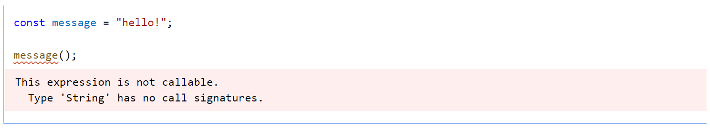
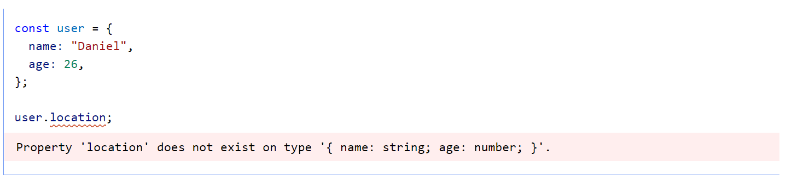
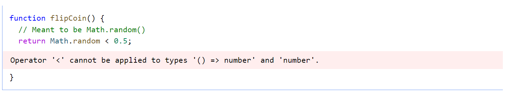
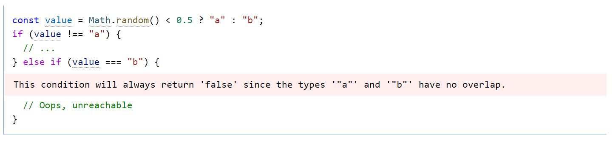
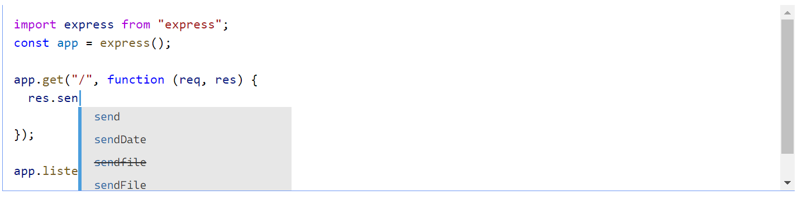
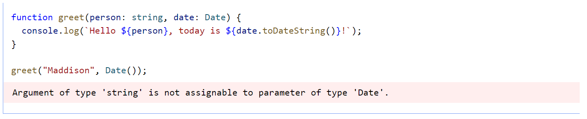
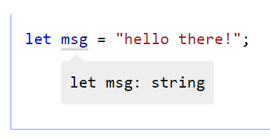

# Những thứ cơ bản

[Online version](https://www.typescriptlang.org/docs/handbook/2/basic-types.html)

Chào mừng đến với trang đầu tiên của cuốn sổ tay. Nếu đây là trải nghiệm đầu tiên của bạn với TypeScript - bạn có thể muốn bắt đầu tại một trong các hướng dẫn ['Bắt đầu'](intro.md#bắt-đầu)

<details>
  <summary>English version</summary>

  > Welcome to the first page of the handbook. If this is your first experience with TypeScript - you may want to start at one of the 'Getting Started' guides
</details>

Mỗi và mọi giá trị trong JavaScript đều có một tập hợp các hành vi mà bạn có thể quan sát khi chạy các hoạt động khác nhau. Điều đó nghe có vẻ trừu tượng, nhưng là một ví dụ nhanh, hãy xem xét một số hoạt động chúng ta có thể chạy trên một thông báo có tên biến.

<details>
  <summary>English version</summary>

  > Each and every value in JavaScript has a set of behaviors you can observe from running different operations. That sounds abstract, but as a quick example, consider some operations we might run on a variable named message.
</details>

```typescript
// Accessing the property 'toLowerCase'
// on 'message' and then calling it
message.toLowerCase();
// Calling 'message'
message();
```

Nếu chúng ta chia nhỏ điều này, dòng mã chạy được đầu tiên sẽ truy cập một thuộc tính có tên là `toLowerCase` và sau đó gọi nó. Dòng mã thứ hai cố gắng gọi trực tiếp `message`.

<details>
  <summary>English version</summary>

  > If we break this down, the first runnable line of code accesses a property called `toLowerCase` and then calls it. The second one tries to call `message` directly.
</details>

Nhưng giả sử chúng ta không biết giá trị của `message` - và điều đó khá phổ biến - chúng ta không thể nói chắc chắn rằng chúng ta sẽ nhận được kết quả gì khi cố gắng chạy bất kỳ đoạn mã nào trong số này. Hành vi của mỗi hoạt động phụ thuộc hoàn toàn vào giá trị mà chúng ta đã có ngay từ đầu.

<details>
  <summary>English version</summary>

  > But assuming we don’t know the value of `message` - and that’s pretty common - we can’t reliably say what results we’ll get from trying to run any of this code. The behavior of each operation depends entirely on what value we had in the first place.
</details>

- Có thể gọi được `message` không?
- Nó có thuộc tính `toLowerCase` trên đó không?
- Nếu có thì `toLowerCase` có thể gọi được không?
- Nếu cả hai giá trị này đều có thể gọi được thì chúng trả về giá trị gì?

<details>
  <summary>English version</summary>

  > - Is `message` callable?
  > - Does it have a property called `toLowerCase` on it?
  > - If it does, is `toLowerCase` even callable?
  > - If both of these values are callable, what do they return?
</details>

Câu trả lời cho những câu hỏi này thường là những thứ chúng ta ghi nhớ trong đầu khi viết JavaScript và chúng ta phải hy vọng rằng chúng ta đã hiểu đúng tất cả các chi tiết.

<details>
  <summary>English version</summary>

  > The answers to these questions are usually things we keep in our heads when we write JavaScript, and we have to hope we got all the details right.
</details>

Giả sử `message` được xác định theo cách sau.

<details>
  <summary>English version</summary>

  > Let’s say `message` was defined in the following way.
</details>

```typescript
const message = "Hello World!";
```

Như bạn có thể đoán, nếu chúng ta cố gắng chạy message.toLowerCase (), chúng ta sẽ chỉ nhận được cùng một chuỗi viết thường.

<details>
  <summary>English version</summary>

  > As you can probably guess, if we try to run message.toLowerCase(), we’ll get the same string only in lower-case.
</details>

Còn dòng mã thứ hai thì sao? Nếu bạn đã quen với JavaScript, bạn sẽ biết điều này không thành công với một ngoại lệ:

<details>
  <summary>English version</summary>

  > What about that second line of code? If you’re familiar with JavaScript, you’ll know this fails with an exception:
</details>

```typescript
TypeError: message is not a function
```

Thật tuyệt nếu chúng ta có thể tránh được những sai lầm như thế này.

<details>
  <summary>English version</summary>

  > It’d be great if we could avoid mistakes like this.
</details>

Khi chúng ta chạy mã của mình, cách mà JavaScript runtime của chúng ta chọn việc cần làm là tìm ra kiểu của giá trị - loại hành vi và khả năng mà nó có. Đó là một phần của những gì TypeError đang ám chỉ - nó nói rằng chuỗi "Hello World!" không thể được gọi là một hàm.

<details>
  <summary>English version</summary>

  > When we run our code, the way that our JavaScript runtime chooses what to do is by figuring out the type of the value - what sorts of behaviors and capabilities it has. That’s part of what that TypeError is alluding to - it’s saying that the string "Hello World!" cannot be called as a function.
</details>

Đối với một số giá trị, chẳng hạn như kiểu nguyên thủy chuỗi và số, chúng ta có thể xác định kiểu của chúng trong thời gian chạy bằng cách sử dụng toán tử typeof. Nhưng đối với những thứ khác như hàm, không có cơ chế thời gian chạy tương ứng để xác định loại của chúng. Ví dụ, hãy xem xét hàm này:

<details>
  <summary>English version</summary>

  > For some values, such as the primitives string and number, we can identify their type at runtime using the typeof operator. But for other things like functions, there’s no corresponding runtime mechanism to identify their types. For example, consider this function:
</details>

```typescript
function fn(x) {
  return x.flip();
}
```

Chúng ta có thể _quan sát_ bằng cách đọc mã rằng hàm này sẽ chỉ hoạt động nếu được cung cấp một đối tượng có thuộc tính callable `flip`, nhưng JavaScript không hiển thị thông tin này theo cách mà chúng ta có thể kiểm tra khi mã đang chạy. Cách duy nhất trong JavaScript thuần túy để biết những gì `fn` làm với một giá trị cụ thể là gọi nó và xem điều gì sẽ xảy ra. Loại hành vi này khiến bạn khó dự đoán mã sẽ làm gì trước khi chạy, điều đó có nghĩa là khó biết mã của bạn sẽ làm gì trong khi viết.

<details>
  <summary>English version</summary>

  > We can _observe_ by reading the code that this function will only work if given an object with a callable `flip` property, but JavaScript doesn’t surface this information in a way that we can check while the code is running. The only way in pure JavaScript to tell what `fn` does with a particular value is to call it and see what happens. This kind of behavior makes it hard to predict what code will do before it runs, which means it’s harder to know what your code is going to do while you’re writing it.
</details>

Nhìn theo cách này, một kiểu là khái niệm mô tả giá trị nào có thể được chuyển tới `fn` và giá trị nào sẽ bị lỗi. JavaScript chỉ thực sự cung cấp kiểu _động_ - chạy mã để xem điều gì xảy ra.

<details>
  <summary>English version</summary>

  > Seen in this way, a type is the concept of describing which values can be passed to `fn` and which will crash. JavaScript only truly provides _dynamic_ typing - running the code to see what happens.
</details>

Giải pháp thay thế là sử dụng hệ thống kiểu _tĩnh_ để đưa ra dự đoán về những gì mã được mong đợi trước khi nó chạy.

<details>
  <summary>English version</summary>

  > The alternative is to use a _static_ type system to make predictions about what code is expected before it runs.
</details>

## Kiểm tra kiểu tĩnh

Hãy nghĩ lại về `TypeError` mà chúng ta đã có trước đó khi cố gắng gọi một `chuỗi` dưới dạng một hàm. _Đa số mọi người_ không muốn gặp bất kỳ loại lỗi nào khi chạy mã của họ - những lỗi đó được coi là lỗi! Và khi chúng ta viết mã mới, chúng ta cố gắng hết sức để tránh các lỗi mới.

<details>
  <summary>English version</summary>

  > Think back to that `TypeError` we got earlier from trying to call a `string` as a function. _Most people_ don’t like to get any sorts of errors when running their code - those are considered bugs! And when we write new code, we try our best to avoid introducing new bugs.
</details>

Nếu chúng ta chỉ thêm một chút mã, lưu tệp của mình, chạy lại mã và ngay lập tức thấy lỗi, chúng ta có thể nhanh chóng giải quyết vấn đề; nhưng không phải lúc nào cũng vậy. Chúng ta có thể đã không kiểm tra tính năng này đủ kỹ lưỡng, vì vậy chúng ta có thể không bao giờ thực sự gặp phải một lỗi tiềm ẩn sẽ xảy ra! Hoặc nếu chúng ta đủ may mắn để chứng kiến lỗi, chúng ta có thể đã thực hiện tái cấu trúc lớn và thêm nhiều mã khác nhau mà chúng ta buộc phải tìm hiểu kỹ.

<details>
  <summary>English version</summary>

  > If we add just a bit of code, save our file, re-run the code, and immediately see the error, we might be able to isolate the problem quickly; but that’s not always the case. We might not have tested the feature thoroughly enough, so we might never actually run into a potential error that would be thrown! Or if we were lucky enough to witness the error, we might have ended up doing large refactorings and adding a lot of different code that we’re forced to dig through.
</details>

Lý tưởng nhất là chúng ta có thể có một công cụ giúp chúng ta tìm ra những lỗi này _trước_ khi mã của chúng ta chạy. Đó là những gì một trình kiểm tra kiểu tĩnh như TypeScript làm. _Hệ thống kiểu tĩnh_ mô tả hình dạng và hành vi của giá trị của chúng ta sẽ như thế nào khi chúng ta chạy chương trình của mình. Một trình kiểm tra kiểu như TypeScript sử dụng thông tin đó và cho chúng ta biết khi nào mọi thứ có thể đi chệch hướng.

<details>
  <summary>English version</summary>

  > Ideally, we could have a tool that helps us find these bugs _before_ our code runs. That’s what a static type-checker like TypeScript does. _Static types systems_ describe the shapes and behaviors of what our values will be when we run our programs. A type-checker like TypeScript uses that information and tells us when things might be going off the rails.
</details>



Chạy mẫu cuối cùng đó với TypeScript sẽ cung cấp cho chúng tôi một thông báo lỗi trước khi chúng tôi chạy mã ngay từ đầu.

<details>
  <summary>English version</summary>

  > Running that last sample with TypeScript will give us an error message before we run the code in the first place.
</details>

## Không có lỗi ngoại lệ

Cho đến nay, chúng ta đã thảo luận về một số vấn đề nhất định như lỗi thời gian chạy - các trường hợp thời gian chạy JavaScript cho chúng ta biết rằng nó nghĩ rằng điều gì đó vô nghĩa. Những trường hợp đó xảy ra vì [đặc tả ECMAScript](https://tc39.github.io/ecma262/) có hướng dẫn rõ ràng về cách ngôn ngữ sẽ hoạt động khi nó gặp sự cố không mong muốn.

<details>
  <summary>English version</summary>

  > So far we’ve been discussing certain things like runtime errors - cases where the JavaScript runtime tells us that it thinks something is nonsensical. Those cases come up because [the ECMAScript specification](https://tc39.github.io/ecma262/) has explicit instructions on how the language should behave when it runs into something unexpected.
</details>

Ví dụ: đặc tả nói rằng việc cố gắng gọi một thứ gì đó không thể gọi được sẽ gây ra lỗi. Có thể điều đó nghe giống như "hành vi rõ ràng", nhưng bạn có thể tưởng tượng rằng việc truy cập một thuộc tính không tồn tại trên một đối tượng cũng sẽ gây ra lỗi. Thay vào đó, JavaScript cung cấp cho chúng ta các hành vi khác nhau và trả về giá trị `undefined`:

<details>
  <summary>English version</summary>

  > For example, the specification says that trying to call something that isn’t callable should throw an error. Maybe that sounds like “obvious behavior”, but you could imagine that accessing a property that doesn’t exist on an object should throw an error too. Instead, JavaScript gives us different behavior and returns the value `undefined`:
</details>

```typescript
const user = {
  name: "Daniel",
  age: 26,
};
user.location; // returns undefined
```

Cuối cùng, hệ thống loại tĩnh phải thực hiện lệnh gọi mã nào sẽ được gắn cờ là lỗi trong hệ thống của nó, ngay cả khi JavaScript “hợp lệ” sẽ không gây ra lỗi ngay lập tức. Trong TypeScript, đoạn mã sau tạo ra lỗi về `location` không được xác định:

<details>
  <summary>English version</summary>

  > Ultimately, a static type system has to make the call over what code should be flagged as an error in its system, even if it’s “valid” JavaScript that won’t immediately throw an error. In TypeScript, the following code produces an error about location not being defined:
</details>



Mặc dù đôi khi điều đó ngụ ý đánh đổi những gì bạn có thể thể hiện, nhưng mục đích là để tìm ra các lỗi hợp pháp trong các chương trình của chúng ta. Và TypeScript bắt được rất nhiều lỗi hợp pháp.

<details>
  <summary>English version</summary>

  > While sometimes that implies a trade-off in what you can express, the intent is to catch legitimate bugs in our programs. And TypeScript catches a lot of legitimate bugs.
</details>

Ví dụ: lỗi chính tả,

<details>
  <summary>English version</summary>

  > For example: typos,
</details>

```typescript
const announcement = "Hello World!";

// How quickly can you spot the typos?
announcement.toLocaleLowercase();
announcement.toLocalLowerCase();

// We probably meant to write this...
announcement.toLocaleLowerCase();
```

các hàm không thể gọi,

<details>
  <summary>English version</summary>

  > uncalled functions,
</details>



hoặc các lỗi logic cơ bản.

<details>
  <summary>English version</summary>

  > or basic logic errors.
</details>



## Types for Tooling

TypeScript có thể bắt lỗi khi chúng ta mắc lỗi trong mã của mình. Điều đó thật tuyệt, nhưng TypeScript cũng có thể ngăn chúng ta mắc phải những sai lầm đó ngay từ đầu.

<details>
  <summary>English version</summary>

  > TypeScript can catch bugs when we make mistakes in our code. That’s great, but TypeScript can also prevent us from making those mistakes in the first place.
</details>

Trình kiểm tra kiểu có thông tin để kiểm tra những thứ như liệu chúng ta có đang truy cập vào các thuộc tính phù hợp trên các biến và các thuộc tính khác hay không. Khi có thông tin đó, nó cũng có thể bắt đầu đề xuất những thuộc tính nào bạn có thể muốn sử dụng.

<details>
  <summary>English version</summary>

  > The type-checker has information to check things like whether we’re accessing the right properties on variables and other properties. Once it has that information, it can also start suggesting which properties you might want to use.
</details>

Điều đó có nghĩa là TypeScript cũng có thể được tận dụng để chỉnh sửa mã và trình kiểm tra kiểu lõi có thể cung cấp thông báo lỗi và hoàn thành mã khi bạn nhập vào trình soạn thảo. Đó là một phần của những gì mọi người thường đề cập đến khi họ nói về công cụ trong TypeScript.

<details>
  <summary>English version</summary>

  > That means TypeScript can be leveraged for editing code too, and the core type-checker can provide error messages and code completion as you type in the editor. That’s part of what people often refer to when they talk about tooling in TypeScript.
</details>



TypeScript coi trọng việc sử dụng công cụ và điều đó vượt ra ngoài sự hoàn thiện và sai sót khi bạn nhập. Một trình soạn thảo hỗ trợ TypeScript có thể cung cấp "các bản sửa lỗi nhanh" để tự động sửa lỗi, tái cấu trúc để dễ dàng tổ chức lại mã và các tính năng điều hướng hữu ích để chuyển đến định nghĩa của một biến hoặc tìm tất cả các tham chiếu đến một biến nhất định. Tất cả điều này được xây dựng trên trình kiểm tra kiểu và hoàn toàn đa nền tảng, vì vậy hãy xem [trình soạn thảo yêu thích của bạn có hỗ trợ TypeScript](https://github.com/Microsoft/TypeScript/wiki/TypeScript-Editor-Support).

<details>
  <summary>English version</summary>

  > TypeScript takes tooling seriously, and that goes beyond completions and errors as you type. An editor that supports TypeScript can deliver “quick fixes” to automatically fix errors, refactorings to easily re-organize code, and useful navigation features for jumping to definitions of a variable, or finding all references to a given variable. All of this is built on top of the type-checker and is fully cross-platform, so it’s likely that [your favorite editor has TypeScript support available](https://github.com/Microsoft/TypeScript/wiki/TypeScript-Editor-Support).
</details>

## `tsc`, trình biên dịch TypeScript

Chúng ta đã nói về type-_checking_, nhưng chúng ta chưa sử dụng type-checker của mình. Hãy làm quen với người bạn mới `tsc` của chúng ta, trình biên dịch TypeScript. Trước tiên, chúng ta sẽ cần lấy nó qua npm.

<details>
  <summary>English version</summary>

  > We’ve been talking about type-_checking_, but we haven’t yet used our type-checker. Let’s get acquainted with our new friend `tsc`, the TypeScript compiler. First we’ll need to grab it via npm.
</details>

```shell
npm install -g typescript
```

> Điều này sẽ cài đặt Trình biên dịch TypeScript **tsc** trên toàn cục. Thay vào đó, bạn có thể sử dụng **npx** hoặc các công cụ tương tự nếu muốn chạy **tsc** từ gói node_modules cục bộ.

<details>
  <summary>English version</summary>

  > This installs the TypeScript Compiler **tsc** globally. You can use **npx** or similar tools if you’d prefer to run **tsc** from a local node_modules package instead.
</details>

Bây giờ chúng ta hãy chuyển đến một thư mục trống và thử viết chương trình TypeScript đầu tiên của chúng ta `hello.ts`

<details>
  <summary>English version</summary>

  > Now let’s move to an empty folder and try writing our first TypeScript program: `hello.ts:`
</details>

```typescript
// Greets the world.
console.log("Hello world!");
```

Lưu ý rằng không có kiểu cách nào ở đây; chương trình “hello world” này trông giống với những gì bạn viết cho chương trình “hello world” bằng JavaScript. Và bây giờ chúng ta hãy gõ kiểm tra nó bằng cách chạy lệnh `tsc` đã được cài đặt cho chúng ta bởi gói `typescript`.

<details>
  <summary>English version</summary>

  > Notice there are no frills here; this “hello world” program looks identical to what you’d write for a “hello world” program in JavaScript. And now let’s type-check it by running the command `tsc` which was installed for us by the `typescript` package.
</details>

```shell
tsc hello.ts
```

Tada!

Chờ đã, "tada" chính xác là gì? Chúng ta đã chạy `tsc` và không có gì xảy ra! Chà, không có lỗi kiểu nào, vì vậy chúng ta không nhận được bất kỳ đầu ra nào trong console của mình vì không có gì để báo cáo.

<details>
  <summary>English version</summary>

  > Wait, “tada” what exactly? We ran `tsc` and nothing happened! Well, there were no type errors, so we didn’t get any output in our console since there was nothing to report.
</details>

Nhưng hãy kiểm tra lại - chúng ta đã nhận được một số _file_ làm đầu ra. Nếu chúng ta xem trong thư mục hiện tại của mình, chúng ta sẽ thấy file `hello.js` bên cạnh `hello.ts`. Đó là kết quả đầu ra từ file `hello.ts` của chúng ta sau khi `tsc` _biên dịch_ hoặc _biến đổi_ nó thành một file JavaScript thuần túy. Và nếu chúng ta kiểm tra nội dung, chúng ta sẽ thấy những gì TypeScript cho ra sau khi nó xử lý tệp `.ts`:

<details>
  <summary>English version</summary>

  > But check again - we got some _file_ output instead. If we look in our current directory, we’ll see a `hello.js` file next to `hello.ts`. That’s the output from our `hello.ts` file after `tsc` _compiles_ or _transforms_ it into a plain JavaScript file. And if we check the contents, we’ll see what TypeScript spits out after it processes a `.ts` file:
</details>

```javascript
// Greets the world.
console.log("Hello world!");
```

Trong trường hợp này, TypeScript có rất ít biến đổi, vì vậy nó trông giống với những gì chúng ta đã viết. Trình biên dịch cố gắng cho ra mã có thể đọc được sạch sẽ trông giống như một thứ gì đó mà một người sẽ viết. Mặc dù điều đó không phải lúc nào cũng dễ dàng như vậy, nhưng TypeScript thụt lề một cách nhất quán, lưu ý đến thời điểm mã của chúng tôi trải dài trên các dòng mã khác nhau và cố gắng giữ các chú thích xung quanh.

<details>
  <summary>English version</summary>

  > In this case, there was very little for TypeScript to transform, so it looks identical to what we wrote. The compiler tries to emit clean readable code that looks like something a person would write. While that’s not always so easy, TypeScript indents consistently, is mindful of when our code spans across different lines of code, and tries to keep comments around.
</details>

Còn nếu chúng ta _đưa ra_ lỗi kiểm tra kiểu thì sao? Hãy viết lại `hello.ts`:

<details>
  <summary>English version</summary>

  > What about if we _did_ introduce a type-checking error? Let’s rewrite `hello.ts`:
</details>

```typescript
// This is an industrial-grade general-purpose greeter function:
function greet(person, date) {
  console.log(`Hello ${person}, today is ${date}!`);
}

greet("Brendan");
```

Nếu chúng ta chạy lại `tsc hello.ts`, chú ý rằng chúng ta gặp lỗi trên dòng lệnh!

<details>
  <summary>English version</summary>

  > If we run `tsc hello.ts` again, notice that we get an error on the command line!
</details>

```typescript
Expected 2 arguments, but got 1.
```

TypeScript đang cho chúng ta biết rằng chúng ta đã quên truyền một đối số cho hàm `greet`, và đúng là như vậy. Cho đến giờ, chúng ta chỉ viết JavaScript chuẩn, nhưng tính năng kiểm tra kiểu vẫn có thể tìm thấy các vấn đề với mã của chúng ta. Cảm ơn TypeScript!

<details>
  <summary>English version</summary>

  > TypeScript is telling us we forgot to pass an argument to the `greet` function, and rightfully so. So far we’ve only written standard JavaScript, and yet type-checking was still able to find problems with our code. Thanks TypeScript!
</details>

## Emitting with Errors

Một điều bạn có thể không nhận thấy từ ví dụ trước là file `hello.js` của chúng ta đã thay đổi một lần nữa. Nếu chúng ta mở tệp đó lên thì chúng ta sẽ thấy rằng nội dung về cơ bản vẫn giống với tệp đầu vào của chúng ta. Điều đó có thể hơi ngạc nhiên vì thực tế là `tsc` đã báo lỗi về mã của chúng tôi, nhưng điều này dựa trên một trong những giá trị cốt lõi của TypeScript: phần lớn thời gian, bạn sẽ biết rõ hơn TypeScript.

<details>
  <summary>English version</summary>

  > One thing you might not have noticed from the last example was that our `hello.js` file changed again. If we open that file up then we’ll see that the contents still basically look the same as our input file. That might be a bit surprising given the fact that `tsc` reported an error about our code, but this is based on one of TypeScript’s core values: much of the time, you will know better than TypeScript.
</details>

Để nhắc lại trước đó, mã kiểm tra kiểu giới hạn các loại chương trình bạn có thể chạy và do đó, có một sự cân bằng về những thứ mà trình kiểm tra kiểu thấy có thể chấp nhận được. Hầu như mọi thời điểm điều đó không sao, nhưng có những trường hợp mà những lần kiểm tra đó cản trở. Ví dụ: hãy tưởng tượng bạn đang di chuyển mã JavaScript sang TypeScript và đưa ra các lỗi kiểm tra kiểu. Cuối cùng, bạn sẽ phải dọn dẹp mọi thứ cho trình kiểm tra kiểu, nhưng mã JavaScript gốc đó đã hoạt động! Tại sao việc chuyển đổi nó sang TypeScript lại ngăn bạn chạy nó?

<details>
  <summary>English version</summary>

  > To reiterate from earlier, type-checking code limits the sorts of programs you can run, and so there’s a tradeoff on what sorts of things a type-checker finds acceptable. Most of the time that’s okay, but there are scenarios where those checks get in the way. For example, imagine yourself migrating JavaScript code over to TypeScript and introducing type-checking errors. Eventually you’ll get around to cleaning things up for the type-checker, but that original JavaScript code was already working! Why should converting it over to TypeScript stop you from running it?
</details>

Vì vậy, TypeScript không cản trở bạn. Tất nhiên, theo thời gian, bạn có thể muốn phòng thủ hơn một chút trước những sai lầm và làm cho TypeScript hoạt động nghiêm ngặt hơn một chút. Trong trường hợp đó, bạn có thể sử dụng tùy chọn trình biên dịch [noEmitOnError](../tsconfig.md#no-emit-on-error---noemitonerror). Hãy thử thay đổi tệp `hello.ts` của bạn và chạy `tsc` với cờ đó:

<details>
  <summary>English version</summary>

  > So TypeScript doesn’t get in your way. Of course, over time, you may want to be a bit more defensive against mistakes, and make TypeScript act a bit more strictly. In that case, you can use the [noEmitOnError](../tsconfig.md#no-emit-on-error---noemitonerror) compiler option. Try changing your `hello.ts` file and running `tsc` with that flag:
</details>

```shell
tsc --noEmitOnError hello.ts
```

Bạn sẽ nhận thấy rằng `hello.js` không bao giờ được cập nhật.

<details>
  <summary>English version</summary>

  > You’ll notice that `hello.js` never gets updated.
</details>

## Các kiểu rõ ràng

Cho đến nay, chúng ta vẫn chưa nói cho TypeScript biết `person` hay `date` là gì. Hãy chỉnh sửa mã để cho TypeScript biết rằng `person` là một `chuỗi` và `date` phải là một đối tượng `Date`. Chúng ta cũng sẽ sử dụng phương thức `toDateString()` trên `date`.

<details>
  <summary>English version</summary>

  > Up until now, we haven’t told TypeScript what `person` or `date` are. Let’s edit the code to tell TypeScript that `person` is a `string`, and that `date` should be a `Date` object. We’ll also use the `toDateString()` method on `date`.
</details>

```typescript
function greet(person: string, date: Date) {
  console.log(`Hello ${person}, today is ${date.toDateString()}!`);
}
```

Những gì chúng ta đã làm là thêm _type annotations_ trên `person` và `date` để mô tả những kiểu giá trị mà `greet` có thể được gọi với. Bạn có thể đọc là “`greet` nhận một `person` thuộc kiểu `string`, và một `date` thuộc kiểu `Date` ”.

<details>
  <summary>English version</summary>

  > What we did was add _type annotations_ on `person` and `date` to describe what types of values `greet` can be called with. You can read that signature as “`greet` takes a `person` of type `string`, and a `date` of type `Date`”.
</details>

Với điều này, TypeScript có thể cho chúng tôi biết về các trường hợp khác mà `greet` có thể đã được gọi không chính xác. Ví dụ…

<details>
  <summary>English version</summary>

  > With this, TypeScript can tell us about other cases where `greet` might have been called incorrectly. For example…
</details>



Huh? TypeScript đã báo cáo lỗi trên đối số thứ hai của chúng ta, nhưng tại sao?

<details>
  <summary>English version</summary>

  > Huh? TypeScript reported an error on our second argument, but why?
</details>

Có lẽ đáng ngạc nhiên, việc gọi `Date()` trong JavaScript trả về một `chuỗi`. Mặt khác, việc xây dựng một `Date` với `new Date()` thực sự mang lại cho chúng ta những gì chúng ta mong đợi.

<details>
  <summary>English version</summary>

  > Perhaps surprisingly, calling `Date()` in JavaScript returns a `string`. On the other hand, constructing a `Date` with `new Date()` actually gives us what we were expecting.
</details>

Dù sao, chúng ta có thể nhanh chóng sửa lỗi:

<details>
  <summary>English version</summary>

  > Anyway, we can quickly fix up the error:
</details>

```typescript
function greet(person: string, date: Date) {
  console.log(`Hello ${person}, today is ${date.toDateString()}!`);
}

greet("Maddison", new Date());
```

Hãy nhớ rằng không phải lúc nào chúng ta cũng phải viết _type annotations_ rõ ràng. Trong nhiều trường hợp, TypeScript thậm chí có thể chỉ _suy luận_ (hoặc “tìm ra”) các kiểu cho chúng ta ngay cả khi chúng ta bỏ qua chúng.

<details>
  <summary>English version</summary>

  > Keep in mind, we don’t always have to write explicit type annotations. In many cases, TypeScript can even just _infer_ (or “figure out”) the types for us even if we omit them.
</details>



Mặc dù chúng ta không nói với TypeScript rằng `msg` có kiểu `string`, nó vẫn có thể tìm ra điều đó. Đó là một tính năng và tốt nhất là không nên thêm _annotations_ khi hệ thống kiểu vẫn suy ra cùng một kiểu.

<details>
  <summary>English version</summary>

  > Even though we didn’t tell TypeScript that `msg` had the type `string` it was able to figure that out. That’s a feature, and it’s best not to add annotations when the type system would end up inferring the same type anyway.
</details>

> Lưu ý: thông điệp tooltip bên trong mã mẫu trước đó là những gì trình soạn thảo của bạn sẽ hiển thị nếu bạn di chuột qua tên biến.

<details>
  <summary>English version</summary>

  > Note: The message bubble inside the previous code sample is what your editor would show if you had hovered over the word.
</details>

## Các kiểu đã xóa

Hãy xem điều gì sẽ xảy ra khi chúng ta biên dịch hàm `greet` trên với `tsc` để xuất ra JavaScript:

<details>
  <summary>English version</summary>

  > Let’s take a look at what happens when we compile the above function `gree`t with `tsc` to output JavaScript:
</details>

```javascript
"use strict";
function greet(person, date) {
    console.log("Hello ".concat(person, ", today is ").concat(date.toDateString(), "!"));
}
greet("Maddison", new Date());
```

Lưu ý hai điều ở đây:

   1. Các tham số `person` và `date` của chúng ta không còn có _type annotations_ nữa.
   2. “Template string” của chúng tôi - chuỗi đã sử dụng dấu gạch ngược (ký tự `\``) - đã được chuyển đổi thành chuỗi đơn giản với các phép nối.

<details>
  <summary>English version</summary>

  > Notice two things here:
  >
  >   1. Our `person` and `date` parameters no longer have type annotations.
  >   2. Our “template string” - that string that used backticks (the `\`` character) - was converted to plain strings with concatenations.
</details>

Sau đó sẽ nói thêm về điểm thứ hai, nhưng bây giờ chúng ta hãy tập trung vào điểm đầu tiên đó. _Type annotations_ không phải là một phần của JavaScript (hoặc ECMAScript), vì vậy thực sự không có bất kỳ trình duyệt hoặc thời gian chạy nào khác có thể chạy TypeScript mà không bị sửa đổi. Đó là lý do tại sao TypeScript cần một trình biên dịch ngay từ đầu - nó cần một số cách để loại bỏ hoặc chuyển đổi bất kỳ mã nào dành riêng cho TypeScript để bạn có thể chạy nó. Hầu hết các mã cụ thể của TypeScript đều bị xóa và tương tự, ở đây các _type annotations_ của chúng ta đã bị xóa hoàn toàn.

<details>
  <summary>English version</summary>

  > More on that second point later, but let’s now focus on that first point. Type annotations aren’t part of JavaScript (or ECMAScript to be pedantic), so there really aren’t any browsers or other runtimes that can just run TypeScript unmodified. That’s why TypeScript needs a compiler in the first place - it needs some way to strip out or transform any TypeScript-specific code so that you can run it. Most TypeScript-specific code gets erased away, and likewise, here our type annotations were completely erased.
</details>

> **Hãy nhớ:** _Type annotations_ không bao giờ thay đổi hành vi thời gian chạy của chương trình của bạn.

<details>
  <summary>English version</summary>

  > **Remember:** Type annotations never change the runtime behavior of your program.
</details>

## Hạ cấp

Một khác biệt khác so với ở trên là template string của chúng ta được viết lại từ

<details>
  <summary>English version</summary>

  > One other difference from the above was that our template string was rewritten from
</details>

```typescript
`Hello ${person}, today is ${date.toDateString()}!`;
```

thành

```javascript
"Hello " + person + ", today is " + date.toDateString() + "!";
```

Tại sao điều này xảy ra?

<details>
  <summary>English version</summary>

  > Why did this happen?
</details>

Template strings là một tính năng từ phiên bản ECMAScript được gọi là ECMAScript 2015 (còn gọi là ECMAScript 6, ES2015, ES6, v.v. - đừng hỏi). TypeScript có khả năng viết lại mã từ các phiên bản ECMAScript mới hơn sang các phiên bản cũ hơn như ECMAScript 3 hoặc ECMAScript 5 (còn gọi là ES3 và ES5). Quá trình chuyển từ phiên bản ECMAScript mới hơn hoặc “cao hơn” xuống phiên bản cũ hơn hoặc “thấp hơn” đôi khi được gọi là hạ cấp.

<details>
  <summary>English version</summary>

  > Template strings are a feature from a version of ECMAScript called ECMAScript 2015 (a.k.a. ECMAScript 6, ES2015, ES6, etc. - don’t ask). TypeScript has the ability to rewrite code from newer versions of ECMAScript to older ones such as ECMAScript 3 or ECMAScript 5 (a.k.a. ES3 and ES5). This process of moving from a newer or “higher” version of ECMAScript down to an older or “lower” one is sometimes called downleveling.
</details>

Theo mặc định, TypeScript nhắm mục tiêu đến ES3, một phiên bản rất cũ của ECMAScript. Chúng ta có thể chọn phiên bản gần đây hơn một chút bằng cách sử dụng tùy chọn [target](../tsconfig.md#target---target). Chạy với `--target es2015` sẽ thay đổi TypeScript thành mục tiêu ECMAScript 2015, có nghĩa là mã sẽ có thể chạy ở bất cứ nơi nào hỗ trợ ECMAScript 2015. Vì vậy, chạy `tsc --target es2015 hello.ts` cho chúng ta kết quả sau:

<details>
  <summary>English version</summary>

  > By default TypeScript targets ES3, an extremely old version of ECMAScript. We could have chosen something a little bit more recent by using the [target](../tsconfig.md#target---target) option. Running with `--target es2015` changes TypeScript to target ECMAScript 2015, meaning code should be able to run wherever ECMAScript 2015 is supported. So running `tsc --target es2015 hello.ts` gives us the following output:
</details>

```javascript
function greet(person, date) {
  console.log(`Hello ${person}, today is ${date.toDateString()}!`);
}
greet("Maddison", new Date());
```

> Mặc dù mục tiêu mặc định là ES3, nhưng phần lớn các trình duyệt hiện tại đều hỗ trợ ES2015. Do đó, hầu hết các nhà phát triển có thể chỉ định ES2015 trở lên một cách an toàn làm mục tiêu, trừ khi khả năng tương thích với các trình duyệt cổ nhất định là quan trọng.

<details>
  <summary>English version</summary>

  > While the default target is ES3, the great majority of current browsers support ES2015. Most developers can therefore safely specify ES2015 or above as a target, unless compatibility with certain ancient browsers is important.
</details>

## Sự nghiêm khắc

Những người dùng khác nhau đến với TypeScript để tìm kiếm những thứ khác nhau trong trình kiểm tra kiểu. Một số người đang tìm kiếm trải nghiệm chọn tham gia lỏng lẻo hơn có thể giúp chỉ xác thực một số phần trong chương trình của họ và vẫn có công cụ tốt. Đây là trải nghiệm mặc định với TypeScript, trong đó các loại là tùy chọn, suy luận lấy các loại khoan dung nhất và không có kiểm tra các giá trị tiềm ẩn `null`/`undefined`. Giống như cách mà `tsc` phát ra khi gặp lỗi, các giá trị mặc định này được đặt ra để tránh theo cách của bạn. Nếu bạn đang di chuyển JavaScript hiện có, đó có thể là bước đầu tiên đáng mong đợi.

<details>
  <summary>English version</summary>

  > Different users come to TypeScript looking for different things in a type-checker. Some people are looking for a more loose opt-in experience which can help validate only some parts of their program, and still have decent tooling. This is the default experience with TypeScript, where types are optional, inference takes the most lenient types, and there’s no checking for potentially `null`/`undefined` values. Much like how `tsc` emits in the face of errors, these defaults are put in place to stay out of your way. If you’re migrating existing JavaScript, that might be a desirable first step.
</details>

Ngược lại, nhiều người dùng thích để TypeScript xác thực càng nhiều càng tốt ngay lập tức và đó là lý do tại sao ngôn ngữ này cũng cung cấp cài đặt độ nghiêm ngặt. Các cài đặt nghiêm ngặt này biến tính năng kiểm tra kiểu tĩnh từ một công tắc (mã của bạn có được kiểm tra hay không) thành thứ gì đó gần với mặt số hơn. Bạn càng quay số này lên, TypeScript sẽ càng kiểm tra bạn nhiều hơn. Điều này có thể đòi hỏi một chút công việc bổ sung, nhưng nói chung, nó tự trả về lâu dài và cho phép kiểm tra kỹ lưỡng hơn và công cụ chính xác hơn. Khi có thể, cơ sở mã mới phải luôn bật các kiểm tra tính nghiêm ngặt này.

<details>
  <summary>English version</summary>

  > In contrast, a lot of users prefer to have TypeScript validate as much as it can straight away, and that’s why the language provides strictness settings as well. These strictness settings turn static type-checking from a switch (either your code is checked or not) into something closer to a dial. The further you turn this dial up, the more TypeScript will check for you. This can require a little extra work, but generally speaking it pays for itself in the long run, and enables more thorough checks and more accurate tooling. When possible, a new codebase should always turn these strictness checks on.
</details>

TypeScript có một số cờ kiểm tra mức độ nghiêm ngặt kiểm tra kiểu có thể được bật hoặc tắt và tất cả các ví dụ của chúng tôi sẽ được viết với tất cả chúng được bật trừ khi có quy định khác. Cờ [strict](../tsconfig.md#strict---strict) trong CLI hoặc `"strict": true` trong [tsconfig.json](tsconfig-json.md) bật tất cả chúng đồng thời , nhưng chúng tôi có thể chọn không tham gia riêng lẻ. Hai công cụ lớn nhất mà bạn nên biết là [noImplicitAny](../tsconfig.md#no-implicit-any---noimplicitany) và [strictNullChecks](../tsconfig.md#strict-null-checks---strictnullchecks).

<details>
  <summary>English version</summary>

  > TypeScript has several type-checking strictness flags that can be turned on or off, and all of our examples will be written with all of them enabled unless otherwise stated. The [strict](../tsconfig.md#strict---strict) flag in the CLI, or `"strict": true` in a [tsconfig.json](tsconfig-json.md) toggles them all on simultaneously, but we can opt out of them individually. The two biggest ones you should know about are [noImplicitAny](../tsconfig.md#no-implicit-any---noimplicitany) and [strictNullChecks](../tsconfig.md#strict-null-checks---strictnullchecks).
</details>

## `noImplicitAny`

Recall that in some places, TypeScript doesn’t try to infer types for us and instead falls back to the most lenient type: any. This isn’t the worst thing that can happen - after all, falling back to any is just the plain JavaScript experience anyway.

However, using any often defeats the purpose of using TypeScript in the first place. The more typed your program is, the more validation and tooling you’ll get, meaning you’ll run into fewer bugs as you code. Turning on the noImplicitAny flag will issue an error on any variables whose type is implicitly inferred as any.

## `strictNullChecks`

By default, values like null and undefined are assignable to any other type. This can make writing some code easier, but forgetting to handle null and undefined is the cause of countless bugs in the world - some consider it a billion dollar mistake! The strictNullChecks flag makes handling null and undefined more explicit, and spares us from worrying about whether we forgot to handle null and undefined.
