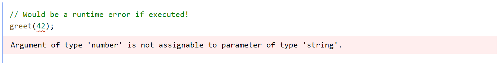
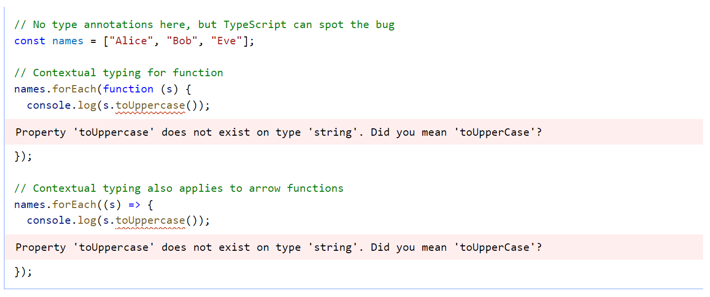
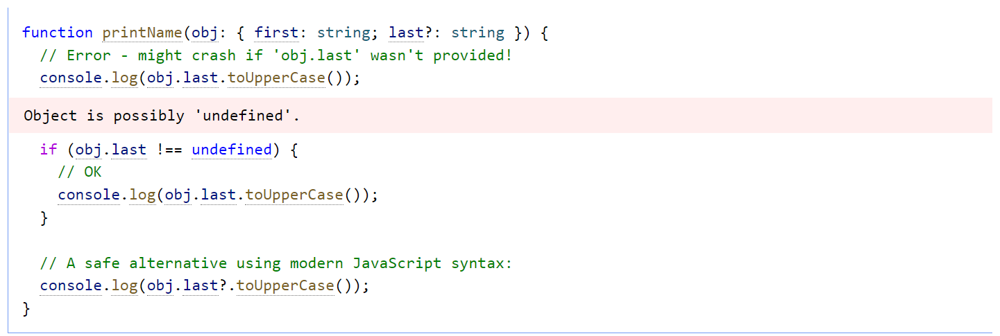
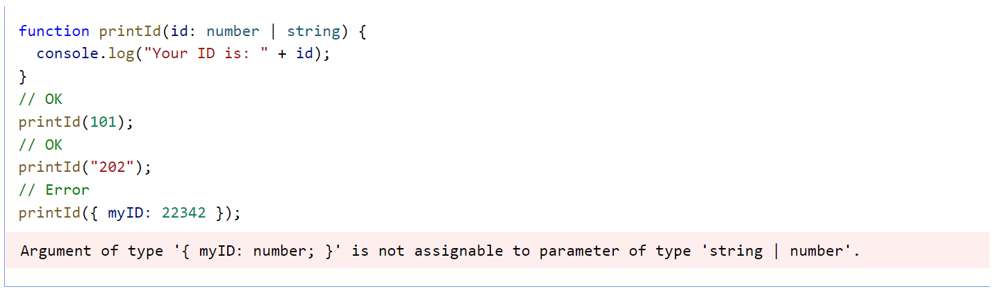
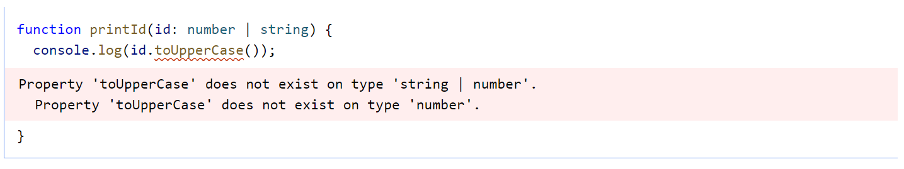

# Everyday Types

[Online Version](https://www.typescriptlang.org/docs/handbook/2/everyday-types.html)

Trong chương này, chúng ta sẽ đề cập đến một số kiểu giá trị phổ biến nhất mà bạn sẽ tìm thấy trong mã JavaScript và giải thích các cách tương ứng để mô tả các kiểu đó trong TypeScript. Đây không phải là một danh sách đầy đủ và các chương trong tương lai sẽ mô tả nhiều cách hơn để đặt tên và sử dụng các kiểu khác.

<details>
  <summary>English version</summary>

  > In this chapter, we’ll cover some of the most common types of values you’ll find in JavaScript code, and explain the corresponding ways to describe those types in TypeScript. This isn’t an exhaustive list, and future chapters will describe more ways to name and use other types.
</details>

Các kiểu cũng có thể xuất hiện trong nhiều _vị trí_ hơn là chỉ
_type annotations_. Khi chúng ta tìm hiểu về bản thân các kiểu, chúng ta cũng sẽ tìm hiểu về những nơi mà chúng ta có thể tham khảo các kiểu này để hình thành các cấu trúc mới.

<details>
  <summary>English version</summary>

  > Types can also appear in many more _places_ than just type annotations. As we learn about the types themselves, we’ll also learn about the places where we can refer to these types to form new constructs.
</details>

Chúng ta sẽ bắt đầu bằng cách xem xét các kiểu cơ bản và phổ biến nhất mà bạn có thể gặp khi viết mã JavaScript hoặc TypeScript. Những thứ này sau này sẽ tạo thành các khối xây dựng cốt lõi của nhiều kiểu phức tạp hơn.

<details>
  <summary>English version</summary>

  > We’ll start by reviewing the most basic and common types you might encounter when writing JavaScript or TypeScript code. These will later form the core building blocks of more complex types.
</details>

## Kiểu dữ liệu nguyên thủy: `string`, `number`, và `boolean`

JavaScript có ba kiểu [nguyên thủy](https://developer.mozilla.org/en-US/docs/Glossary/Primitive) được sử dụng rất phổ biến: `string`, `number` và `boolean`. Mỗi kiểu có một kiểu tương ứng trong TypeScript. Như bạn có thể mong đợi, đây là những tên giống như bạn sẽ thấy nếu bạn đã sử dụng toán tử JavaScript `typeof` trên một giá trị của các kiểu đó:
   - `string` đại diện cho các giá trị chuỗi như `"Hello, world"`
   - `number` dành cho các số như `42`. JavaScript không có giá trị runtime đặc biệt cho số nguyên, vì vậy không có giá trị tương đương với `int` hoặc `float` - mọi thứ chỉ đơn giản là `number`
   - `boolean` dành cho hai giá trị `true` và `false`

<details>
  <summary>English version</summary>

  > JavaScript has three very commonly used [primitives](https://developer.mozilla.org/en-US/docs/Glossary/Primitive): `string`, `number`, and `boolean`. Each has a corresponding type in TypeScript. As you might expect, these are the same names you’d see if you used the JavaScript `typeof` operator on a value of those types:
  >   - `string` represents string values like `"Hello, world"`
  >   - `number` is for numbers like `42`. JavaScript does not have a special runtime value for integers, so there’s no equivalent to `int` or `float` - everything is simply `number`
  >   - `boolean` is for the two values `true` and `false`
</details>

> Tên kiểu **String**, **Number** và **Boolean** (bắt đầu bằng chữ in hoa) là hợp lệ, nhưng đề cập đến một số kiểu tích hợp đặc biệt sẽ rất hiếm khi xuất hiện trong mã của bạn. Tốt nhất _luôn_ sử dụng **string**, **number** hoặc **boolean** cho các kiểu.

<details>
  <summary>English version</summary>

  > The type names **String**, **Number**, and **Boolean** (starting with capital letters) are legal, but refer to some special built-in types that will very rarely appear in your code. _Always_ use **string**, **number**, or **boolean** for types.
</details>

## Arrays

Để chỉ định kiểu của một mảng như `[1, 2, 3]`, bạn có thể sử dụng cú pháp `number[]`; cú pháp này hoạt động cho bất kỳ kiểu nào (ví dụ: `string[]` là một mảng các chuỗi, v.v.). Bạn cũng có thể thấy điều này được viết là `Array<number>`, có nghĩa tương tự. Chúng ta sẽ tìm hiểu thêm về cú pháp `T<U>` khi chúng ta đề cập đến _generics_.

<details>
  <summary>English version</summary>

  > To specify the type of an array like `[1, 2, 3]`, you can use the syntax `number[]`; this syntax works for any type (e.g. `string[]` is an array of strings, and so on). You may also see this written as `Array<number>`, which means the same thing. We’ll learn more about the syntax `T<U>` when we cover _generics_.
</details>

> Lưu ý rằng **[number]** là một thứ khác; tham khảo phần về [Tuples](objects.md#tuple-types).

<details>
  <summary>English version</summary>

  > Note that **[number]** is a different thing; refer to the section on [Tuples](objects.md#tuple-types).
</details>

## any

TypeScript cũng có một kiểu đặc biệt, `any`, mà bạn có thể sử dụng bất cứ khi nào bạn không muốn một giá trị cụ thể có thể gây ra lỗi khi kiểm tra kiểu.

<details>
  <summary>English version</summary>

  > TypeScript also has a special type, `any`, that you can use whenever you don’t want a particular value to cause typechecking errors.
</details>

Khi một giá trị thuộc kiểu `any`, bạn có thể truy cập vào bất kỳ thuộc tính nào của nó (lần lượt sẽ là loại `any`), gọi nó như một hàm, gán nó cho (hoặc từ) một giá trị thuộc bất kỳ loại nào, hoặc khá nhiều thứ khác hợp lệ về mặt cú pháp:

<details>
  <summary>English version</summary>

  > When a value is of type `any`, you can access any properties of it (which will in turn be of type `any`), call it like a function, assign it to (or from) a value of any type, or pretty much anything else that’s syntactically legal:
</details>

```typescript
let obj: any = { x: 0 };
// None of the following lines of code will throw compiler errors.
// Using `any` disables all further type checking, and it is assumed
// you know the environment better than TypeScript.
obj.foo();
obj();
obj.bar = 100;
obj = "hello";
const n: number = obj;
```

Kiểu `any` hữu ích khi bạn không muốn viết ra một kiểu dài dòng chỉ để thuyết phục TypeScript rằng một dòng mã cụ thể là được.

<details>
  <summary>English version</summary>

  > The `any` type is useful when you don’t want to write out a long type just to convince TypeScript that a particular line of code is okay.
</details>

### noImplicitAny

Khi bạn không chỉ định một kiểu và TypeScript không thể suy ra nó từ ngữ cảnh, trình biên dịch thường sẽ mặc định thành `any`.

<details>
  <summary>English version</summary>

  > When you don’t specify a type, and TypeScript can’t infer it from context, the compiler will typically default to `any`.
</details>

Tuy nhiên, bạn thường muốn tránh điều này vì `any` không được kiểm tra kiểu. Sử dụng cờ trình biên dịch [noImplicitAny](../../tsconfig.md#no-implicit-any---noimplicitany) để gắn cờ tồn tại bất kỳ kiểu `any` nào trong đoạn mã đều là lỗi.

<details>
  <summary>English version</summary>

  > You usually want to avoid this, though, because `any` isn’t type-checked. Use the compiler flag [noImplicitAny](../../tsconfig.md#no-implicit-any---noimplicitany) to flag any implicit `any` as an error.
</details>

## Type Annotations on Variables

Khi bạn khai báo một biến bằng cách sử dụng `const`, `var` hoặc `let`, bạn có thể tùy chọn thêm _type annotatio_ để chỉ định rõ ràng kiểu của biến:

<details>
  <summary>English version</summary>

  > When you declare a variable using `const`, `var`, or `let`, you can optionally add a type annotation to explicitly specify the type of the variable:
</details>

```typescript
let myName: string = "Alice";
```

> TypeScript không sử dụng khai báo kiểu “kiểu ở bên trái” như **int x = 0;** Chú thích kiểu sẽ luôn đi _sau_ thứ được nhập.

<details>
  <summary>English version</summary>

  > TypeScript doesn’t use “types on the left”-style declarations like **int x = 0;** Type annotations will always go _after_ the thing being typed.
</details>

Tuy nhiên, trong hầu hết các trường hợp, điều này là không cần thiết. Bất cứ khi nào có thể, TypeScript cố gắng tự động _suy luận_ các kiểu trong mã của bạn. Ví dụ: kiểu của một biến được suy ra dựa trên kiểu của bộ khởi tạo của nó:

<details>
  <summary>English version</summary>

  > In most cases, though, this isn’t needed. Wherever possible, TypeScript tries to automatically _infer_ the types in your code. For example, the type of a variable is inferred based on the type of its initializer:
</details>

```typescript
// No type annotation needed -- 'myName' inferred as type 'string'
let myName = "Alice";
```

Đối với hầu hết các phần, bạn không cần phải học rõ ràng các quy tắc suy luận. Nếu bạn đang bắt đầu, hãy thử sử dụng ít _type annotations_ hơn bạn nghĩ - bạn có thể ngạc nhiên về số lượng mà bạn cần để TypeScript có thể hiểu đầy đủ những gì đang xảy ra.

<details>
  <summary>English version</summary>

  > For the most part you don’t need to explicitly learn the rules of inference. If you’re starting out, try using fewer type annotations than you think - you might be surprised how few you need for TypeScript to fully understand what’s going on.
</details>

## Hàm

Các hàm là phương tiện chính để truyền dữ liệu trong JavaScript. TypeScript cho phép bạn chỉ định kiểu của cả giá trị đầu vào và đầu ra của các hàm.

<details>
  <summary>English version</summary>

  > Functions are the primary means of passing data around in JavaScript. TypeScript allows you to specify the types of both the input and output values of functions.
</details>

### Type Annotations Tham số

Khi bạn khai báo một hàm, bạn có thể thêm _type annotations_ sau mỗi tham số để khai báo kiểu tham số mà hàm chấp nhận. _Type annotations_ tham số đi sau tên tham số:

<details>
  <summary>English version</summary>

  > When you declare a function, you can add type annotations after each parameter to declare what types of parameters the function accepts. Parameter type annotations go after the parameter name:
</details>

```typescript
// Parameter type annotation
function greet(name: string) {
  console.log("Hello, " + name.toUpperCase() + "!!");
}
```

Khi một tham số có _type annotation_, các đối số cho hàm đó sẽ được kiểm tra:

<details>
  <summary>English version</summary>

  > When a parameter has a type annotation, arguments to that function will be checked:
</details>



> Ngay cả khi bạn không có _type annotation_ trên các tham số của mình, TypeScript vẫn sẽ kiểm tra xem bạn đã chuyển đúng số lượng tham số chưa.

<details>
  <summary>English version</summary>

  > Even if you don’t have type annotations on your parameters, TypeScript will still check that you passed the right number of arguments.
</details>

### Type Annotations Trả về

Bạn cũng có thể thêm _type annotations_ trả về. Các _type annotations_ trả về xuất hiện sau danh sách tham số:

<details>
  <summary>English version</summary>

  > You can also add return type annotations. Return type annotations appear after the parameter list:
</details>

```typescript
function getFavoriteNumber(): number {
  return 26;
}
```

Giống như _type annotations_ biến, bạn thường không cần _type annotations_ trả về vì TypeScript sẽ suy ra kiểu trả về của hàm dựa trên các câu lệnh `return` của nó. _Type annotations_ trong ví dụ trên không thay đổi bất kỳ điều gì. Một số cơ sở mã sẽ chỉ định rõ ràng kiểu trả về cho mục đích tài liệu, để ngăn chặn những thay đổi ngẫu nhiên hoặc chỉ vì sở thích cá nhân.

<details>
  <summary>English version</summary>

  > Much like variable type annotations, you usually don’t need a return type annotation because TypeScript will infer the function’s return type based on its `return` statements. The type annotation in the above example doesn’t change anything. Some codebases will explicitly specify a return type for documentation purposes, to prevent accidental changes, or just for personal preference.
</details>

### Hàm Anonymous

Hàm ẩn danh hơi khác một chút so với khai báo hàm. Khi một hàm xuất hiện ở nơi mà TypeScript có thể xác định cách nó sẽ được gọi, các tham số của hàm đó sẽ tự động được cung cấp theo kiểu.

<details>
  <summary>English version</summary>

  > Anonymous functions are a little bit different from function declarations. When a function appears in a place where TypeScript can determine how it’s going to be called, the parameters of that function are automatically given types.
</details>

Đây là một ví dụ:

<details>
  <summary>English version</summary>

  > Here’s an example:
</details>



Mặc dù tham số `s` không có chú thích kiểu, TypeScript đã sử dụng các kiểu của hàm `forEach`, cùng với kiểu suy ra của mảng, để xác định kiểu mà `s` sẽ có.

<details>
  <summary>English version</summary>

  > Even though the parameter `s` didn’t have a type annotation, TypeScript used the types of the `forEach` function, along with the inferred type of the array, to determine the type `s` will have.
</details>

Quá trình này được gọi là _contextual typing_ vì _context_ mà hàm xuất hiện bên trong thông báo kiểu nó phải có.

<details>
  <summary>English version</summary>

  > This process is called _contextual typing_ because the _context_ that the function occurred within informs what type it should have.
</details>

Tương tự như các quy tắc suy luận, bạn không cần phải tìm hiểu rõ ràng cách điều này xảy ra, nhưng hiểu rằng điều đó _nhất định_ xảy ra có thể giúp bạn nhận thấy khi nào không cần _type annotations_. Sau đó, chúng ta sẽ xem thêm các ví dụ về cách ngữ cảnh mà một giá trị xuất hiện có thể ảnh hưởng đến kiểu của nó.

<details>
  <summary>English version</summary>

  > Similar to the inference rules, you don’t need to explicitly learn how this happens, but understanding that it _does_ happen can help you notice when type annotations aren’t needed. Later, we’ll see more examples of how the context that a value occurs in can affect its type.
</details>

## Object Types

Ngoài kiểu nguyên thủy, kiểu phổ biến nhất mà bạn sẽ gặp là _object type_. Điều này đề cập đến bất kỳ giá trị JavaScript nào có thuộc tính, gần như là tất cả chúng! Để xác định một kiểu đối tượng, chúng ta chỉ cần liệt kê các thuộc tính của nó và các kiểu của chúng.

<details>
  <summary>English version</summary>

  > Apart from primitives, the most common sort of type you’ll encounter is an _object type_. This refers to any JavaScript value with properties, which is almost all of them! To define an object type, we simply list its properties and their types.
</details>

Ví dụ: đây là một hàm nhận một đối tượng _point-like_:

<details>
  <summary>English version</summary>

  > For example, here’s a function that takes a point-like object:
</details>

```typescript
// The parameter's type annotation is an object type
function printCoord(pt: { x: number; y: number }) {
  console.log("The coordinate's x value is " + pt.x);
  console.log("The coordinate's y value is " + pt.y);
}
printCoord({ x: 3, y: 7 });
```

Ở đây, chúng ta đã thêm _type annotations_ cho tham số với một kiểu có hai thuộc tính - `x` và `y` - cả hai đều thuộc kiểu `số`. Bạn có thể sử dụng `,` hoặc `;` để phân tách các thuộc tính và dấu phân tách cuối cùng là tùy chọn dù dùng cách nào.

<details>
  <summary>English version</summary>

  > Here, we annotated the parameter with a type with two properties - `x` and `y` - which are both of type `number`. You can use `,` or `;` to separate the properties, and the last separator is optional either way.
</details>

Phần kiểu của mỗi thuộc tính cũng là tùy chọn. Nếu bạn không chỉ định một kiểu, nó sẽ được giả định là `any`.

<details>
  <summary>English version</summary>

  > The type part of each property is also optional. If you don’t specify a type, it will be assumed to be `any`.
</details>

### Thuộc tính tùy chọn

Các kiểu đối tượng cũng có thể chỉ định rằng một số hoặc tất cả các thuộc tính của chúng là `tùy chọn`. Để thực hiện việc này, hãy thêm dấu `?` Vào sau tên thuộc tính:

<details>
  <summary>English version</summary>

  > Object types can also specify that some or all of their properties are `optional`. To do this, add a `?` after the property name:
</details>

```typescript
function printName(obj: { first: string; last?: string }) {
  // ...
}
// Both OK
printName({ first: "Bob" });
printName({ first: "Alice", last: "Alisson" });
```

Trong JavaScript, nếu bạn truy cập một thuộc tính không tồn tại, bạn sẽ nhận được giá trị `undefined` chứ không phải là lỗi thời gian chạy. Do đó, khi bạn _truy xuất_ một thuộc tính tùy chọn, bạn sẽ phải kiểm tra `undefined` trước khi sử dụng nó.

<details>
  <summary>English version</summary>

  > In JavaScript, if you access a property that doesn’t exist, you’ll get the value `undefined` rather than a runtime error. Because of this, when you _read_ from an optional property, you’ll have to check for `undefined` before using it.
</details>



## Kiểu Tập hợp

Hệ thống kiểu của TypeScript cho phép bạn tạo các kiểu mới từ những kiểu hiện có bằng cách sử dụng nhiều toán tử. Giờ chúng ta đã biết cách viết một số kiểu, đã đến lúc bắt đầu _kết hợp_ chúng theo những cách thú vị.

<details>
  <summary>English version</summary>

  > TypeScript’s type system allows you to build new types out of existing ones using a large variety of operators. Now that we know how to write a few types, it’s time to start _combining_ them in interesting ways.
</details>

### Định nghĩa Kiểu Tập hợp

Cách đầu tiên để kết hợp các kiểu mà bạn có thể thấy là kiểu _tập hợp_. Kiểu tập hợp là kiểu được hình thành từ hai hoặc nhiều kiểu khác, đại diện cho các giá trị có thể là _bất kỳ kiểu nào_ trong số các kiểu đó. Chúng ta gọi mỗi kiểu này là _phần tử_ của tập hợp.

<details>
  <summary>English version</summary>

  > The first way to combine types you might see is a _union_ type. A union type is a type formed from two or more other types, representing values that may be _any one_ of those types. We refer to each of these types as the union’s _members_.
</details>

Hãy viết một hàm có thể hoạt động trên chuỗi hoặc số:

<details>
  <summary>English version</summary>

  > Let’s write a function that can operate on strings or numbers:
</details>



### Làm việc với Kiểu Tập hợp

Thật dễ dàng để _cung cấp_ một giá trị phù hợp với một kiểu tập hợp - chỉ cần cung cấp một kiểu phù hợp với bất kỳ phần tử nào của tập hợp. Nếu bạn _có_ một giá trị của kiểu tập hợp, bạn làm việc với nó như thế nào?

<details>
  <summary>English version</summary>

  > It’s easy to _provide_ a value matching a union type - simply provide a type matching any of the union’s members. If you _have_ a value of a union type, how do you work with it?
</details>

TypeScript sẽ chỉ cho phép một hoạt động nếu nó hợp lệ với _mọi_ phần tử của tập hợp. Ví dụ, nếu bạn có tập hợp `string | number`, bạn không thể sử dụng các phương thức chỉ có sẵn trên `string`:

<details>
  <summary>English version</summary>

  > TypeScript will only allow an operation if it is valid for _every_ member of the union. For example, if you have the union `string | number`, you can’t use methods that are only available on `string`:
</details>



Giải pháp là _narrow_ kết hợp với mã, giống như bạn làm trong JavaScript mà không có _type annotations_. _Narrowing_ xảy ra khi TypeScript có thể suy ra một kiểu cụ thể hơn cho một giá trị dựa trên cấu trúc của mã.

<details>
  <summary>English version</summary>

  > The solution is to _narrow_ the union with code, the same as you would in JavaScript without type annotations. _Narrowing_ occurs when TypeScript can deduce a more specific type for a value based on the structure of the code.
</details>

Ví dụ, TypeScript biết rằng chỉ một giá trị `string` sẽ có một `typeof` giá trị `"string"`:

<details>
  <summary>English version</summary>

  > For example, TypeScript knows that only a `string` value will have a `typeof` value `"string"`:
</details>

```typescript
function printId(id: number | string) {
  if (typeof id === "string") {
    // In this branch, id is of type 'string'
    console.log(id.toUpperCase());
  } else {
    // Here, id is of type 'number'
    console.log(id);
  }
}
```

Một ví dụ khác là sử dụng một hàm như `Array.isArray`:

<details>
  <summary>English version</summary>

  > Another example is to use a function like `Array.isArray`:
</details>

```typescript
function welcomePeople(x: string[] | string) {
  if (Array.isArray(x)) {
    // Here: 'x' is 'string[]'
    console.log("Hello, " + x.join(" and "));
  } else {
    // Here: 'x' is 'string'
    console.log("Welcome lone traveler " + x);
  }
}
```

Lưu ý rằng trong nhánh `else`, chúng ta không cần phải làm gì đặc biệt - nếu `x` không phải là `string[]`, thì nó phải là một `string`.

<details>
  <summary>English version</summary>

  > Notice that in the `else` branch, we don’t need to do anything special - if `x` wasn’t a `string[]`, then it must have been a `string`.
</details>

Đôi khi bạn sẽ có một tập hợp mà tất cả các phần tử đều có điểm chung. Ví dụ, cả mảng và chuỗi đều có phương thức `slice`. Nếu mọi phần tử trong tập hợp có thuộc tính chung, bạn có thể sử dụng thuộc tính đó mà không bị thu hẹp:

<details>
  <summary>English version</summary>

  > Sometimes you’ll have a union where all the members have something in common. For example, both arrays and strings have a `slice` method. If every member in a union has a property in common, you can use that property without narrowing:
</details>

```typescript
// Return type is inferred as number[] | string
function getFirstThree(x: number[] | string) {
  return x.slice(0, 3);
}
```

> Có thể gây nhầm lẫn rằng _tập hợp_ của các kiểu dường như có thuộc tính _giao nhau_ của các kiểu đó. Đây không phải là một sự tình cờ - cái tên _tập hợp_ xuất phát từ lý thuyết kiểu. _Tập hợp_ **number | string** được cấu tạo bằng cách lấy tập hợp của các _giá trị_ từ mỗi kiểu. Lưu ý rằng đã cho hai tập hợp với các dữ kiện tương ứng về mỗi tập hợp, chỉ _phần tử_ của các dữ kiện đó mới áp dụng cho _tập hợp_ của chính các tập hợp đó. Ví dụ: nếu chúng ta có một phòng gồm những người cao đội mũ và một phòng khác gồm những người nói tiếng Tây Ban Nha đội mũ, sau khi kết hợp các phòng đó, điều duy nhất chúng ta biết về _mọi người_ là họ phải đội mũ.

<details>
  <summary>English version</summary>

  > It might be confusing that a _union_ of types appears to have the _intersection_ of those types’ properties. This is not an accident - the name _union_ comes from type theory. The _union_ **number | string** is composed by taking the union of the _values_ from each type. Notice that given two sets with corresponding facts about each set, only the _intersection_ of those facts applies to the _union_ of the sets themselves. For example, if we had a room of tall people wearing hats, and another room of Spanish speakers wearing hats, after combining those rooms, the only thing we know about _every_ person is that they must be wearing a hat.
</details>

## Bí danh của kiểu

Chúng ta đã và đang sử dụng các kiểu đối tượng và kiểu tập hợp bằng cách viết chúng trực tiếp trong _type annotations_. Điều này rất tiện lợi, nhưng bạn thường muốn sử dụng cùng một loại nhiều lần và gọi nó bằng một tên duy nhất.

<details>
  <summary>English version</summary>

  > We’ve been using object types and union types by writing them directly in type annotations. This is convenient, but it’s common to want to use the same type more than once and refer to it by a single name.
</details>

_Bí danh của kiểu_ chính xác là như vậy - một _tên_ cho bất kỳ _kiểu_ nào. Cú pháp cho bí danh kiểu là:

<details>
  <summary>English version</summary>

  > A _type alias_ is exactly that - a _name_ for any _type_. The syntax for a type alias is:
</details>

```typescript
type Point = {
  x: number;
  y: number;
};

// Exactly the same as the earlier example
function printCoord(pt: Point) {
  console.log("The coordinate's x value is " + pt.x);
  console.log("The coordinate's y value is " + pt.y);
}

printCoord({ x: 100, y: 100 });
```

Bạn thực sự có thể sử dụng bí danh của kiểu để đặt tên cho bất kỳ kiểu nào, không chỉ là kiểu đối tượng. Ví dụ: bí danh kiểu có thể đặt tên cho kiểu tập hợp:

<details>
  <summary>English version</summary>

  > You can actually use a type alias to give a name to any type at all, not just an object type. For example, a type alias can name a union type:
</details>

```typescript
type ID = number | string;
```

Lưu ý rằng bí danh _chỉ_ là bí danh - bạn không thể sử dụng bí danh của kiểu để tạo các “phiên bản” khác nhau/riêng biệt của cùng một kiểu. Khi bạn sử dụng bí danh, nó chính xác như thể bạn đã viết loại bí danh. Nói cách khác, mã này có thể _trông_ không hợp lệ, nhưng theo TypeScript thì được vì cả hai kiểu đều là bí danh cho cùng một kiểu:

<details>
  <summary>English version</summary>

  > Note that aliases are _only_ aliases - you cannot use type aliases to create different/distinct “versions” of the same type. When you use the alias, it’s exactly as if you had written the aliased type. In other words, this code might _look_ illegal, but is OK according to TypeScript because both types are aliases for the same type:
</details>

```typescript
type UserInputSanitizedString = string;

function sanitizeInput(str: string): UserInputSanitizedString {
  return sanitize(str);
}

// Create a sanitized input
let userInput = sanitizeInput(getInput());

// Can still be re-assigned with a string though
userInput = "new input";
```

## Literal Types
