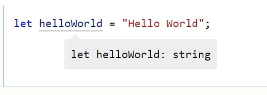
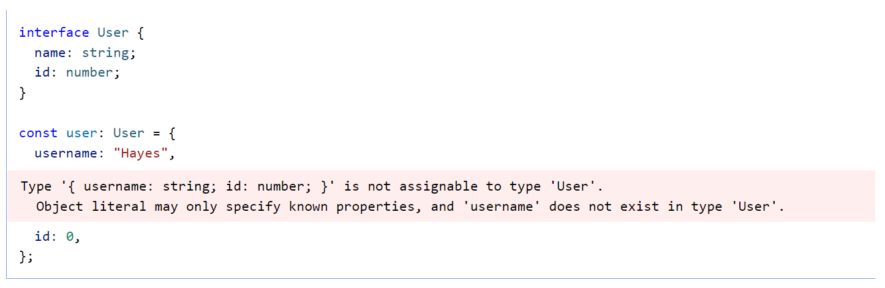
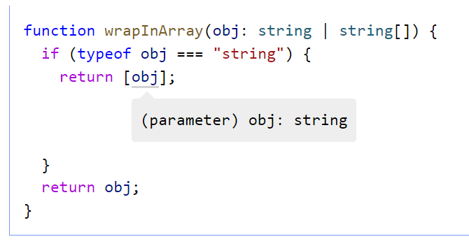
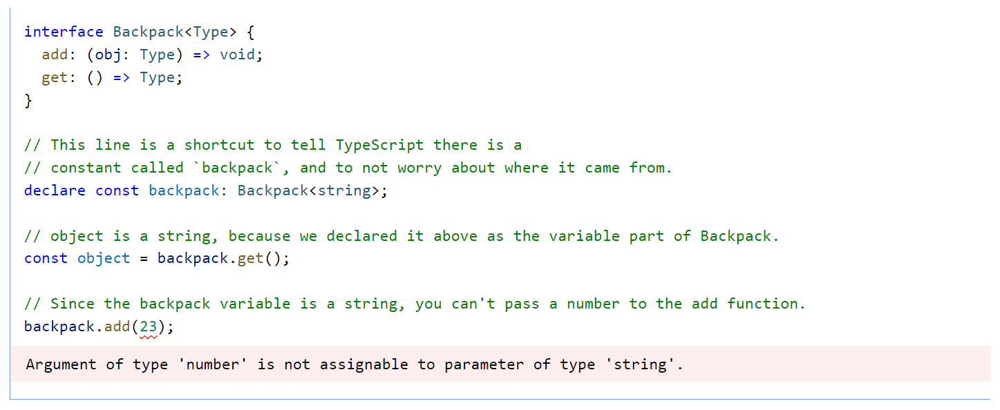
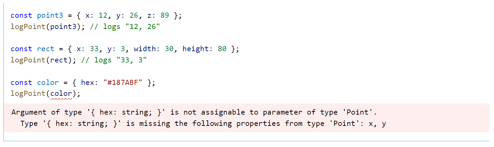

# TypeScript dành cho lập trình viên JavaScript

[Online version](https://www.typescriptlang.org/docs/handbook/typescript-in-5-minutes.html)

TypeScript có mối quan hệ bất thường với JavaScript. TypeScript cung cấp tất cả các tính năng của JavaScript và một lớp bổ sung ở trên cùng: Hệ thống kiểu của TypeScript.

<details>
  <summary>English version</summary>

  > TypeScript stands in an unusual relationship to JavaScript. TypeScript offers all of JavaScript’s features, and an additional layer on top of these: TypeScript’s type system.
</details>

Ví dụ: JavaScript cung cấp các kiểu nguyên thủy như chuỗi và số, nhưng nó không kiểm tra xem bạn đã chỉ định chúng một cách nhất quán hay chưa. TypeScript thì có.

<details>
  <summary>English version</summary>

  > For example, JavaScript provides language primitives like string and number, but it doesn’t check that you’ve consistently assigned these. TypeScript does.
</details>

Điều này có nghĩa là mã JavaScript đang hoạt động hiện tại của bạn cũng là mã TypeScript. Lợi ích chính của TypeScript là nó có thể làm nổi bật các hành vi không mong muốn trong mã của bạn, giảm nguy cơ xuất hiện lỗi.

<details>
  <summary>English version</summary>

  > This means that your existing working JavaScript code is also TypeScript code. The main benefit of TypeScript is that it can highlight unexpected behavior in your code, lowering the chance of bugs.
</details>

Hướng dẫn này cung cấp một cái nhìn tổng quan ngắn gọn về TypeScript, tập trung vào hệ thống kiểu của nó.

<details>
  <summary>English version</summary>

  > This tutorial provides a brief overview of TypeScript, focusing on its type system.
</details>

## Suy luận kiểu

TypeScript biết ngôn ngữ JavaScript và sẽ tạo ra các kiểu cho bạn trong nhiều trường hợp. Ví dụ: trong việc tạo một biến và gán nó cho một giá trị cụ thể, TypeScript sẽ sử dụng kiểu cảu giá trị làm kiểu của nó.

<details>
  <summary>English version</summary>

  > TypeScript knows the JavaScript language and will generate types for you in many cases. For example in creating a variable and assigning it to a particular value, TypeScript will use the value as its type.
</details>



Bằng cách hiểu cách hoạt động của JavaScript, TypeScript có thể xây dựng một hệ thống kiểu chấp nhận mã JavaScript nhưng có các kiểu. Điều này cung cấp một hệ thống kiểu mà không cần thêm các ký tự bổ sung để làm cho các kiểu rõ ràng trong mã của bạn. Đó là cách TypeScript biết rằng `helloWorld` là một `chuỗi` trong ví dụ trên.

<details>
  <summary>English version</summary>

  > By understanding how JavaScript works, TypeScript can build a type-system that accepts JavaScript code but has types. This offers a type-system without needing to add extra characters to make types explicit in your code. That’s how TypeScript knows that `helloWorld` is a `string` in the above example.
</details>

Bạn có thể đã viết JavaScript trong Visual Studio Code và có trình chỉnh sửa tự động hoàn thành. Visual Studio Code sử dụng TypeScript để làm việc với JavaScript dễ dàng hơn.

<details>
  <summary>English version</summary>

  > You may have written JavaScript in Visual Studio Code, and had editor auto-completion. Visual Studio Code uses TypeScript under the hood to make it easier to work with JavaScript.
</details>

## Định nghĩa kiểu

Bạn có thể sử dụng nhiều design pattern khác nhau trong JavaScript. Tuy nhiên, một số design pattern khiến các kiểu khó được suy ra tự động (ví dụ: các pattern sử dụng lập trình động). Để giải quyết những trường hợp này, TypeScript hỗ trợ một phần mở rộng của ngôn ngữ JavaScript, cung cấp những nơi để bạn cho TypeScript biết các kiểu nên là gì.

<details>
  <summary>English version</summary>

  > You can use a wide variety of design patterns in JavaScript. However, some design patterns make it difficult for types to be inferred automatically (for example, patterns that use dynamic programming). To cover these cases, TypeScript supports an extension of the JavaScript language, which offers places for you to tell TypeScript what the types should be.
</details>

Ví dụ: để tạo một đối tượng có kiểu được suy luận bao gồm `name: string` và `id: number`, bạn có thể viết:

<details>
  <summary>English version</summary>

  > For example, to create an object with an inferred type which includes `name: string` and `id: number`, you can write:
</details>

```typescript
const user = {
  name: "Hayes",
  id: 0,
};
```

Bạn có thể mô tả rõ ràng hình dạng của đối tượng này bằng cách sử dụng khai báo `interface`:

<details>
  <summary>English version</summary>

  > You can explicitly describe this object’s shape using an `interface` declaration:
</details>

```typescript
interface User {
  name: string;
  id: number;
}
```

Sau đó, bạn có thể khai báo một đối tượng JavaScript tuân theo hình dạng của `interface` mới của bạn bằng cách sử dụng cú pháp như `: TypeName` sau một khai báo biến:

<details>
  <summary>English version</summary>

  > You can then declare that a JavaScript object conforms to the shape of your new `interface` by using syntax like `: TypeName` after a variable declaration:
</details>

```typescript
const user: User = {
  name: "Hayes",
  id: 0,
};
```

Nếu bạn cung cấp một đối tượng không phù hợp với interface bạn đã cung cấp, TypeScript sẽ cảnh báo bạn:

<details>
  <summary>English version</summary>

  > If you provide an object that doesn’t match the interface you have provided, TypeScript will warn you:
</details>



Vì JavaScript hỗ trợ các lớp và lập trình hướng đối tượng, nên TypeScript cũng vậy. Bạn có thể sử dụng một khai báo interface với các lớp:

<details>
  <summary>English version</summary>

  > Since JavaScript supports classes and object-oriented programming, so does TypeScript. You can use an interface declaration with classes:
</details>

```typescript
interface User {
  name: string;
  id: number;
}

class UserAccount {
  name: string;
  id: number;

  constructor(name: string, id: number) {
    this.name = name;
    this.id = id;
  }
}

const user: User = new UserAccount("Murphy", 1);
```

Bạn có thể sử dụng các interface để chú giải các tham số và giá trị trả về cho các hàm:

<details>
  <summary>English version</summary>

  > You can use interfaces to annotate parameters and return values to functions:
</details>

```typescript
function getAdminUser(): User {
  //...
}

function deleteUser(user: User) {
  // ...
}
```

Đã có một tập hợp nhỏ các kiểu nguyên thủy có sẵn trong JavaScript: `boolean`,`bigint`, `null`, `number`, `string`, `symbol` và `undefined` mà bạn có thể sử dụng trong một interface. TypeScript mở rộng danh sách này với một số kiểu khác, chẳng hạn như `any` (cho phép bất cứ kiểu nào), [unknown](https://www.typescriptlang.org/play#example/unknown-and-osystem) (ensure someone using this type declares what the type is), [never](https://www.typescriptlang.org/play#example/unknown-and-osystem) (it’s not possible that this type could happen) và `void` (một hàm trả về `undefined` hoặc không có giá trị trả về).

<details>
  <summary>English version</summary>

  > There is already a small set of primitive types available in JavaScript: `boolean`, `bigint`, `null`, `number`, `string`, `symbol`, and `undefined`, which you can use in an interface. TypeScript extends this list with a few more, such as `any` (allow anything), [unknown](https://www.typescriptlang.org/play#example/unknown-and-never) (ensure someone using this type declares what the type is), [never](https://www.typescriptlang.org/play#example/unknown-and-never) (it’s not possible that this type could happen), and `void` (a function which returns `undefined` or has no return value).
</details>

Bạn sẽ thấy rằng có hai cú pháp cho việc xây dựng kiểu: [Interfaces and Types](https://www.typescriptlang.org/play/?e=83#example/types-vs-interfaces). Bạn nên ưu tiên `interface` hơn. Chỉ sử dụng `type` khi bạn cần các tính năng cụ thể.

<details>
  <summary>English version</summary>

  > You’ll see that there are two syntaxes for building types: [Interfaces and Types](https://www.typescriptlang.org/play/?e=83#example/types-vs-interfaces). You should prefer `interface`. Use `type` when you need specific features.
</details>

## Tạo ra kiểu

Với TypeScript, bạn có thể tạo các kiểu phức tạp bằng cách kết hợp các kiểu đơn giản. Có hai cách phổ biến để làm như vậy: với unions và với generics.

<details>
  <summary>English version</summary>

  > With TypeScript, you can create complex types by combining simple ones. There are two popular ways to do so: with unions, and with generics.
</details>

### Unions

Với union, bạn có thể khai báo một kiểu có thể là một trong nhiều kiểu. Ví dụ: bạn có thể mô tả kiểu boolean là true hoặc false:

<details>
  <summary>English version</summary>

  > With a union, you can declare that a type could be one of many types. For example, you can describe a boolean type as being either true or false:
</details>

```typescript
type MyBool = true | false;
```

_Lưu ý_: Nếu bạn di chuột qua `MyBool` ở trên, bạn sẽ thấy nó được phân loại là `boolean`. Đó là một thuộc tính của Structural Type System. Tìm hiểu kỹ hơn bên dưới đây.

<details>
  <summary>English version</summary>

  > _Note_: If you hover over `MyBool` above, you’ll see that it is classed as `boolean`. That’s a property of the Structural Type System. More on this below.
</details>

Một trường hợp sử dụng phổ biến cho các kiểu union là mô tả tập hợp `chuỗi` hoặc `số` [literals](2/everyday-types.md#literal-types) là một giá trị được phép là:

<details>
  <summary>English version</summary>

  > A popular use-case for union types is to describe the set of `string` or `number` [literals](2/everyday-types.md#literal-types) that a value is allowed to be:
</details>

```typescript
type WindowStates = "open" | "closed" | "minimized";
type LockStates = "locked" | "unlocked";
type PositiveOddNumbersUnderTen = 1 | 3 | 5 | 7 | 9;
```

Các union cũng cung cấp một cách xử lý các kiểu khác. Ví dụ: bạn có thể có một hàm nhận một mảng hoặc một chuỗi:

<details>
  <summary>English version</summary>

  > Unions provide a way to handle different types too. For example, you may have a function that takes an array or a string:
</details>

```typescript
function getLength(obj: string | string[]) {
  return obj.length;
}
```

Để tìm hiểu kiểu của một biến, hãy sử dụng `typeof`:

<details>
  <summary>English version</summary>

  > To learn the type of a variable, use `typeof`:
</details>

| Type | Predicate |
| === | === |
| string | typeof s === "string" |
| number | typeof n === "number" |
| boolean | typeof b === "boolean" |
| undefined | typeof undefined === "undefined" |
| function | typeof f === "function" |
| array | Array.isArray(a) |

Ví dụ: bạn có thể đặt một hàm trả về các giá trị khác nhau tùy thuộc vào việc nó được truyền vào một chuỗi hay một mảng:

<details>
  <summary>English version</summary>

  > For example, you can make a function return different values depending on whether it is passed a string or an array:
</details>



### Generics

Generics cung cấp các kiểu cho các biến. Một ví dụ phổ biến là một mảng. Một mảng không có generics có thể chứa bất kỳ thứ gì. Một mảng có generics có thể mô tả kiểu của các giá trị mà mảng đó chứa.

<details>
  <summary>English version</summary>

  > Generics provide variables to types. A common example is an array. An array without generics could contain anything. An array with generics can describe the values that the array contains.
</details>

```typescript
type StringArray = Array<string>;
type NumberArray = Array<number>;
type ObjectWithNameArray = Array<{ name: string }>;
```

Bạn có thể khai báo các kiểu của riêng mình sử dụng generic:

<details>
  <summary>English version</summary>

  > You can declare your own types that use generics:
</details>



## Structural Type System

Một trong những nguyên tắc cốt lõi của TypeScript là kiểm tra kiểu tập trung vào hình dạng mà các giá trị có. Điều này đôi khi được gọi là "duck typing" hoặc "structural typing".

<details>
  <summary>English version</summary>

  > One of TypeScript’s core principles is that type checking focuses on the _shape_ that values have. This is sometimes called “duck typing” or “structural typing”.
</details>

Trong một structural type system, nếu hai đối tượng có hình dạng giống nhau thì chúng được coi là cùng kiểu.

<details>
  <summary>English version</summary>

  > In a structural type system, if two objects have the same shape, they are considered to be of the same type.
</details>

```typescript
interface Point {
  x: number;
  y: number;
}

function logPoint(p: Point) {
  console.log(`${p.x}, ${p.y}`);
}

// logs "12, 26"
const point = { x: 12, y: 26 };
logPoint(point);
```

Biến `point` không được khai báo thuộc kiểu `Point`. Tuy nhiên, TypeScript so sánh hình dạng của `point` với hình dạng của `Point` trong khi kiểm tra kiểu. Chúng có hình dạng giống nhau, vì vậy đoạn mã này không có lỗi.

<details>
  <summary>English version</summary>

  > The `point` variable is never declared to be a `Point` type. However, TypeScript compares the shape of `point` to the shape of `Point` in the type-check. They have the same shape, so the code passes.
</details>

Việc so khớp hình dạng chỉ yêu cầu một tập hợp con các trường của đối tượng phải khớp.

<details>
  <summary>English version</summary>

  > The shape-matching only requires a subset of the object’s fields to match.
</details>



Không có sự khác biệt giữa cách các lớp và đối tượng tuân theo các hình dạng:

<details>
  <summary>English version</summary>

  > There is no difference between how classes and objects conform to shapes:
</details>

```typescript
class VirtualPoint {
  x: number;
  y: number;

  constructor(x: number, y: number) {
    this.x = x;
    this.y = y;
  }
}

const newVPoint = new VirtualPoint(13, 56);
logPoint(newVPoint); // logs "13, 56"
```

Nếu đối tượng hoặc lớp có tất cả các thuộc tính bắt buộc, TypeScript sẽ cho rằng chúng khớp nhau, bất kể chúng được triển khai như thế nào.

<details>
  <summary>English version</summary>

  > If the object or class has all the required properties, TypeScript will say they match, regardless of the implementation details.
</details>

## Bước tiếp theo

Đây là một tổng quan ngắn gọn về cú pháp và các công cụ được sử dụng trong TypeScript hàng ngày. Từ đây, bạn có thể:
 - Đọc toàn bộ Handbook [từ đầu đến cuối](intro.md) (30m)
 - Khám phá [Các ví dụ Playground](https://www.typescriptlang.org/play#show-examples)

<details>
  <summary>English version</summary>

  > If the object or class has all the required properties, TypeScript will say they match, regardless of the implementation details.
  > - Read the full Handbook from start to finish (30m)
  > - Explore the [Playground examples](https://www.typescriptlang.org/play#show-examples)
</details>
